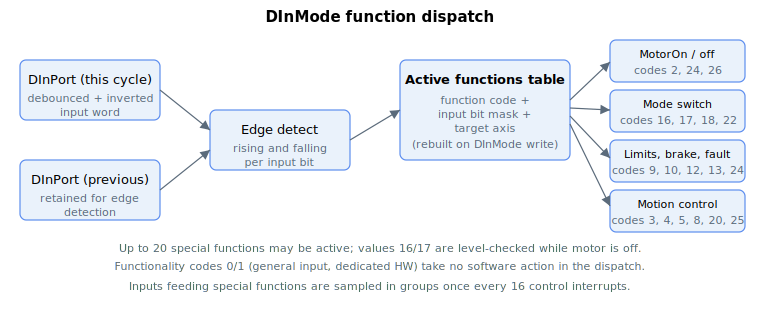

# DInMode

Assigns a software function to each digital input, with per-axis targeting.

## Overview

`DInMode` assigns a software function to a digital input. The array **index** selects the input (1-based: `DInMode[1]` is input 1, `DInMode[2]` is input 2, …).

## How it works

- The **lower 16 bits** of the value select the function (a numeric functionality code — see the table below).
- **Bits 16–27** select which axes the function applies to; each bit is one axis (A–L), and multiple bits may be set.

| Axis | A | B | C | D | E | F | G | H | I | J | K | L |
|------|---|---|---|---|---|---|---|---|---|---|---|---|
| Value, Bit# | 16 | 17 | 18 | 19 | 20 | 21 | 22 | 23 | 24 | 25 | 26 | 27 |

**Example:** `CDInMode[2] = 131081` (binary `…0010 0000 0000 0000 1001`):
- Index → 2 (digital input 2)
- Lower 16 bits → 9 (reverse limit switch)
- Bit 17 set → axis B

…so digital input 2 (of axis C) acts as the reverse-limit-switch input for axis B. (To target axis A instead, set bit 16 — value `65545` — or leave the upper 16 bits at 0; both forms select axis A.)

### Dispatch mechanism

When `DInMode[]` is written, an internal table of active functionalities is built — each entry holds the function code, the input bit mask, and the target axis. Each control cycle this table is walked, comparing the current input word against the previous one ([DInPort](DInPort-DInPortHigh.md)) to detect **rising** and **falling** edges, then running the function's action. Inputs used for these functions are sampled in groups once every 16 interrupts.

### Functionality codes

The lower 16 bits select one of the following functions. The "Edge / level" and "Action" columns summarize what the dispatch does.

| Code | Name | Edge / level | Action |
|------|------|--------------|--------|
| 0 | User input (general purpose) | — | No function; the input is read only via [DInPort](DInPort-DInPortHigh.md). May be assigned to multiple inputs. |
| 1 | Dedicated HW function | — | Routed to dedicated hardware; no software action in the dispatch. |
| 2 | Motor-on input | rising / falling | Rising edge (when off and no fault) requests servo-on; falling edge disables the motor and sets [MotorReason](../../07-status-and-faults/MotorReason.md) = I/O. See [MotorOn](../../08-axis-operation/01-general-keywords/MotorOn.md). |
| 3 | Begin motion | rising | Releases a move armed with [BeginDInOn](../../10-motion/04-motion-command/BeginDInOn.md): sets a per-axis flag the profiler uses to start the move. |
| 4 | Stop motion | rising | Issues a controlled [Stop](../../10-motion/04-motion-command/Stop.md) on the axis (and along the CNC / vector path if it is a member). |
| 5 | Clear input pulses | rising / falling | With servo on: rising edge aborts the current move; falling edge re-begins motion from the present reference. |
| 6 | Abort-resume motion | — | Reserved — defined but not implemented in firmware. |
| 7 | Alarm reset | level + falling | Held on for ≥20 ms then released clears the fault ([ConFlt](../../07-status-and-faults/ConFlt.md) → none). |
| 8 | Abort motion | level (on) | Aborts motion immediately ([Abort](../../10-motion/04-motion-command/Abort.md)); for CNC/vector members aborts the whole group. |
| 9 | Reverse limit switch (RLS) | level | Sets/clears the RLS bit in [LimitsStat](../../06-protections/03-motion/position-limit-protection/LimitsStat.md) and [StatReg](../../07-status-and-faults/StatReg.md) bit 17; the limit handler decelerates the axis. |
| 10 | Forward limit switch (FLS) | level | Sets/clears the FLS bit in [LimitsStat](../../06-protections/03-motion/position-limit-protection/LimitsStat.md) and [StatReg](../../07-status-and-faults/StatReg.md) bit 18; the limit handler decelerates the axis. |
| 11 | Torque limit on | level | Enables/disables the current (torque) limit (gates `CurrLimMode`). |
| 12 | Activate dynamic brake | level | Turns the dynamic brake on/off. |
| 13 | Lock static brake | level | Locks/releases the static brake (only when brake mode is "automatic by discrete input"). See [Static brake](../../06-protections/06-brake/Staticbrake.md). |
| 14 | Control-set change | level | Selects the active gain set when schedule mode is manual/DInPort. |
| 15 | Add filter | level | Enables/disables the second velocity bi-quad filter. |
| 16 | Mode switch VEL ↔ POS | level (motor off) | While the motor is off, selects velocity vs position [OperationMode](../../08-axis-operation/01-general-keywords/OperationMode.md). |
| 17 | Mode switch VEL ↔ CUR | level (motor off) | While the motor is off, selects velocity vs current mode. |
| 18 | Mode switch POS ↔ CUR | rising / falling | Switches between position and current mode (rising → position, falling → current). |
| 19 | Clear absolute encoder | — | Defined; no action in the dispatch (empty case). |
| 20 | Change speed | rising | Applies the queued new speed (`SpeedChgNew` → `Speed`). |
| 21 | Home | level | Sets/clears the home state and [StatReg](../../07-status-and-faults/StatReg.md) home bit; toggling raises a home-change pulse. |
| 22 | Mode switch POS ↔ FORCE | rising / falling | Switches between position and force mode (rising → position, falling → force). |
| 23 | Hall A | — | Marks this input as Hall A (Hall B/C assumed on the next inputs); HW routing, no dispatch action. |
| 24 | Fault input | level (on) | While on and motor on, disables the motor with fault [ConFlt](../../07-status-and-faults/ConFlt.md) = 1050 (external fault input activated). |
| 25 | Homing on input | rising | Triggers `HomingOn = 1` to start a homing sequence. |
| 26 | Fault input — controlled stop | level (on) | While on, performs a controlled stop and disables the motor at the end. |

## Notes

1. After changing `DInMode[]`, [Save](../../01-system/02-operation/Save.md) and [Reset](../../01-system/02-operation/Reset.md) — some special functions only start (or stop) working after a power cycle.
2. At most **20** special functions may be assigned across the digital inputs; beyond that, only the first 20 are operational. A function applied to two axes counts as two.
3. Functions are evaluated in ascending index order; a duplicate functionality on a later input is ignored (except general-purpose input). No error is raised, but PCSuite shows a warning.

## Changes between versions

Central-i v5 adds one functionality code: **27 — Heidenhain limits**. It is not present in v4 / standalone (where the highest code is 26). All codes 0–26 above are unchanged.

## See also

- [DInPort-DInPortHigh](DInPort-DInPortHigh.md) — input states this dispatch reads
- [DInLog-DInLogHigh](DInLog-DInLogHigh.md) — logic inversion applied before the state is read
- [BeginDInOn](../../10-motion/04-motion-command/BeginDInOn.md) — per-axis enable for the begin-motion function (code 3)
- [MotorOn](../../08-axis-operation/01-general-keywords/MotorOn.md) — enabled/disabled by the motor-on (code 2) and fault (codes 24/26) functions
- [LimitsStat](../../06-protections/03-motion/position-limit-protection/LimitsStat.md) — RLS/FLS bits driven by codes 9/10
