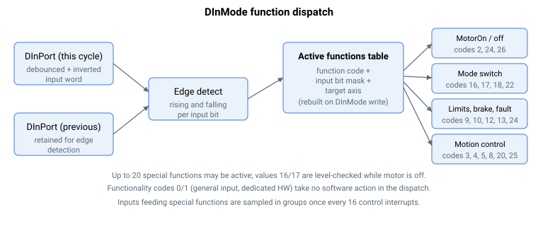

# DInMode

为每个数字量输入分配一个软件函数，并支持逐轴定向。

## 概述

`DInMode` 为某个数字量输入分配一个软件函数。数组**索引**选择输入（从 1 开始：`DInMode[1]` 是输入 1，`DInMode[2]` 是输入 2，……）。

## 工作原理

- 值的**低 16 位**选择函数（一个数字功能码——见下表）。
- **位 16–27** 选择该函数应用于哪些轴；每一位对应一个轴（A–L），可同时置多位。

| Axis | A | B | C | D | E | F | G | H | I | J | K | L |
|------|---|---|---|---|---|---|---|---|---|---|---|---|
| Value, Bit# | 16 | 17 | 18 | 19 | 20 | 21 | 22 | 23 | 24 | 25 | 26 | 27 |

**示例：** `CDInMode[2] = 131081`（二进制 `…0010 0000 0000 0000 1001`）：
- 索引 → 2（数字量输入 2）
- 低 16 位 → 9（反向限位开关）
- 置位 17 → 轴 B

……因此数字量输入 2（轴 C 的）作为轴 B 的反向限位开关输入。（若改为定向到轴 A，置位 16——值 `65545`——或将高 16 位保持为 0；两种形式都选择轴 A。）

### 分派机制

当写入 `DInMode[]` 时，会构建一张活动功能的内部表——每个条目保存功能码、输入位掩码和目标轴。每个控制周期遍历此表，将当前输入字与上一个输入字（[DInPort](DInPort-DInPortHigh.md)）进行比较以检测**上升**沿和**下降**沿，然后运行该函数的动作。用于这些函数的输入每 16 个中断分组采样一次。



### 功能码

低 16 位选择以下函数之一。"Edge / level" 和 "Action" 两列概述了分派的行为。

| Code | Name | Edge / level | Action |
|------|------|--------------|--------|
| 0 | User input (general purpose) | — | 无函数；输入仅通过 [DInPort](DInPort-DInPortHigh.md) 读取。可分配给多个输入。 |
| 1 | Dedicated HW function | — | 路由至专用硬件；分派中无软件动作。 |
| 2 | Motor-on input | rising / falling | 上升沿（在失能且无故障时）请求伺服使能；下降沿失能电机并将 [MotorReason](../../07-status-and-faults/MotorReason.md) 设为 I/O。见 [MotorOn](../../08-axis-operation/01-general-keywords/MotorOn.md)。 |
| 3 | Begin motion | rising | 释放一个由 [BeginDInOn](../../10-motion/04-motion-command/BeginDInOn.md) 武装的运动：设置一个逐轴标志，规划器据此启动运动。 |
| 4 | Stop motion | rising | 对该轴发出受控 [Stop](../../10-motion/04-motion-command/Stop.md)（若该轴是成员，则沿 CNC / 矢量路径一并停止）。 |
| 5 | Clear input pulses | rising / falling | 在伺服使能时：上升沿中止当前运动；下降沿从当前参考重新开始运动。 |
| 6 | Abort-resume motion | — | 保留——已定义但固件中未实现。 |
| 7 | Alarm reset | level + falling | 保持开启 ≥20 ms 后释放可清除故障（[ConFlt](../../07-status-and-faults/ConFlt.md) → none）。 |
| 8 | Abort motion | level (on) | 立即中止运动（[Abort](../../10-motion/04-motion-command/Abort.md)）；对 CNC/矢量成员则中止整个组。 |
| 9 | Reverse limit switch (RLS) | level | 在 [LimitsStat](../../06-protections/03-motion/position-limit-protection/LimitsStat.md) 和 [StatReg](../../07-status-and-faults/StatReg.md) 位 17 中置位/清除 RLS 位；限位处理器对该轴减速。 |
| 10 | Forward limit switch (FLS) | level | 在 [LimitsStat](../../06-protections/03-motion/position-limit-protection/LimitsStat.md) 和 [StatReg](../../07-status-and-faults/StatReg.md) 位 18 中置位/清除 FLS 位；限位处理器对该轴减速。 |
| 11 | Torque limit on | level | 使能/禁用电流（转矩）限制（门控 `CurrLimMode`）。 |
| 12 | Activate dynamic brake | level | 开启/关闭动态制动。 |
| 13 | Lock static brake | level | 抱闸/松闸静态制动器（仅当制动模式为"按离散输入自动"时）。见 [Static brake](../../06-protections/06-brake/Staticbrake.md)。 |
| 14 | Control-set change | level | 当调度模式为手动/DInPort 时选择活动增益组。 |
| 15 | Add filter | level | 使能/禁用第二个速度双二阶滤波器。 |
| 16 | Mode switch VEL ↔ POS | level (motor off) | 在电机失能时，选择速度还是位置 [OperationMode](../../08-axis-operation/01-general-keywords/OperationMode.md)。 |
| 17 | Mode switch VEL ↔ CUR | level (motor off) | 在电机失能时，选择速度还是电流模式。 |
| 18 | Mode switch POS ↔ CUR | rising / falling | 上升沿**仅在当前处于电流模式时**切换到位置；下降沿**仅在当前处于位置模式且该轴不是 CNC 或矢量成员时**切换到电流。从速度或力模式无效。 |
| 19 | Clear absolute encoder | — | 已定义；分派中无动作（空 case）。 |
| 20 | Change speed | rising | 应用排队的新速度（`SpeedChgNew` → `Speed`）。 |
| 21 | Home | level | 置位/清除原点状态和 [StatReg](../../07-status-and-faults/StatReg.md) 原点位；切换时产生一个原点变化脉冲。 |
| 22 | Mode switch POS ↔ FORCE | rising / falling | 上升沿**仅在当前处于力模式时**切换到位置；下降沿**仅在当前处于位置模式且该轴不是 CNC 或矢量成员时**切换到力。从速度或电流模式无效。 |
| 23 | Hall A | — | 将此输入标记为 Hall A（Hall B/C 假定在后续输入上）；HW 路由，无分派动作。 |
| 24 | Fault input | level (on) | 在开启且电机使能（且非仿真电机）时，以故障 [ConFlt](../../07-status-and-faults/ConFlt.md) = 1050（外部故障输入激活）失能电机。在仿真电机上被忽略。 |
| 25 | Homing on input | rising | 触发 `HomingOn = 1` 以启动回零序列。 |
| 26 | Fault input — controlled stop | level (on) | 在开启时执行受控停止，并在结束时失能电机。 |

## 注意事项

1. 更改 `DInMode[]` 后，执行 [Save](../../01-system/02-operation/Save.md) 和 [Reset](../../01-system/02-operation/Reset.md)——某些特殊函数仅在重新上电后才开始（或停止）工作。
2. 在所有数字量输入上最多可分配 **20** 个特殊函数；超过后，只有前 20 个生效。应用于两个轴的函数算作两个。
3. 函数按索引升序求值；后续输入上的重复功能将被忽略（通用输入除外）。不会报错，但 PCSuite 会显示警告。

## 示例

### 演练：在数字量输入 3 上接线并使用原点开关

将 DI 3 配置为轴 A 的原点状态输入：选择端口、分配函数、设置失效安全极性并添加消抖。接线就位后，该输入的电平驱动原点位和基于 `Pos` 的回零逻辑。

```text
AMotorOn=0                ; configure with the motor off
ADInMode[3]=21            ; function 21 = home (level); applies to this axis (upper bits 0 = axis A)
ADInLog=4                 ; bit 2 set — invert DI 3 so a disconnected switch (low) is treated as "not home"
ADInFilt=3                ; 3-sample hardware debounce (raise if the switch is electrically noisy)
ASave                     ; persist (DInMode and DInLog are flash-saveable; DInFilt too)
AReset                    ; some DInMode functions only attach on power-up — restart the controller
                          ; ... then verify ...
ADInPort                  ; read the live input word; bit 2 reflects DI 3 after filter and inversion
AStatReg                  ; the home bit in StatReg tracks the input level
```

对限位开关使用相同的方式（函数 9 = RLS，10 = FLS）——这些输入馈入 [LimitsStat](../../06-protections/03-motion/position-limit-protection/LimitsStat.md)，当轴朝着已激活的限位移动时，限位处理器会对其减速。

### 演练：从数字量输入驱动运动启动

将 `DInMode = 3`（begin motion）与 [BeginDInOn](../../10-motion/04-motion-command/BeginDInOn.md) 配对，使按下按钮即可启动一个已武装的运动。

```text
ADInMode[4]=3             ; DI 4 = begin motion (rising edge)
ABeginDInOn=1             ; arm: the next rising edge of DI 4 releases the queued move
                          ; ... rising edge on DI 4 ...
AMotionStat               ; motion has started — non-zero
```

### 边界情况

- **电机失能** — 代码 16（VEL↔POS）和 17（VEL↔CUR）中由输入驱动的模式切换**仅在电机失能时生效**；电机使能时的边沿被静默忽略。代码 18（POS↔CUR）和 22（POS↔FORCE）无论电机状态如何都在边沿上动作，但仅当该轴已处于两个参与模式之一时。
- **CNC / 矢量成员** — 当该轴是 CNC 或矢量组成员时，代码 18 和 22 不会切换到电流或力模式；分派静默跳过该转换。
- **仿真电机** — 代码 24（故障输入）在仿真电机上被忽略；即使故障输入被置位，电机仍保持使能。
- **超出范围的功能码** — 表中未列出的值在分派时被忽略（无错误，无动作）。
- **超过 20 个活动函数** — 只有前 20 个分派条目生效；后续分配在分派时静默无效。
- **另一输入上的重复函数** — 只有索引较低的输入会被执行；后面的重复项被丢弃（函数 0 = 通用除外）。PCSuite 发出配置警告。
- **Save / Reset** — 某些代码仅在重新上电时才附加（或释放）；编辑 `DInMode` 后必须执行 [Save](../../01-system/02-operation/Save.md) 和 [Reset](../../01-system/02-operation/Reset.md)。
- **平台** — 代码 27（Heidenhain limits）仅 central-i v5 支持；代码 0–26 为所有平台通用。

## 版本间的变化

Central-i v5 新增一个功能码：**27 — Heidenhain limits**。它在 v4 / standalone 中不存在（其最高代码为 26）。上述所有代码 0–26 均未变化。

## 另请参阅

- [DInPort-DInPortHigh](DInPort-DInPortHigh.md) — 此分派读取的输入状态
- [DInLog-DInLogHigh](DInLog-DInLogHigh.md) — 在读取状态之前应用的逻辑反转
- [BeginDInOn](../../10-motion/04-motion-command/BeginDInOn.md) — begin-motion 函数（代码 3）的逐轴使能
- [MotorOn](../../08-axis-operation/01-general-keywords/MotorOn.md) — 由 motor-on（代码 2）和 fault（代码 24/26）函数使能/失能
- [LimitsStat](../../06-protections/03-motion/position-limit-protection/LimitsStat.md) — 由代码 9/10 驱动的 RLS/FLS 位
