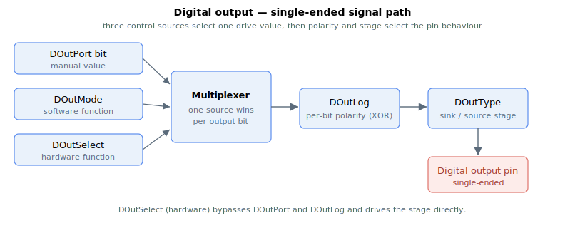
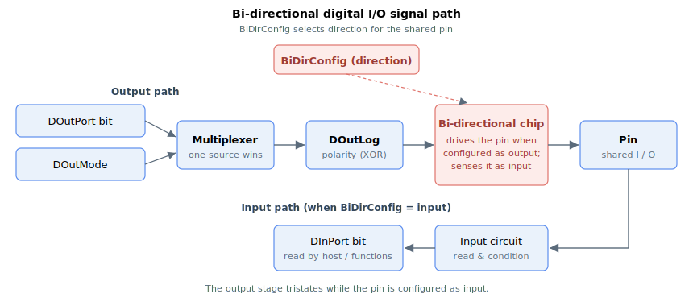

# Digital outputs

There are multiple ways to control the digital outputs.

1.  Hardware function assignment (via DOutSelect)
2.  Software function assignment (via DOutMode)
3.  Manual value assignment (via DOutPort, DOutPortSBit, DOutPortCBit, DOutPortTBit)

Digital outputs are represented by bits in a single signal variable (0-based indexing). This applies for DOutPort, DOutLog and DOutType.

| Bit \# | Corresponds to |
|--------|----------------|
| 0      | Output 1       |
| 1      | Output 2       |
| 2      | Output 3       |
| …      | …              |

For array-type keywords representing digital outputs in array indices, 1-based indexing is used. This applies for DOutMode, DOutSelect, DOutPortSBit, DOutPortCBit and DOutPortTBit.

| Index \# | Corresponds to |
|----------|----------------|
| 1        | Output 1       |
| 2        | Output 2       |
| 3        | Output 3       |
| …        | …              |

Hardware functions are executed on the hardware layer; these functions need very high frequency signal generation (i.e. 80MHz). To assign a hardware function to an output(e.g. position event, encoder emulation), DOutSelect shall be set to the desired function. DOutPort and DOutMode will be irrelevant.

Software functions are executed on the software layer; these functions do not need such a high bandwidth (i.e. 16kHz). To assign an output a software function (E.g. Motor on status / In-target status), DOutSelect shall be set to “0 – Software (using DOutMode)”. DOutMode shall be set to the desired function. DOutPort will be irrelevant.

Manual value assignment is also executed on the software layer. To manually assign an output value (E.g. output 1 on), DOutSelect shall be set to “0 – Software (using DOutMode)”. DOutMode shall be set to “0 – General output (using DOutPort)”. The bits in DOutPort shall define which outputs are turned on or off.

For single-ended digital outputs, the signal path is as shown.

The single-ended digital outputs support both sink and source mode. This is configured via DOutType.

For bi-directional differential IO’s, the signal path is as shown.

Some pins are bi-directional IO’s, they can be configured to be in output mode or input mode. In output mode, the input will still be connected, so read-back is possible. In input mode, the output is not driving the voltage.

For single direction differential outputs, ignore the BiDirConfig portion.
