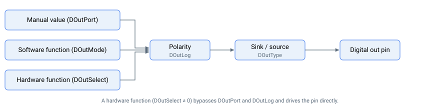
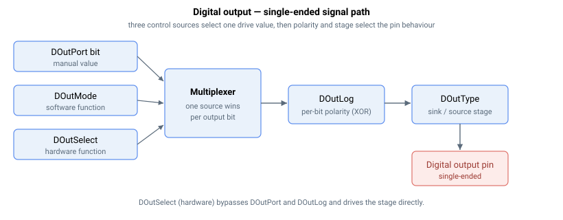
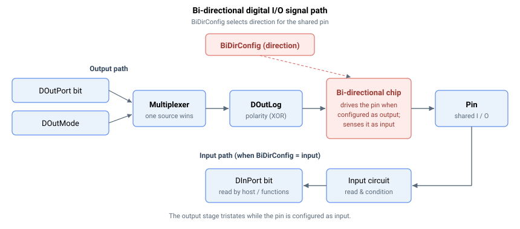

# 数字量输出

控制数字量输出有多种方式。

1.  硬件函数分配（通过 DOutSelect）
2.  软件函数分配（通过 DOutMode）
3.  手动值分配（通过 DOutPort、DOutPortSBit、DOutPortCBit、DOutPortTBit）

手动值或软件函数设置输出状态，该状态随后经过极性（DOutLog）和灌/拉电流（DOutType）级到达引脚。通过 DOutSelect 选择的硬件函数直接驱动引脚，并绕过这些级。

数字量输出由单个信号变量中的位表示（位索引从 0 开始）。这适用于 DOutPort、DOutLog 和 DOutType。

| Bit \# | Corresponds to |
|--------|----------------|
| 0      | Output 1       |
| 1      | Output 2       |
| 2      | Output 3       |
| …      | …              |

对于以数组索引表示数字量输出的数组型关键字，使用从 1 开始的索引。这适用于 DOutMode、DOutSelect、DOutPortSBit、DOutPortCBit 和 DOutPortTBit。

| Index \# | Corresponds to |
|----------|----------------|
| 1        | Output 1       |
| 2        | Output 2       |
| 3        | Output 3       |
| …        | …              |

硬件函数在硬件层执行；这些函数需要非常高频率的信号生成（即 80MHz）。要为某个输出分配硬件函数（例如位置事件、编码器仿真），应将 DOutSelect 设为所需函数。DOutPort 和 DOutMode 将不起作用。

软件函数在软件层执行；这些函数不需要如此高的带宽（即 16kHz）。要为某个输出分配软件函数（例如电机使能状态 / 到位状态），应将 DOutSelect 设为"0 – Software (using DOutMode)"。DOutMode 应设为所需函数。DOutPort 将不起作用。

手动值分配也在软件层执行。要手动为某个输出分配值（例如输出 1 开启），应将 DOutSelect 设为"0 – Software (using DOutMode)"。DOutMode 应设为"0 – General output (using DOutPort)"。DOutPort 中的各位定义哪些输出开启或关闭。

对于单端数字量输出，信号路径如图所示。

单端数字量输出同时支持灌电流和拉电流模式。这通过 DOutType 配置。

对于双向差分 IO，信号路径如图所示。

某些引脚是双向 IO，它们可配置为输出模式或输入模式。在输出模式下，输入仍保持连接，因此可以回读。在输入模式下，输出不驱动电压。

对于单向差分输出，忽略 BiDirConfig 部分。
