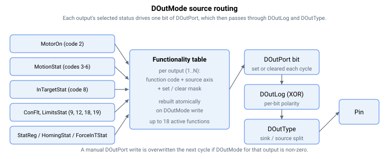

# DOutMode

将某个控制器状态映射到每个数字量输出（软件功能分配）。

## 概述

`DOutMode` 为数字量输出分配一个软件功能，使该输出反映选定的控制器状态。它仅在该输出的 [DOutSelect](DOutSelect.md) 为 `0`（软件控制）时生效。数组**索引**即输出编号（从 1 起算：`DOutMode[1]` 为输出 1）。

## 工作原理

`DOutMode` 在一个 32 位值中打包了两个字段：

- **低 16 位**选择*功能*——输出应跟随的状态；
- **高 16 位**选择读取其状态的*源轴*（A = 0、B = 1、……；`0` 也表示"本轴 / 与轴无关"，为向后兼容而保留）。源轴编号必须**小于**轴数；等于或大于该值的值将被拒绝并发出告警，该条目被忽略。

写入 `DOutMode` 不会在每个周期直接对其进行处理。而是会重建一张紧凑的**功能表**：每个低 16 位功能非零的输出都会被记录下来，包含目标 `DOutPort` 位（一个置位掩码及其取反的清除掩码）、功能码和源轴。新表会以原子方式换入，因此绝不会使用到一个构建中的半成品表。同时活动的输出功能有 **18 个**的硬性上限；超出后多余的条目会被丢弃并记录一条告警。

随后遍历该表并应用每个功能，工作分散在一个 16 周期分派帧的三个子分片中（每个子分片约六个功能），以限定每周期的开销。对于每个条目，会评估所选状态并将该输出的 [DOutPort](DOutPort.md) 位**置位**（状态为真）或**清除**（状态为假）。由于该功能驱动 `DOutPort`，因此 [DOutLog](DOutLog.md) 极性和 [DOutType](DOutType.md) 灌/拉电流路由仍会在其之上生效，与手动输出完全相同。这也意味着由 `DOutMode` 驱动的输出会覆盖你手动写入该 `DOutPort` 位的任何值。



功能码与控制器状态的映射如下：

| Value | Function | Status source (set when…) |
|-------|----------|---------------------------|
| 0 | 通用输出 – 无功能 | 输出跟随 [DOutPort](DOutPort.md) |
| 1 | 保留（专用硬件功能占位） | — |
| 2 | 电机使能状态 | 电机已使能 |
| 3 | 运动中状态 | [MotionStat](../../10-motion/05-motion-status/MotionStat.md) ≠ 0 |
| 4 | 加速中状态¹ | `MotionStat` 加速中位已置位 |
| 5 | 减速中状态¹ | `MotionStat` 减速中位已置位 |
| 6 | 匀速状态¹ | 运动中且加速位和减速位均未置位 |
| 7 | 运动结束 | 未实现 |
| 8 | 到位状态 | [InTargetStat](../../10-motion/05-motion-status/InTargetStat.md) = 已到达目标 |
| 9 | 故障/报警状态 | [ConFlt](../../07-status-and-faults/ConFlt.md) ≠ 0 |
| 10 | 上次运动中的告警 | 未实现 |
| 11 | 上次运动中的电流饱和 | 未实现 |
| 12 | 限位激活 | [LimitsStat](../../06-protections/03-motion/position-limit-protection/LimitsStat.md) ≠ 0 |
| 13 | 超出行程范围 | 整形后的位置参考 > [FwdPLim](../../06-protections/03-motion/position-limit-protection/FwdPLim.md) 或 < [RevPLim](../../06-protections/03-motion/position-limit-protection/RevPLim.md) |
| 14 | 再生激活 | [RegenUsed](../../09-current-and-voltage/05-regeneration/RegenUsed.md) ≠ 0 **且** [StatReg](../../07-status-and-faults/StatReg.md) bit 1 已置位（当 `RegenUsed = 0` 时清除） |
| 15 | 动态制动激活 | `StatReg` 动态制动位已置位 |
| 16 | 静态制动器抱闸 | `StatReg` 静态制动器抱闸请求位已置位 |
| 17 | 保留 | （某些产品上供内部看门狗使用） |
| 18 | 反向限位开关（RLS）激活 | `LimitsStat` RLS 位已置位 |
| 19 | 正向限位开关（FLS）激活 | `LimitsStat` FLS 位已置位 |
| 20 | 回零完成 | [HomingStat](../../16-homing/HomingStat.md) = 成功完成 |
| 21 | 力到位状态 | [ForceInTStat](../../08-axis-operation/04-force-operation-mode/ForceInTStat.md) = 已到达目标 |

¹ 仅对使用内置规划器的运动模式有效（例如间接脉冲/方向使用，而直接脉冲/方向不使用）。

## 示例

```text
ADOutMode[1]=2       ; output 1 follows this axis' motor-on status
ADOutMode[2]=65538   ; upper 16 bits = 1 (axis B), lower 16 bits = 2 (motor-on):
                     ;   output 2 reflects axis B's motor-on status
ADOutMode[3]=14      ; output 3 follows "regeneration active"
ADOutMode[1]=0       ; hand output 1 back to manual DOutPort control
```

### 演练：由故障驱动数字量输出

每当该轴处于故障状态时点亮数字量输出 5 上的指示灯，且灯的接线使其在激活时**熄灭**（即取反极性）。

```text
AMotorOn=0                ; configure with the motor off
ADOutSelect=0             ; (default) output 5 is under software control, not a hardware function
ADOutMode[5]=9            ; function 9 = fault/alarm status (set when ConFlt is non-zero)
ADOutLog=16               ; bit 4 set — invert output 5's final polarity for the lamp wiring
ADOutType=0               ; (default routing) — adjust per product if sink/source matters
ASave                     ; DOutMode, DOutLog and DOutType are flash-saveable
                          ; ... force a fault to test ...
AConFlt                   ; non-zero — function 9 sets DOutPort bit 4
ADOutPort                 ; read back the bit driven by the function
```

功能表分派每个周期置位/清除 `DOutPort` 位，然后 [DOutLog](DOutLog.md) 对其取反（因此无故障时灯亮，故障时灯灭），在支持该拆分的产品上 [DOutType](DOutType.md) 将其路由到选定的灌/拉电流引脚。

若要跟踪*系统级*条件而非本地轴，请使用高 16 位的轴选择器。例如 `ADOutMode[5]=65545`（`65536 + 9`）将本轴的输出 5 连接到轴 B 的故障状态。

### 边界情况

- **索引 0**——无效；有效索引为 `DOutMode[1]`–`DOutMode[16]`。`DOutMode[0]` 不存在。
- **DOutSelect ≠ 0**——**不查询** `DOutMode`；该输出由 [DOutSelect](DOutSelect.md) 选定的硬件功能驱动，与所分配的 `DOutMode` 功能无关。
- **超过 18 个活动功能**——超过硬性上限后，多余的条目会被丢弃，并在构建表时记录一条告警。
- **超范围的轴选择器**——不小于轴数的源轴编号将被拒绝并发出告警；该条目在构建表时被忽略。
- **未实现的功能**——功能码 `7`（运动结束）、`10`（告警）、`11`（电流饱和）、`17`（保留）即使被分配也不会驱动输出。
- **运动中 / 加速 / 减速**——仅对使用内置规划器的运动模式有效；直接脉冲/方向不会推进这些位。
- **对功能位的手动写入**——会在下一个周期被该功能覆盖；如果想要手动控制，请先设置 `DOutMode = 0`。
- **保存 / 复位**——可保存至闪存；该表在每次写入时以及启动时都会重建。

## 另请参阅

- [DOutSelect](DOutSelect.md) — 必须为 0，DOutMode 才会生效（否则为硬件功能）
- [DOutPort](DOutPort.md) — 功能所驱动的位（功能 0 = 手动）
- [DOutLog](DOutLog.md) — 在被驱动位之上应用的极性
- [StatReg](../../07-status-and-faults/StatReg.md) — 再生 / 制动状态位的来源
- [RegenOn](../../09-current-and-voltage/05-regeneration/RegenOn.md) — 驱动"再生激活"功能（值 14）
