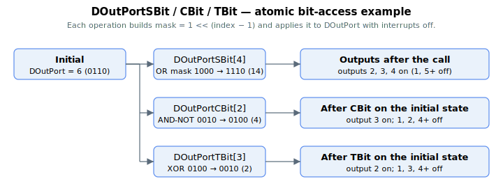

# DOutPortSBit / DOutPortCBit / DOutPortTBit

Atomic set / clear / toggle of individual DOutPort bits.

## Overview

These three array keywords change individual bits of [DOutPort](DOutPort.md) without the read-modify-write race of writing `DOutPort` directly:

- `DOutPortSBit[i]` — **sets** the bit for output *i*
- `DOutPortCBit[i]` — **clears** the bit for output *i*
- `DOutPortTBit[i]` — **toggles** the bit for output *i*

The array index is the output number (1-based: index 1 → DOutPort bit 0 → output 1).

| Index | Changes DOutPort bit # | Output |
|-------|------------------------|--------|
| 1 | 0 | Output 1 |
| 2 | 1 | Output 2 |
| 3 | 2 | Output 3 |
| … | … | … |

## How it works

Each command builds a one-bit mask `1 << (index − 1)` and applies it to `DOutPort` with the **control interrupt disabled** for the duration of the operation, then re-enables it:

| Command | Operation on DOutPort |
|---------|-----------------------|
| `DOutPortSBit[i]` | `DOutPort = DOutPort \| mask` (OR — set bit) |
| `DOutPortCBit[i]` | `DOutPort = DOutPort & ~mask` (AND-NOT — clear bit) |
| `DOutPortTBit[i]` | `DOutPort = DOutPort ^ mask` (XOR — toggle bit) |

Disabling interrupts around the read-modify-write guarantees the control interrupt cannot write `DOutPort` (for a [DOutMode](DOutMode.md) function) part-way through, so only the addressed bit changes and the others are preserved. This is the safe alternative to doing the OR/AND/XOR yourself with a plain `DOutPort` write, which the interrupt can clobber between your read and write. The change still passes through [DOutLog](DOutLog.md) polarity and [DOutType](DOutType.md) routing before reaching the pin.

These operate on the manual output bit, so the addressed output should be under software manual control ([DOutSelect](DOutSelect.md)`[i] = 0` and [DOutMode](DOutMode.md)`[i] = 0`); otherwise a function or hardware route will overwrite the bit on the next cycle.

## Examples

Starting from `DOutPort = 6` (`0b0110`):

| Command | Operation | Result |
|---------|-----------|--------|
| `DOutPortSBit[4]` | set bit 3 | 14 (`0b1110`) |
| `DOutPortCBit[2]` | clear bit 1 | 4 (`0b0100`) |
| `DOutPortTBit[3]` | toggle bit 2 | 2 (`0b0010`) |

### Edge cases

- **Output under software control required** — these operate on the `DOutPort` bit; if the addressed output is driven by a function ([DOutMode](DOutMode.md)`[i] ≠ 0`) or hardware route ([DOutSelect](DOutSelect.md)`[i] ≠ 0`), the function/route rewrites the bit on the next control cycle and the manual change is lost.
- **Motor on/off** — these operations are independent of `MotorOn`; the bit is set/cleared/toggled regardless of servo state.
- **Mode independence** — these operations are independent of [OperationMode](../../08-axis-operation/01-general-keywords/OperationMode.md) and are accepted while in motion.
- **Out-of-range index** — `index − 1` is shifted left into a 32-bit word; indices outside the physical output range still execute the bitwise operation but address a non-routed bit.
- **Inverted output** ([DOutLog](DOutLog.md) bit set for this output) — the polarity inversion is applied after the manual bit value reaches the pin, so a "set" command can produce a low pin level.
- **Simulation** — operates the same way; no hardware effect.

## See also

- [DOutPort](DOutPort.md) — the underlying output bitfield these modify
- [DOutLog](DOutLog.md) — polarity applied to the resulting bit
- [DOutSelect](DOutSelect.md) / [DOutMode](DOutMode.md) — must be 0 for the bit to stay under manual control
