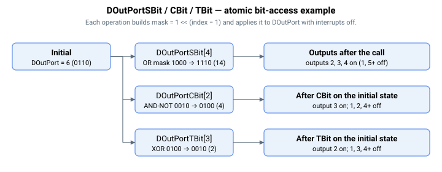

# DOutPortSBit / DOutPortCBit / DOutPortTBit

对各个 DOutPort 位进行原子的置位 / 清除 / 翻转。

## 概述

这三个数组关键字可更改 [DOutPort](DOutPort.md) 的各个位，而不会带来直接写入 `DOutPort` 时的读—改—写竞争：

- `DOutPortSBit[i]` — **置位**输出 *i* 的位
- `DOutPortCBit[i]` — **清除**输出 *i* 的位
- `DOutPortTBit[i]` — **翻转**输出 *i* 的位

数组索引即输出编号（从 1 起算：索引 1 → DOutPort bit 0 → 输出 1）。

| Index | Changes DOutPort bit # | Output |
|-------|------------------------|--------|
| 1 | 0 | Output 1 |
| 2 | 1 | Output 2 |
| 3 | 2 | Output 3 |
| … | … | … |

## 工作原理

每条命令构建一个单位掩码 `1 << (index − 1)`，并在操作期间**禁用控制中断**的情况下将其应用于 `DOutPort`，然后重新启用中断：

| Command | Operation on DOutPort |
|---------|-----------------------|
| `DOutPortSBit[i]` | `DOutPort = DOutPort \| mask` (OR — set bit) |
| `DOutPortCBit[i]` | `DOutPort = DOutPort & ~mask` (AND-NOT — clear bit) |
| `DOutPortTBit[i]` | `DOutPort = DOutPort ^ mask` (XOR — toggle bit) |

在读—改—写期间禁用中断可保证控制中断无法中途写入 `DOutPort`（用于 [DOutMode](DOutMode.md) 功能），因此只有所寻址的位发生改变，其他位得以保留。这是自行用普通 `DOutPort` 写入执行 OR/AND/XOR 的安全替代方案，后者可能在你的读和写之间被中断破坏。该更改在到达引脚之前仍会经过 [DOutLog](DOutLog.md) 极性和 [DOutType](DOutType.md) 路由。

这些操作作用于手动输出位，因此所寻址的输出应处于软件手动控制下（[DOutSelect](DOutSelect.md)`[i] = 0` 且 [DOutMode](DOutMode.md)`[i] = 0`）；否则功能或硬件路由会在下一个周期覆盖该位。

## 示例

从 `DOutPort = 6`（`0b0110`）开始：

| Command | Operation | Result |
|---------|-----------|--------|
| `DOutPortSBit[4]` | set bit 3 | 14 (`0b1110`) |
| `DOutPortCBit[2]` | clear bit 1 | 4 (`0b0100`) |
| `DOutPortTBit[3]` | toggle bit 2 | 2 (`0b0010`) |

### 边界情况

- **要求处于软件控制下的输出**——这些操作作用于 `DOutPort` 位；如果所寻址的输出由功能（[DOutMode](DOutMode.md)`[i] ≠ 0`）或硬件路由（[DOutSelect](DOutSelect.md)`[i] ≠ 0`）驱动，则该功能/路由会在下一个控制周期重写该位，手动更改将丢失。
- **电机使能/失能**——这些操作与 `MotorOn` 无关；无论伺服状态如何，该位都会被置位/清除/翻转。
- **模式无关性**——这些操作与 [OperationMode](../../08-axis-operation/01-general-keywords/OperationMode.md) 无关，并且在运动中也被接受。
- **超范围索引**——索引为 0，或高于该关键字数组边界（> array_size − 1）的索引，将被拒绝并报超范围错误，且不执行位操作。在 central-i 上，处于数组边界内但超出所连接远程单元物理输出数量的索引会被接受并执行，寻址的是一个未路由到物理引脚的位。
- **取反的输出**（此输出的 [DOutLog](DOutLog.md) 位已置位）——极性取反是在手动位值到达引脚之后应用的，因此"置位"命令可能产生低电平引脚。
- **仿真**——以相同方式运行；无硬件效果。

## 另请参阅

- [DOutPort](DOutPort.md) — 这些命令所修改的底层输出位域
- [DOutLog](DOutLog.md) — 应用于所得位的极性
- [DOutSelect](DOutSelect.md) / [DOutMode](DOutMode.md) — 必须为 0，该位才会保持手动控制
