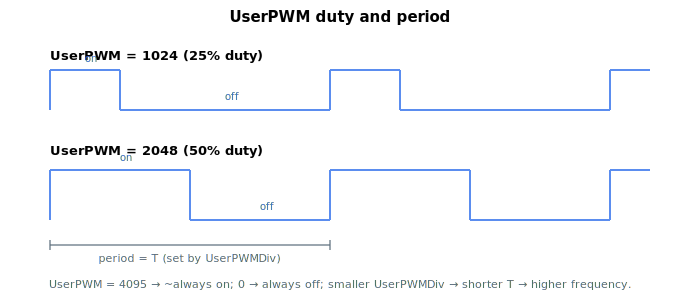

# UserPWM

Duty cycle of each user-controlled PWM output channel.

## Overview

`UserPWM` sets the duty cycle of the user PWM output channels — one element per channel (two channels). The value is the on-time as a fraction of the PWM period over a **12-bit** range (0–4095): `0` = always off, `4095` ≈ always on, `2048` ≈ 50%. The period (and hence frequency) is set by [UserPWMDiv](UserPWMDiv.md). To drive a PWM signal on a physical output, route the channel to that output with [DOutSelect](DOutSelect.md) (the UserPWM 1 / UserPWM 2 selector codes). Saved to flash.

## How it works

The PWM waveform is generated in hardware, not by the control loop. When you write `UserPWM` (or `UserPWMDiv`), the new duty value is applied to that channel immediately — on a standalone controller directly, on central-i by sending it to the remote unit. From then on the waveform is produced continuously in hardware at the configured frequency, independent of the control-loop rate, so the duty resolution and edge timing are not limited by the loop sample time.

A `UserPWM` channel only appears on a pin once that pin's [DOutSelect](DOutSelect.md) is set to the matching UserPWM code; until then the channel runs internally but is not routed out. Because the signal is a hardware function, the [DOutPort](DOutPort.md) / [DOutMode](DOutMode.md) value for that output is irrelevant.



## Examples

```text
AUserPWM[1]=2048     ; ~50% duty cycle on PWM channel 1
AUserPWM[2]=1024     ; ~25% duty cycle on PWM channel 2
AUserPWM[1]          ; read channel 1 duty
```

### Edge cases

- **Index 0** — invalid; valid indices are `UserPWM[1]` and `UserPWM[2]`. `UserPWM[0]` does not exist.
- **Out of range** — values outside `0`–`4095` are rejected.
- **Channel not routed** — without [DOutSelect](DOutSelect.md) set to the matching UserPWM code, the channel runs internally but never reaches a pin.
- **`UserPWMDiv` shared** — both channels share the same period; you cannot give them different frequencies.
- **Boundary values** — `0` produces a constant-low pin; `4095` produces a near-constant-high pin (one sample of low per cycle to keep the duty-cycle representable).
- **Motor on/off** — independent of `MotorOn`.
- **Save** — flash-saveable; reapplied to the hardware at boot.

## See also

- [UserPWMDiv](UserPWMDiv.md) — PWM period / frequency shared by both channels
- [DOutSelect](DOutSelect.md) — route a PWM channel to an output (UserPWM 1 / 2 codes)
