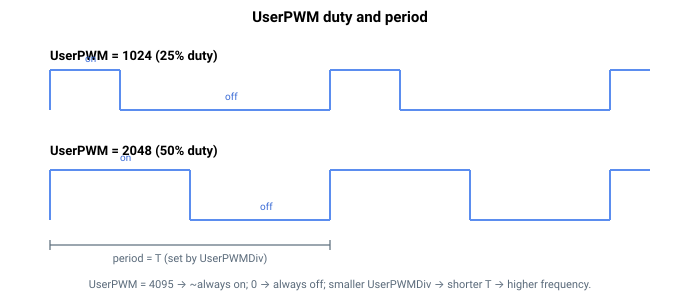

# UserPWM

每个用户控制的 PWM 输出通道的占空比。

## 概述

`UserPWM` 设置用户 PWM 输出通道的占空比——每个通道对应一个元素（共两个通道）。该值为导通时间占 PWM 周期的比例，采用 **12 位**范围（0–4095）：`0` = 始终关断，`4095` ≈ 始终导通，`2048` ≈ 50%。周期（从而频率）由 [UserPWMDiv](UserPWMDiv.md) 设置。要在某个物理输出上驱动 PWM 信号，请用 [DOutSelect](DOutSelect.md) 将该通道路由到该输出（UserPWM 1 / UserPWM 2 选择器代码）。保存至闪存。

## 工作原理

PWM 波形在硬件中生成，而非由控制环生成。当你写入 `UserPWM`（或 `UserPWMDiv`）时，新的占空比值会立即应用于该通道——在独立式控制器上直接应用，在 central-i 上通过发送至远程单元应用。此后，波形以所配置的频率在硬件中连续产生，独立于控制环速率，因此占空比分辨率和边沿时序不受控制环采样时间的限制。

某 `UserPWM` 通道只有在该引脚的 [DOutSelect](DOutSelect.md) 被设置为匹配的 UserPWM 代码后才会出现在该引脚上；在此之前，该通道在内部运行但不被路由输出。由于该信号是硬件功能，该输出的 [DOutPort](DOutPort.md) / [DOutMode](DOutMode.md) 值无效。



## 示例

```text
AUserPWM[1]=2048     ; ~50% duty cycle on PWM channel 1
AUserPWM[2]=1024     ; ~25% duty cycle on PWM channel 2
AUserPWM[1]          ; read channel 1 duty
```

### 边界情况

- **索引 0**——无效；有效索引为 `UserPWM[1]` 和 `UserPWM[2]`。`UserPWM[0]` 不存在。
- **超出范围**——`0`–`4095` 之外的值会被拒绝。
- **通道未路由**——若未将 [DOutSelect](DOutSelect.md) 设置为匹配的 UserPWM 代码，该通道在内部运行但永远不会到达引脚。
- **`UserPWMDiv` 共享**——两个通道共享同一周期；无法为它们设置不同的频率。
- **边界值**——`0` 产生恒定低电平引脚；`4095` 产生近乎恒定高电平的引脚（每周期有一个采样为低，以保持占空比可表示）。
- **电机使能/失能**——与 `MotorOn` 无关。
- **保存**——可保存至闪存；启动时重新应用到硬件。

## 另请参阅

- [UserPWMDiv](UserPWMDiv.md)——两个通道共享的 PWM 周期/频率
- [DOutSelect](DOutSelect.md)——将 PWM 通道路由到输出（UserPWM 1 / 2 代码）
