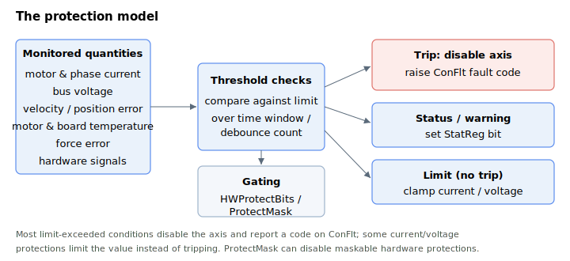

# Protections

Keywords that protect the motor, amplifier, and machine by limiting operation and tripping faults when limits are exceeded. Each protection monitors a quantity, checks it against a limit (often over a time window or debounce count), and on a trip disables the axis and raises a [ConFlt](../07-status-and-faults/ConFlt.md) fault code and/or sets a [StatReg](../07-status-and-faults/StatReg.md) status bit. Which hardware protections are active is gated by [HWProtectBits](01-general-protection/HWProtectBits.md) / [ProtectMask](01-general-protection/ProtectMask.md).

The category is organised by what is protected:

- **General protection** — which hardware protections are active and enabled ([HWProtectBits](01-general-protection/HWProtectBits.md), [ProtectMask](01-general-protection/ProtectMask.md)).
- **Current and voltage** — current limiting via the I²t scheme ([ContCL](02-current-and-voltage/ContCL.md) / [PeakCL](02-current-and-voltage/PeakCL.md) / [PeakTime](02-current-and-voltage/PeakTime.md)), current-command limits ([CurrLimMode](02-current-and-voltage/CurrLimMode.md), [CurrLimFwd](02-current-and-voltage/CurrLimFwd.md), [CurrLimRev](02-current-and-voltage/CurrLimRev.md)), over-current trips ([MaxMotorCurr](02-current-and-voltage/MaxMotorCurr.md), [MaxPhaseCurr](02-current-and-voltage/MaxPhaseCurr.md)), bus-voltage limits ([MinVBus](02-current-and-voltage/MinVBus.md) / [MaxVBus](02-current-and-voltage/MaxVBus.md) / [MaxVBusTime](02-current-and-voltage/MaxVBusTime.md) / [MaxVBusAbs](02-current-and-voltage/MaxVBusAbs.md)), plus [MaxPWM](02-current-and-voltage/MaxPWM.md) and [PowerSupply](02-current-and-voltage/PowerSupply.md).
- **Motion** — velocity/acceleration and following-error limits, software travel limits, and stuck/stall detection (see the sub-groups: general-maximum-limits, position-limit-protection, motor-stuck-protection, dual-loop-stuck-protection, stepper-stall-protection).
- **Force control** — force-error limits ([MaxForceErr](04-force-control/MaxForceErr.md), [MaxForceErrOL](04-force-control/MaxForceErrOL.md)).
- **Motor temperature** — sensor selection and over-temperature limit ([MotorTempUsed](05-motor-temperature/MotorTempUsed.md), [MotorTemp](05-motor-temperature/MotorTemp.md), [MaxMotorTemp](05-motor-temperature/MaxMotorTemp.md)).
- **Brake** — [dynamic](06-brake/Dynamicbrake.md) (electrical) and [static](06-brake/Staticbrake.md) (holding) braking.
- **Board temperature** — board and power-stage temperature ([BoardTemp](07-board-temperature/BoardTemp.md), [PwrTemp](07-board-temperature/PwrTemp.md), [MaxPwrTemp](07-board-temperature/MaxPwrTemp.md)).

Most limit-exceeded conditions disable the axis and report a code to [ConFlt](../07-status-and-faults/ConFlt.md); some current/voltage protections (notably [PeakCL](02-current-and-voltage/PeakCL.md) saturation, the [CurrLimMode](02-current-and-voltage/CurrLimMode.md) clamps, and [MaxPWM](02-current-and-voltage/MaxPWM.md)) *limit* the value rather than tripping. The position-limit protections ([FwdPLim](03-motion/position-limit-protection/FwdPLim.md) / [RevPLim](03-motion/position-limit-protection/RevPLim.md) and [LimitsStat](03-motion/position-limit-protection/LimitsStat.md)) do not raise a fault either — they trigger a controlled deceleration and record the cause in [MotionReason](../10-motion/05-motion-status/MotionReason.md).

After a trip, diagnose using the snapshot pair [ConFltSnapSrc](../07-status-and-faults/ConFltSnapSrc.md) / [ConFltSnapVal](../07-status-and-faults/ConFltSnapVal.md) and the unit-wide [ErrLog](../07-status-and-faults/ErrLog.md); the [MotorReason](../07-status-and-faults/MotorReason.md) keyword distinguishes a controller fault from a deliberate disable. See [Controller error codes](../../04-error-codes/controller-error-codes.md) for the meaning of each ConFlt code.
