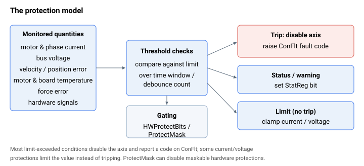

# 保护

通过限制运行并在超出限值时触发故障，来保护电机、驱动器与机器的关键字。每项保护都会监测某个量，将其与限值进行比较（通常基于一段时间窗口或消抖计数），并在跳闸时禁用轴，同时触发 [ConFlt](../07-status-and-faults/ConFlt.md) 故障码和/或置位 [StatReg](../07-status-and-faults/StatReg.md) 状态位。哪些硬件保护处于激活状态由 [HWProtectBits](01-general-protection/HWProtectBits.md) / [ProtectMask](01-general-protection/ProtectMask.md) 控制。

本类别按保护对象进行组织：

- **General protection（通用保护）** — 哪些硬件保护处于激活并启用状态（[HWProtectBits](01-general-protection/HWProtectBits.md)、[ProtectMask](01-general-protection/ProtectMask.md)）。
- **Current and voltage（电流与电压）** — 通过 I²t 方案进行电流限制（[ContCL](02-current-and-voltage/ContCL.md) / [PeakCL](02-current-and-voltage/PeakCL.md) / [PeakTime](02-current-and-voltage/PeakTime.md)）、电流指令限值（[CurrLimMode](02-current-and-voltage/CurrLimMode.md)、[CurrLimFwd](02-current-and-voltage/CurrLimFwd.md)、[CurrLimRev](02-current-and-voltage/CurrLimRev.md)）、过流跳闸（[MaxMotorCurr](02-current-and-voltage/MaxMotorCurr.md)、[MaxPhaseCurr](02-current-and-voltage/MaxPhaseCurr.md)）、母线电压限值（[MinVBus](02-current-and-voltage/MinVBus.md) / [MaxVBus](02-current-and-voltage/MaxVBus.md) / [MaxVBusTime](02-current-and-voltage/MaxVBusTime.md) / [MaxVBusAbs](02-current-and-voltage/MaxVBusAbs.md)），以及 [MaxPWM](02-current-and-voltage/MaxPWM.md) 和 [PowerSupply](02-current-and-voltage/PowerSupply.md)。
- **Motion（运动）** — 速度/加速度与跟随误差限值、软件运动限位，以及堵转/失步检测（参见各子组：general-maximum-limits、position-limit-protection、motor-stuck-protection、dual-loop-stuck-protection、stepper-stall-protection）。
- **Force control（力控制）** — 力误差限值（[MaxForceErr](04-force-control/MaxForceErr.md)、[MaxForceErrOL](04-force-control/MaxForceErrOL.md)）。
- **Motor temperature（电机温度）** — 传感器选择与过温限值（[MotorTempUsed](05-motor-temperature/MotorTempUsed.md)、[MotorTemp](05-motor-temperature/MotorTemp.md)、[MaxMotorTemp](05-motor-temperature/MaxMotorTemp.md)）。
- **Brake（制动器）** — [动态](06-brake/Dynamicbrake.md)（电气）与[静态](06-brake/Staticbrake.md)（保持）制动。
- **Board temperature（板温度）** — 板与功率级温度（[BoardTemp](07-board-temperature/BoardTemp.md)、[PwrTemp](07-board-temperature/PwrTemp.md)、[MaxPwrTemp](07-board-temperature/MaxPwrTemp.md)）。
- **Anomaly detection（异常检测）** — 碰撞/异常检测，它学习一次运动的预期信号分段，并在出现超出分段的采样时，要么发出受控停止指令，要么以 [ConFlt](../07-status-and-faults/ConFlt.md) 码 1067 禁用轴（[AnomDtctOn](08-anomaly-detection/AnomDtctOn.md)、[AnomDtctCnfg](08-anomaly-detection/AnomDtctCnfg.md)、[AnomDtctUL](08-anomaly-detection/AnomDtctUL.md)/[AnomDtctLL](08-anomaly-detection/AnomDtctLL.md)、[AnomDtctGap](08-anomaly-detection/AnomDtctGap.md)、[AnomDtctSt](08-anomaly-detection/AnomDtctSt.md)）；自 v5（central-i）起可用。

大多数超限条件会禁用轴并向 [ConFlt](../07-status-and-faults/ConFlt.md) 报告一个码；某些电流/电压保护（尤其是 [PeakCL](02-current-and-voltage/PeakCL.md) 饱和、[CurrLimMode](02-current-and-voltage/CurrLimMode.md) 钳位，以及 [MaxPWM](02-current-and-voltage/MaxPWM.md)）会*限制*该值而非跳闸。位置限位保护（[FwdPLim](03-motion/position-limit-protection/FwdPLim.md) / [RevPLim](03-motion/position-limit-protection/RevPLim.md) 和 [LimitsStat](03-motion/position-limit-protection/LimitsStat.md)）也不会触发故障——它们会触发受控减速，并将原因记录在 [MotionReason](../10-motion/05-motion-status/MotionReason.md) 中。[异常检测](08-anomaly-detection/00-overview.md)也可配置为发出受控停止指令，而非以 [ConFlt](../07-status-and-faults/ConFlt.md) 码 1067 禁用轴。

跳闸后，可使用快照对 [ConFltSnapSrc](../07-status-and-faults/ConFltSnapSrc.md) / [ConFltSnapVal](../07-status-and-faults/ConFltSnapVal.md) 以及单元级 [ErrLog](../07-status-and-faults/ErrLog.md) 进行诊断；[MotorReason](../07-status-and-faults/MotorReason.md) 关键字可区分控制器故障与有意禁用。各 ConFlt 码的含义参见 [Controller error codes](../../04-error-codes/controller-error-codes.md)。
