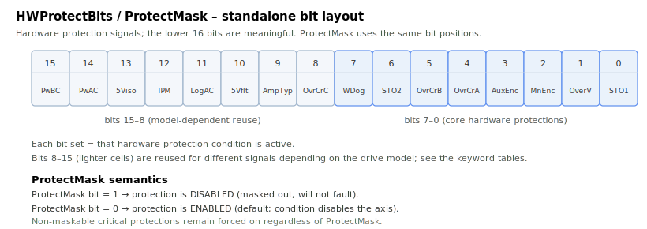
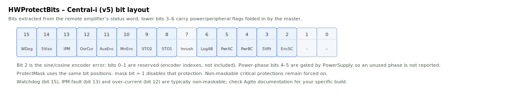

# HWProtectBits

Read-only bitfield reporting active hardware protection conditions.

## Overview

`HWProtectBits` is a read-only bitfield reporting the live state of the drive's hardware protection signals. Each bit corresponds to one hardware fault source (over-current, encoder fault, watchdog, STO/safety inputs, missing power phases, and so on). It is axis-scoped, updated every control cycle, and not saved to flash.

Which of these conditions are actually allowed to disable the axis is selected by [ProtectMask](ProtectMask.md); `HWProtectBits` itself only *reports*. The value captured at the moment of a fault is also stored in the diagnostic snapshot ([ConFltSnapVal](../../07-status-and-faults/ConFltSnapVal.md) records `HWProtectBits` as one of its fixed fields).



## How it works

Each control cycle the drive samples its hardware protection signals into this bitfield. The bit assignment differs between the two hardware families:

- **Standalone (AG300):** the lower 16 bits are meaningful.
- **Central-i (v5):** the bits are extracted from the remote amplifier's status word (the fault status bits, excluding the encoder-index bits), so the bit positions follow the Central-i layout shown in the second table below.

### Standalone (AG300) bit table

| Bit | Mask | Condition |
|-----|------|-----------|
| 0 | 0x0001 | STO1 (safe-torque-off input 1) active |
| 1 | 0x0002 | Linear-amplifier over-voltage / inrush-resistor in use (hardware-dependent reuse of this bit) |
| 2 | 0x0004 | Main-encoder error |
| 3 | 0x0008 | Auxiliary-encoder error |
| 4 | 0x0010 | Over-current, phase A |
| 5 | 0x0020 | Over-current, phase B |
| 6 | 0x0040 | STO2 / VCC-drive (or STO2 on AG100) |
| 7 | 0x0080 | Hardware watchdog |
| 8 | 0x0100 | Linear-amplifier continuous over-current / over-current phase C (hardware-dependent) |
| 9 | 0x0200 | Linear/PWM amplifier-type conflict or amplifier-type error |
| 10 | 0x0400 | 5 V supply fault (encoder / I/O 5 V current limit) |
| 11 | 0x0800 | Logic AC present (AG100) |
| 12 | 0x1000 | IPM fault (AG100) |
| 13 | 0x2000 | 5 V isolated supply (AG100) |
| 14 | 0x4000 | Power AC, A&ndash;C phases (AG100) |
| 15 | 0x8000 | Power AC, B&ndash;C phases (AG100) |

Bits 8&ndash;15 are reused for different signals depending on the drive model (AG100 vs. linear-amplifier vs. other build variants); the meaning shown is for the common build.

### Central-i (v5) bit table

| Bit | Mask | Condition |
|-----|------|-----------|
| 7 | 0x0080 | Inrush resistor still engaged (motor-on not yet allowed) |
| 8 | 0x0100 | STO1 active |
| 9 | 0x0200 | STO2 / VCC-drive |
| 10 | 0x0400 | Main-encoder error |
| 11 | 0x0800 | Auxiliary-encoder error |
| 12 | 0x1000 | Over-current |
| 13 | 0x2000 | IPM fault |
| 14 | 0x4000 | 5 V isolated supply fault |
| 15 | 0x8000 | Watchdog |



The Central-i status word additionally carries power-phase / logic-power flags that are folded into `HWProtectBits` (B&ndash;C power phase missing 0x10, A&ndash;C power phase missing 0x20, A&ndash;B logic power missing 0x40, peripheral 5 V fault 0x08). The power-related bits are treated specially: they are gated by the declared [PowerSupply](../02-current-and-voltage/PowerSupply.md) type, so a phase that the supply does not use is not reported as missing.

When an enabled bit (see [ProtectMask](ProtectMask.md)) is set, the axis is disabled and the matching [ConFlt](../../07-status-and-faults/ConFlt.md) code is raised — for example a 5 V-fault bit raises fault code 1047 (5 V supply fault), STO1 raises the STO fault, and an over-current bit raises an over-current fault. See [Controller error codes](../../../04-error-codes/controller-error-codes.md) for the full mapping.

## Examples

```text
AHWProtectBits      ; read the active hardware protection conditions
```

Test a specific condition by masking: on a standalone drive, "STO1 active" is `AHWProtectBits & 0x0001`, and "main-encoder error" is `AHWProtectBits & 0x0004`.

## See also

- [ProtectMask](ProtectMask.md) — selects which of these bits are allowed to fault the axis
- [ConFlt](../../07-status-and-faults/ConFlt.md) — fault code raised when an enabled protection bit sets
- [ConFltSnapVal](../../07-status-and-faults/ConFltSnapVal.md) — captures `HWProtectBits` at the moment of a fault
- [PowerSupply](../02-current-and-voltage/PowerSupply.md) — gates the power-phase bits
- [Controller error codes](../../../04-error-codes/controller-error-codes.md) — meaning of each fault code
