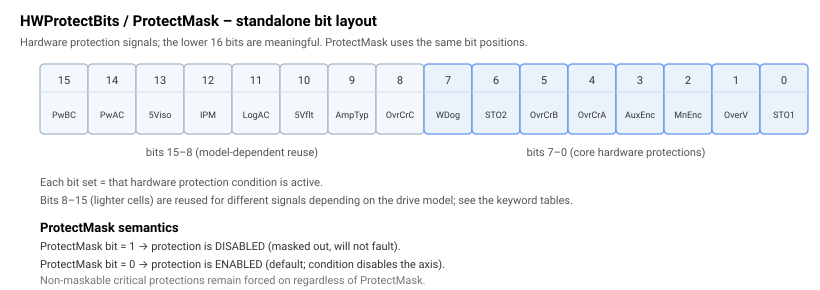
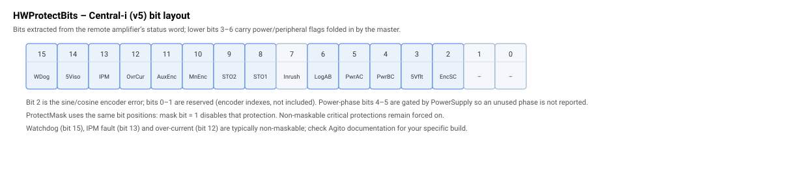

# HWProtectBits

只读位域，报告处于激活状态的硬件保护条件。

## 概述

`HWProtectBits` 是一个只读位域，报告驱动器硬件保护信号的实时状态。每一位对应一个硬件故障源（过流、编码器故障、看门狗、STO/安全输入、缺失电源相等等）。它是轴作用域的，每个控制周期更新一次，且不保存至闪存。

这些条件中实际允许哪些禁用轴由 [ProtectMask](ProtectMask.md) 选择；`HWProtectBits` 本身仅作*报告*。故障发生时刻捕获的值也会存入诊断快照（[ConFltSnapVal](../../07-status-and-faults/ConFltSnapVal.md) 将 `HWProtectBits` 记录为其固定字段之一）。



## 工作原理

每个控制周期，驱动器将其硬件保护信号采样到该位域中。两个硬件系列的位分配不同：

- **Standalone (AG300)：** 低 16 位有意义。
- **Central-i (v5)：** 这些位是从远程驱动器的状态字中提取的（故障状态位，不含编码器索引位），因此位位置遵循下方第二个表所示的 Central-i 布局。

### Standalone (AG300) 位表

| Bit | Mask | Condition |
|-----|------|-----------|
| 0 | 0x0001 | STO1（安全转矩关断输入 1）激活 |
| 1 | 0x0002 | 线性驱动器过压 / 浪涌电阻使用中（该位的硬件相关复用） |
| 2 | 0x0004 | 主编码器错误 |
| 3 | 0x0008 | 辅助编码器错误 |
| 4 | 0x0010 | 过流，A 相 |
| 5 | 0x0020 | 过流，B 相 |
| 6 | 0x0040 | STO2 / VCC-drive（或 AG100 上的 STO2） |
| 7 | 0x0080 | 硬件看门狗 |
| 8 | 0x0100 | 线性驱动器连续过流 / C 相过流（硬件相关） |
| 9 | 0x0200 | 线性/PWM 驱动器类型冲突或驱动器类型错误 |
| 10 | 0x0400 | 5 V 电源故障（编码器 / I/O 5 V 限流） |
| 11 | 0x0800 | 逻辑 AC 存在（AG100） |
| 12 | 0x1000 | IPM 故障（AG100） |
| 13 | 0x2000 | 5 V 隔离电源（AG100） |
| 14 | 0x4000 | 功率 AC，A&ndash;C 相（AG100） |
| 15 | 0x8000 | 功率 AC，B&ndash;C 相（AG100） |

位 8&ndash;15 根据驱动器型号（AG100 与线性驱动器与其他构建变体）复用于不同信号；所示含义针对通用构建。

### Central-i (v5) 位表

| Bit | Mask | Condition |
|-----|------|-----------|
| 2 | 0x0004 | 编码器正弦/余弦错误 |
| 7 | 0x0080 | 浪涌电阻仍接入（尚不允许电机使能） |
| 8 | 0x0100 | STO1 激活 |
| 9 | 0x0200 | STO2 / VCC-drive |
| 10 | 0x0400 | 主编码器错误 |
| 11 | 0x0800 | 辅助编码器错误 |
| 12 | 0x1000 | 过流 |
| 13 | 0x2000 | IPM 故障 |
| 14 | 0x4000 | 5 V 隔离电源故障 |
| 15 | 0x8000 | 看门狗 |



Central-i 状态字还携带了折叠进 `HWProtectBits` 的电源相 / 逻辑电源标志（正弦/余弦编码器错误 0x04、外设 5 V 故障 0x08、缺失 B&ndash;C 功率相 0x10、缺失 A&ndash;C 功率相 0x20、缺失 A&ndash;B 逻辑电源 0x40）。这些电源相关位被特殊处理：它们受所声明的 [PowerSupply](../02-current-and-voltage/PowerSupply.md) 类型控制，因此电源不使用的相不会被报告为缺失。远程状态的位 0&ndash;1 是编码器索引标志，会被屏蔽（不属于 `HWProtectBits`）。

当已启用的位（参见 [ProtectMask](ProtectMask.md)）被置位时，轴被禁用，并触发对应的 [ConFlt](../../07-status-and-faults/ConFlt.md) 码——例如 5 V 故障位触发 ConFlt 码 1047（5 V 电源故障），STO1 触发 ConFlt 码 1024（STO1 已激活），STO2/VCC 触发 ConFlt 码 1034，看门狗触发 ConFlt 码 1004，过流位触发 ConFlt 码 1025（电机 A）、1036（电机 B）或 1059（电机 C），缺失 AC 相触发 ConFlt 码 1054。完整映射参见 [Controller error codes](../../../04-error-codes/controller-error-codes.md)。

### 当多个位同时被置位时

只要**任何**已启用的位被置位，轴会立即被禁用，但 [ConFlt](../../07-status-and-faults/ConFlt.md) 仅报告**单个**码。每个保护条件按固定顺序独立评估，且每次匹配都会覆盖 `ConFlt` 值，因此当多个条件同时激活时，该顺序中最后一个就是你看到的码。`ConFlt` 因而标识了激活条件中的*某一个*，不一定是最先置位或最严重的那个。要查看故障时激活的全部条件，请读取 `HWProtectBits` 本身（每个激活位都存在），或读取诊断快照 [ConFltSnapVal](../../07-status-and-faults/ConFltSnapVal.md)`[11]`，它保存了故障发生时刻捕获的完整位域。

在 AG100（单通道）驱动器上，STO2 条件（ConFlt 码 1052）也会驱动 IPM 故障输入，因此 STO2 被最后评估，以确保真实的 STO2 事件被报告为 STO2 而非 IPM 故障（ConFlt 码 1027）。在该硬件上，如果 STO2 与 IPM 故障位都被置位，`ConFlt` 显示 1052。

### 边界情况

- **电机失能：** 这些位会每个控制周期持续根据实时硬件信号更新，但将置位的位转换为禁用轴的 [ConFlt](../../07-status-and-faults/ConFlt.md) 的步骤仅在轴使能（电机使能）时运行，不在仿真中运行，也不在位置驱动型驱动器上运行。因此在电机失能时，某个条件可能在 `HWProtectBits` 中可见而尚未使轴故障。当你下次尝试电机使能时，仍存在的条件会在使能请求时被重新检查：如果某个锁存的硬件保护位仍被置位，则使能被拒绝并返回对应的 `ConFlt` 码，因此仍处于置位状态的锁存 STO/编码器/看门狗/IPM 条件会阻止下一次电机使能，直到底层信号清除。
- **模式相关性：** 硬件保护采样在每个控制采样上运行，与运行模式无关。
- **[PowerSupply](../02-current-and-voltage/PowerSupply.md) 对电源相的屏蔽：** AC 相位受所声明的电源类型控制。当 `PowerSupply = 2`（DC）时，AC 相位被抑制；当 `PowerSupply = 1`（单相）时，仅检查 B–C 相位；当 `PowerSupply = 3`（三相）时，A–C 与 B–C 均被检查。
- **跨硬件变体的位复用：** 位 8–15 的含义在 AG100（单通道）、线性驱动器及其他构建变体之间不同——请通过产品数据表确认你的硬件上每一位报告的是哪个信号。
- **Central-i 上的位 0–1：** 编码器索引位会从 `HWProtectBits` 中屏蔽，即使它们出现在远程状态字中。
- **快照：** 故障发生时刻的值作为固定槽位捕获在 [ConFltSnapVal](../../07-status-and-faults/ConFltSnapVal.md)`[11]` 中。

## 示例

```text
AHWProtectBits      ; read the active hardware protection conditions
```

通过掩码测试特定条件：在 standalone 驱动器上，“STO1 激活”为 `AHWProtectBits & 0x0001`，“主编码器错误”为 `AHWProtectBits & 0x0004`。

## 另请参阅

- [ProtectMask](ProtectMask.md) — 选择允许其中哪些位使轴故障
- [ConFlt](../../07-status-and-faults/ConFlt.md) — 已启用的保护位置位时触发的故障码
- [ConFltSnapVal](../../07-status-and-faults/ConFltSnapVal.md) — 在故障发生时刻捕获 `HWProtectBits`
- [PowerSupply](../02-current-and-voltage/PowerSupply.md) — 控制电源相位
- [Controller error codes](../../../04-error-codes/controller-error-codes.md) — 各故障码的含义
