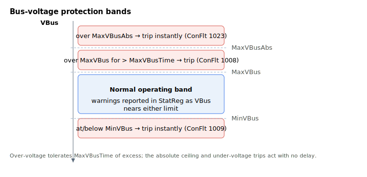
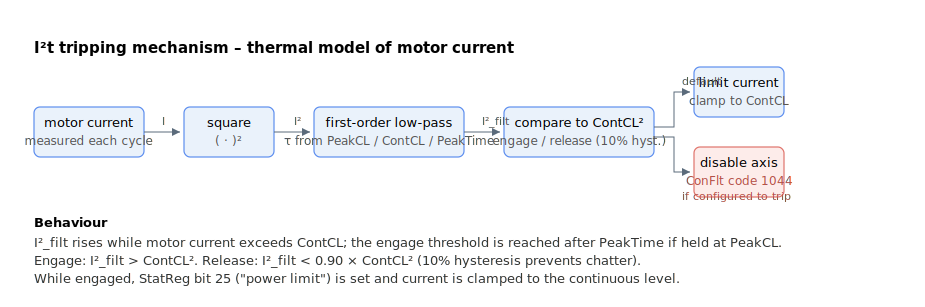
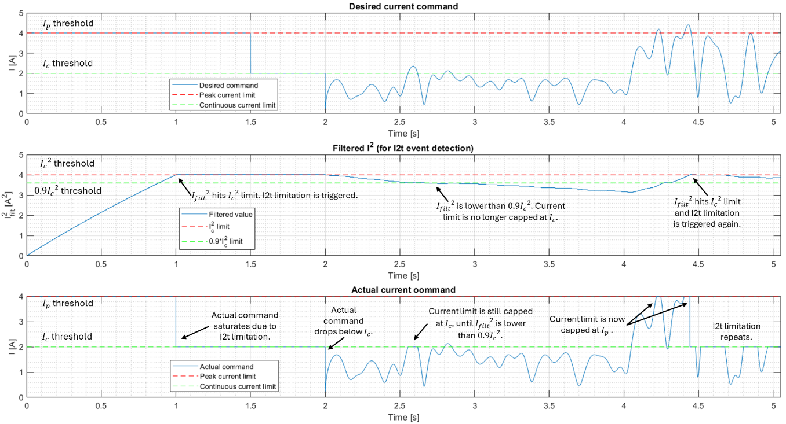

# Current and voltage

Agito controller has several current and voltage protection mechanisms.

| No. | Protection mechanisms |
|---|---|
| 1 | **Limitation of the current command** Current command (CurrRef) is limited at peak current limit (PeakCL) by default. User can overwrite this saturation limit by using CurrLimMode and relevant parameters. |
| 2 | **I2t protection** I2t protection protects the motor and amplifier from excessive continuous current (RMS). The I2t trip curve’s time constant is calculated from continuous current limit (ContCL) and peak current time (PeakTime) parameters. |
| 3 | **Motor current protection** Absolute value of motor current (MotorCurr) is monitored against maximum motor current (MaxMotorCurr). If absolute value of MotorCurr exceeds MaxMotorCurr for 4 consecutive controller cycles, axis is disabled with an error code at ConFlt. |
| 4 | **Phase current protection** Absolute value of motor phase current is monitored against maximum phase motor current (MaxPhaseCurr). If absolute value of phase current exceeds MaxPhaseCurr for 0.25ms, axis is disabled with an error code at ConFlt. This protection is needed in cases such as stalling, where motor current is below protection rating, but phase current is above safe value. |
| 5 | **PWM duty cycle protection** For PWM drives, maximum duty cycle of PWM can be limited by MaxPWM parameter. Default MaxPWM value corresponds to 100% PWM duty cycle. |
| 6 | **Bus voltage protection** Bus voltage is monitored with maximum limit of MaxVBus and minimum limit of MinVBus. An over-voltage above MaxVBus for time greater than MaxVBusTime disables the axis with an error code at ConFlt; an under-voltage at or below MinVBus disables the axis immediately. Bus voltage is also monitored against MaxVBusAbs value. If absolute bus voltage value exceeds this limit, axis will be instantaneously disabled, and an error is thrown to ConFlt. |
| 7 | **Drive power supply protection** The drive input power terminals will be monitored against disconnection. User will have to enter the type of power supply in use (PowerSupply) in configuration page to ensure correct pins are checked. |

The bus-voltage protection (item 6) is layered into bands around the normal operating range:



<u>I2t protection for Agito controller:</u>

Time-current curve is a safety curve depicting constant/step current applied against trip time (or time to damage). It is commonly represented by a plot of I-squared against trip time and assumes zero current before $t = 0$.

Generally, the trip curve used is

$$
I^{2} = \frac{{I_{c}}^{2}\ \ }{1 - e^{- \frac{t}{\tau}}\ }
$$

where

- $I_{c}$ and $I$ are continuous and applied current in unit of A (or Arms)

- $t$ and $\tau$ are trip time and time constant in unit of seconds

From this formula, if $I^{2} = {I_{c}}^{2}$, the trip time is infinite.

The following picture shows an Akribis motor trip curve.

**Trip curve of Akribis AUM2-S2-S motor**
Peak current: 8Arms, Continuous current: 1.6Arms, Peak time: 1s

```desmos-graph
left=0; right=5; bottom=0; top=70
height=300;
xAxisLabel=Time (s)
yAxisLabel=I² (Arms²)
---
y=2.56/(1-e^{-x/24.5})|x>0|blue
y=2.56|#aaaaaa|dashed
x=1|y>=0|y<=64|#aaaaaa|dashed
y=64|x>=0|x<=1|#aaaaaa|dashed
(1,64)|label:(1, 64)|black|noline
```

Agito will implement its own I2t protection based on this trip curve equation. User needs to define ContCL, PeakCL and PeakTime, which represent the continuous current, peak current and peak current time, respectively. The controller will calculate time constant according to the formula.

To protect the motor, it is recommended to use more conservative ContCL, PeakCL and PeakTime values than the actual motor’s values. ContCL, PeakCL and PeakTime should at most be equal to the motor datasheet values.

The controller tripping mechanism works by continuously obtaining $I^{2}$ (through MotorCurr parameter) and filtering this value with low-pass filter with time constant $\tau$. If the filtered result is higher than ${I_{c}}^{2}$, I2t trip event is triggered.



The low-pass filter, in continuous form, is

$$
G(s) = \ \frac{1\ }{\tau s + 1}
$$

The low-pass filter, in discrete form by forward Euler approximation, is

$$
G\left( z^{- 1} \right) = \ \frac{\frac{T_{s}}{\tau}\ z^{- 1}}{1 + \left( \frac{T_{s}}{\tau} - 1 \right)z^{- 1}}
$$

This low-pass filter obtains the equivalent continuous power dissipated at the motor.

**Note:**

1. For FW version 3.0.5 and later, user can select the protective action taken once the I2t trip event is triggered by changing bit 3 of ControlMode parameter.
2. I2t power limitation only works if current control loop is activated (please refer to ControlMode ) or if an external amplifier is used to drive an analog output.
3. If external amplifier is used, CurrRef is used for monitoring instead of MotorCurr.

**Example:**



In this simulated example, the following parameters are used.

| Parameter | Value | Descriptions |
|----|----|----|
| ContCL | 2000 | ContCL is in mA. $I_{c} = 2A.$ |
| PeakCL | 4000 | PeakCL is in mA. $I_{p} = 4A.$ |
| PeakTime | 1000 | PeakTime is in ms. $t_{p} = 1s.$ |
| ControlMode, bit 3 | 0 | Current command is capped at $I_{c}$ instead of axis disabling when I2t event is enabled. |
| CurrLimMode | 0 | Default current command limit is set to $I_{p}$ if I2t protection is disabled. |

From $t = 0s$ to $t = 1.5s$, a step desired current command at $I_{p}$ is commanded. For this period, if there is no I2t current limitation, the filtered response, ${I_{filt}}^{2}\$is

$$
{I_{filt}}^{2} = {I_{p}}^{2}\left( 1 - e^{- \ \frac{t}{\tau}} \right)
$$

When $t = t_{p} = 1s$, ${I_{filt}}^{2}$ will be equivalent to ${I_{c}}^{2}$ and I2t trip event is triggered.

$$
{I_{filt}}^{2} = {I_{p}}^{2}(1 - e^{- \ \frac{t_{p}}{\tau}}) = {I_{c}}^{2}\ 
$$

Once the I2t trip event is triggered, current command limit is capped at $I_{c}$. Current saturation is seen from $t = 2.55s$ to $t = 2.63s$. This limit remains at $I_{c}$ until ${I_{filt}}^{2} < 0.9{I_{c}}^{2}$ as observed at $t = 2.7s$.

After the limit is released, current command limit is capped at $I_{p}$, as seen at $t = 4.22s$ and $t = 4.4s$.

I2t limitation also activates at $t = 4.45s$.
