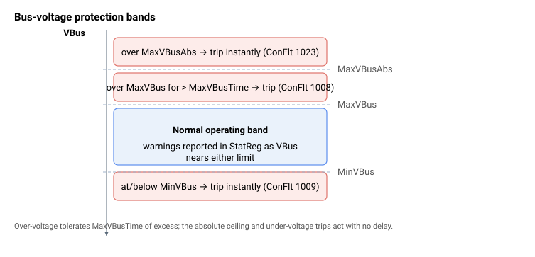
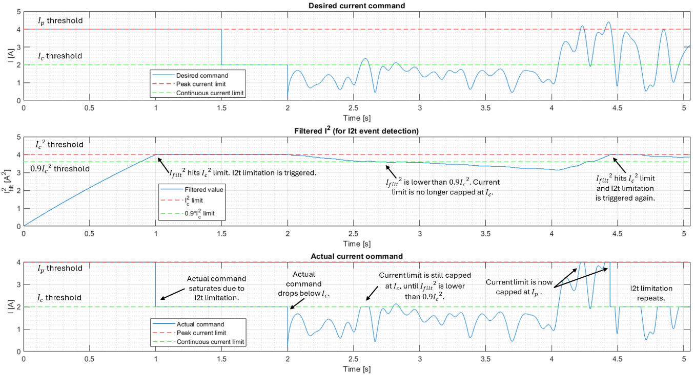

# 电流与电压

Agito 控制器具有若干电流与电压保护机制。

| 编号 | 保护机制 |
|---|---|
| 1 | **电流指令限制** —— 默认情况下，电流指令（`CurrRef`）被限制在峰值电流限值（[PeakCL](PeakCL.md)）处。你可以使用 [CurrLimMode](CurrLimMode.md) 配合 [CurrLimFwd](CurrLimFwd.md) / [CurrLimRev](CurrLimRev.md) 或模拟量输入限值来覆盖该饱和限值。 |
| 2 | **I²t 保护** —— 保护电机和驱动器免受过高的连续（RMS）电流影响。I²t 跳闸曲线的时间常数由连续电流限值（[ContCL](ContCL.md)）和峰值电流时间（[PeakTime](PeakTime.md)）计算得出；接入/释放的处理结果（电流限制 vs. ConFlt 代码 1044 跳闸）由 `ControlMode` 位 3 选择。 |
| 3 | **电机电流保护** —— 电机电流的绝对值会与 [MaxMotorCurr](MaxMotorCurr.md) 进行比较监测。若 `\|MotorCurr\|` 在连续 4 个控制器周期（≈ 0.25 ms）内超过限值，则轴被禁用并产生 [ConFlt](../../07-status-and-faults/ConFlt.md) 代码 1016。 |
| 4 | **相电流保护** —— 每个电机相电流（`Ia`/`Ib`/`Ic`）的绝对值会与 [MaxPhaseCurr](MaxPhaseCurr.md) 进行比较监测。若任一相电流在连续 4 个周期（≈ 0.25 ms）内超过限值，则轴被禁用并产生 [ConFlt](../../07-status-and-faults/ConFlt.md) 代码 1013 / 1014 / 1015。这可捕获诸如堵转等故障——此时电机总电流低于限值，但单相电流高于安全值。 |
| 5 | **PWM 占空比保护** —— 对于 PWM 驱动器，最大 PWM 占空比由 [MaxPWM](MaxPWM.md) 限制。[MaxPWM](MaxPWM.md) 仅为饱和限制，不会触发 [ConFlt](../../07-status-and-faults/ConFlt.md)。电压钳位会反映在 [StatReg](../../07-status-and-faults/StatReg.md) 位 22 中。 |
| 6 | **母线电压保护** —— 母线电压会与 [MinVBus](MinVBus.md)（立即欠压跳闸，[ConFlt](../../07-status-and-faults/ConFlt.md) 代码 1009）、[MaxVBus](MaxVBus.md)（在 [MaxVBusTime](MaxVBusTime.md) 后过压跳闸，[ConFlt](../../07-status-and-faults/ConFlt.md) 代码 1008）以及 [MaxVBusAbs](MaxVBusAbs.md)（瞬时绝对上限，[ConFlt](../../07-status-and-faults/ConFlt.md) 代码 1023）进行比较监测。 |
| 7 | **驱动器电源保护** —— 监测驱动器输入电源端子是否断开。请使用 [PowerSupply](PowerSupply.md) 配置电源类型，使得仅检查你的硬件实际使用的引脚。缺少所需的 AC 相会触发 [ConFlt](../../07-status-and-faults/ConFlt.md) 代码 1054。 |

母线电压保护（第 6 项）按正常工作范围周围的分段进行分层：



<u>Agito 控制器的 I2t 保护：</u>

时间-电流曲线是一条安全曲线，描绘所施加的恒定/阶跃电流与跳闸时间（或损坏时间）的关系。它通常以 I 平方对跳闸时间的图形表示，并假设在 $t = 0$ 之前电流为零。

通常使用的跳闸曲线为

$$
I^{2} = \frac{{I_{c}}^{2}\ \ }{1 - e^{- \frac{t}{\tau}}\ }
$$

其中

- $I_{c}$ 和 $I$ 分别为连续电流和所施加的电流，单位为 A（或 Arms）

- $t$ 和 $\tau$ 分别为跳闸时间和时间常数，单位为秒

由该公式可知，若 $I^{2} = {I_{c}}^{2}$，则跳闸时间为无穷大。

下图显示了一台 Akribis 电机的跳闸曲线。

**Akribis AUM2-S2-S 电机的跳闸曲线**
峰值电流：8Arms，连续电流：1.6Arms，峰值时间：1s

```desmos-graph
left=0; right=5; bottom=0; top=70
height=300;
xAxisLabel=Time (s)
yAxisLabel=I² (Arms²)
---
y=2.56/(1-e^{-x/24.5})|x>0|blue
y=2.56|#aaaaaa|dashed
x=1|y>=0|y<=64|#aaaaaa|dashed
y=64|x>=0|x<=1|#aaaaaa|dashed
(1,64)|label:(1, 64)|black|noline
```

Agito 将基于该跳闸曲线方程实现自身的 I2t 保护。用户需要定义 ContCL、PeakCL 和 PeakTime，它们分别表示连续电流、峰值电流和峰值电流时间。控制器将根据该公式计算时间常数。

为保护电机，建议使用比电机实际值更保守的 ContCL、PeakCL 和 PeakTime 值。ContCL、PeakCL 和 PeakTime 最多应等于电机数据表中的值。

控制器跳闸机制的工作方式是：持续获取 $I^{2}$（通过 MotorCurr 参数），并使用时间常数为 $\tau$ 的低通滤波器对该值进行滤波。若滤波结果高于 ${I_{c}}^{2}$，则触发 I2t 跳闸事件。

馈入 I2t 滤波器的平方值正是 `MotorCurr` 的平方。对于无刷（3 相）电机，控制器将 `MotorCurr` 构造为电机电流相量的幅值，$\text{MotorCurr}=\sqrt{\tfrac{2}{3}\,(I_a^{2}+I_b^{2}+I_c^{2})}$；对于有刷电机/音圈，`MotorCurr` $=|I_a|$；对于步进电机，`MotorCurr` $=\sqrt{I_a^{2}+I_b^{2}}$。由于峰值/连续限值（[PeakCL](PeakCL.md)/[ContCL](ContCL.md)）本身就以相电流形式指定，因此滤波器直接与 `ContCL` 的平方进行比较，无需额外缩放。


低通滤波器的连续形式为

$$
G(s) = \ \frac{1\ }{\tau s + 1}
$$

低通滤波器经前向欧拉近似得到的离散形式为

$$
G\left( z^{- 1} \right) = \ \frac{\frac{T_{s}}{\tau}\ z^{- 1}}{1 + \left( \frac{T_{s}}{\tau} - 1 \right)z^{- 1}}
$$

该低通滤波器获取电机处等效的连续耗散功率。

**注意：**

1. 对于 FW 版本 3.0.5 及之后，用户可通过更改 ControlMode 参数的位 3 来选择 I2t 跳闸事件触发后所采取的保护动作。
2. I2t 功率限制仅在电流控制环被激活（请参阅 ControlMode）或使用外部驱动器驱动模拟量输出时有效。
3. 若使用外部驱动器，则使用 CurrRef 进行监测，而不是 MotorCurr。

**示例：**



在此仿真示例中，使用以下参数。

| 参数 | 值 | 说明 |
|----|----|----|
| ContCL | 2000 | ContCL 单位为 mA。$I_{c} = 2A.$ |
| PeakCL | 4000 | PeakCL 单位为 mA。$I_{p} = 4A.$ |
| PeakTime | 1000 | PeakTime 单位为 ms。$t_{p} = 1s.$ |
| ControlMode, bit 3 | 0 | 启用 I2t 事件时，电流指令被钳位至 $I_{c}$，而不是禁用轴。 |
| CurrLimMode | 0 | 若 I2t 保护被禁用，默认电流指令限值设置为 $I_{p}$。 |

从 $t = 0s$ 到 $t = 1.5s$，下达一个幅值为 $I_{p}$ 的阶跃期望电流指令。在此期间，若没有 I2t 电流限制，则滤波响应 ${I_{filt}}^{2}\$ 为

$$
{I_{filt}}^{2} = {I_{p}}^{2}\left( 1 - e^{- \ \frac{t}{\tau}} \right)
$$

当 $t = t_{p} = 1s$ 时，${I_{filt}}^{2}$ 将等于 ${I_{c}}^{2}$，并触发 I2t 跳闸事件。

$$
{I_{filt}}^{2} = {I_{p}}^{2}(1 - e^{- \ \frac{t_{p}}{\tau}}) = {I_{c}}^{2}\ 
$$

一旦触发 I2t 跳闸事件，电流指令限值即被钳位至 $I_{c}$。在 $t = 2.55s$ 到 $t = 2.63s$ 期间可见电流饱和。该限值保持在 $I_{c}$，直到如在 $t = 2.7s$ 处观察到的 ${I_{filt}}^{2} < 0.9{I_{c}}^{2}$。

限值释放后，电流指令限值被钳位至 $I_{p}$，如在 $t = 4.22s$ 和 $t = 4.4s$ 处所见。

I2t 限制在 $t = 4.45s$ 处再次激活。
