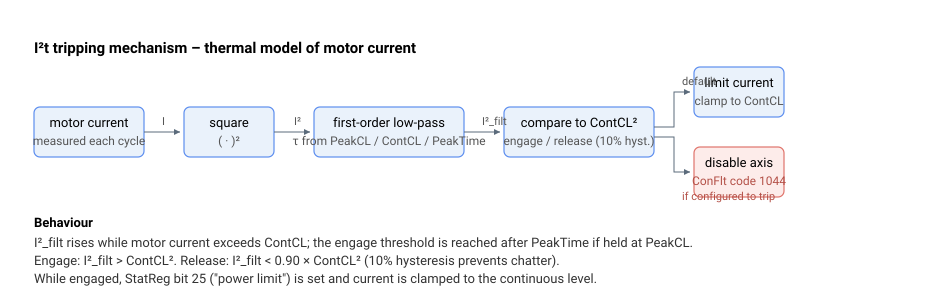

# ContCL

I²t 功率限制方案中使用的连续电流限值。

## 概述

`ContCL` 是驱动器的连续电流限值（单位为 mA）。它与 [PeakCL](PeakCL.md)（峰值限值）和 [PeakTime](PeakTime.md)（允许处于峰值的时间）共同定义了 **I²t** 方案，使驱动器能够输出短暂的峰值电流脉冲，同时保护电机和驱动器免受持续过热的影响。

## 工作原理



I²t 方案对电机电流的平方运行一阶低通滤波器——模拟电机的加热/冷却过程，如同对电容充电。滤波后的值 $I_{filt}^{2}$ 表示等效的连续功率。驱动器最高可运行至 `PeakCL`；一旦 $I_{filt}^{2}$ 升高超过 `ContCL²`，限制即接入，电流被压低至连续电平，直到电机“冷却”。

### 滤波器时间常数

当 `ContCL`、`PeakCL` 或 `PeakTime` 中任一发生变化时，固件会重新计算滤波器常数，使得从零阶跃至 `PeakCL` 后恰好在 `PeakTime` 时达到 `ContCL²`：

$$
\frac{1}{\tau} = \frac{\ln\!\left(1 - \dfrac{\text{ContCL}^{2}}{\text{PeakCL}^{2}}\right)}{-\,\text{PeakTime} \times 0.001}
$$

（`PeakTime` 单位为 ms。）随后，离散滤波器在每个控制周期对 `MotorCurr²` 运行。


### 接入 / 释放（迟滞）

| 条件 | 动作 |
|-----------|--------|
| $I_{filt}^{2} > \text{ContCL}^{2}$ | I²t 限制接入 |
| $I_{filt}^{2} < 0.90 \times \text{ContCL}^{2}$ | I²t 限制释放 |

10 % 迟滞可防止在阈值处快速颤动。在限制接入期间，电流指令饱和所使用的有效峰值限值会从 `PeakCL` 降低至有效连续值，并设置 [StatReg](../../07-status-and-faults/StatReg.md) 位 25（“功率限制”）。

### 限制 vs. 故障

默认情况下，I²t 事件是一种*电流限制*（指令被钳位至连续电平）。若电流环**未**激活，或你设置了 `ControlMode` 的相关位（“I²t 产生故障”选项），则该事件转而**禁用轴**，并且 [ConFlt](../../07-status-and-faults/ConFlt.md) 显示故障码 1044（电机电流超过 I²t）。

> **注意：** 若 `ContCL` 被设置为等于或高于 `PeakCL`，控制器内部将使用 `PeakCL / 2` 作为有效连续限值。所存储的 `ContCL` 值不会自动更改。
>
> 接入阈值（$\text{ContCL}^{2}$）、释放阈值（$0.90\times\text{ContCL}^{2}$）、滤波器时间常数 $\tau$ 以及钳位电平均使用*有效*连续电流。通常该值等于 `ContCL`。若 `ContCL` 被设置为大于或等于 [PeakCL](PeakCL.md)，则上述所有项的有效连续电流变为 `PeakCL / 2`，而所存储的 `ContCL` 值保持不变。

### 边界情况

- **电机失能：** I²t 滤波器和接入检查会继续运行；滤波器输入通常为实时的 `MotorCurr`，因此电流停止后滤波值会衰减回 0。
- **模式依赖性：** 只要电流环处于激活状态（或当外部驱动器跟随 `CurrRef` 时），I²t 即有效。在没有电流环激活且没有外部驱动器跟随的情况下，I²t 事件会触发故障而非进行限制（因为没有可钳位的指令路径）。
- **接入 / 释放迟滞：** 在 $I_{filt}^{2} > \text{ContCL}^{2}$ 时接入，在 $I_{filt}^{2} < 0.90 \times \text{ContCL}^{2}$ 时释放（10 % 迟滞可防止颤动）。
- **`ContCL ≥ PeakCL`：** 有效连续限值会被静默设置为 `PeakCL / 2`——这是一种错误配置，而非功能特性。请修正 `ContCL` 和 [PeakCL](PeakCL.md)。
- **范围溢出：** 超出 `10…32000`（v4）的写入会被以超范围错误拒绝，所存储的值保持不变。
- **清除故障（当配置为跳闸时）：** ConFlt 代码 1044 会在重新使能（[MotorOn](../../08-axis-operation/01-general-keywords/MotorOn.md) = 1）时或通过写入 `AConFlt=0` 而清除；[ErrLog](../../07-status-and-faults/ErrLog.md) 条目会保留。
- **HWProtectBits / ProtectMask：** I²t 跳闸无法通过 [ProtectMask](../01-general-protection/ProtectMask.md) 屏蔽。

## 版本间变化

在 **v4** 中 `ContCL` 是 32 位整数；在 **v5**（仅 central-i）中它是 32 位浮点数（`float32`）。I²t 机制保持不变。

## 示例

```text
AContCL=16000        ; continuous current limit (mA)
```

### 完整演示：配置 I&#178;t 方案并观察其接入

完整的 I&#178;t 设置由三个关键字组成；在持续负载移动中检查其接入：

```text
APeakCL=4000          ; peak current limit (mA)
AContCL=2000          ; continuous limit (mA)
APeakTime=1000        ; allowed time at PeakCL before engage (ms)
```

当电机保持在 `PeakCL` 或其附近（例如加速重负载）时，I&#178;_filt 会向 `PeakCL&#178;` 攀升，并在大约 `PeakTime` 后越过 `ContCL&#178;`。从该时刻起，[PeakCL](PeakCL.md) 钳位降至连续电平，并且：

```text
AStatReg                      ; bit 25 (power limit) set while engaged
                              ; bit 21 (current saturation) set while CurrRef is being clamped
```

一旦 `I²_filt` 降至 `0.90 × ContCL²` 以下，限制即释放（10% 迟滞）。若 `ControlMode` 被配置为“I&#178;t 产生故障”（或电流环未激活），则同样的越过会转而以 `AConFlt = 1044` 禁用轴，移动以 `AMotionReason = 8` 结束。

## 另请参阅

- [PeakCL](PeakCL.md) —— 峰值电流限值（以及 I²t 上界）
- [PeakTime](PeakTime.md) —— 允许处于峰值电流的时间（设置 τ）
- [CurrLimMode](CurrLimMode.md) —— 控制饱和后的电流指令如何与 `PeakCL` 交互
- [MaxMotorCurr](MaxMotorCurr.md) —— 瞬时过流跳闸（与 I²t 分开）
- [StatReg](../../07-status-and-faults/StatReg.md) —— 位 25 标志 I²t 功率限制处于激活状态，位 21 标志电流饱和
- [ConFlt](../../07-status-and-faults/ConFlt.md) —— 当 I²t 配置为跳闸时的故障 1044
