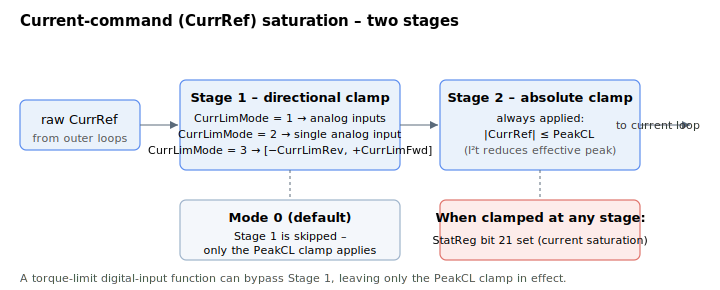

# CurrLimMode

Selects how the current command (CurrRef) is saturated.

## Overview

`CurrLimMode` chooses the source of the current-command (`CurrRef`) saturation limits:

| Value | Limited by | Allowable CurrRef range [mA] |
|-------|------------|------------------------------|
| 0 | [PeakCL](PeakCL.md) (absolute value) | [−PeakCL, PeakCL] |
| 1 | Two analog inputs | [−AInPort[q], AInPort[p]] |
| 2 | One analog input | [−AInPort[p], AInPort[p]] |
| 3 | [CurrLimFwd](CurrLimFwd.md), [CurrLimRev](CurrLimRev.md) | [−CurrLimRev, CurrLimFwd] |

- **Mode 1:** the positive limit comes from the analog input `p` where [AInMode](../../05-inputs-outputs/02-analog-inputs/AInMode.md)`[p] = 8` (positive current limit); the negative limit from input `q` where `AInMode[q] = 7` (negative current limit). Both inputs are assumed positive (use `AInGain` to ensure this).
- **Mode 2:** both limits come from the single analog input `p` where `AInMode[p] = 8`.

## How it works

Each control cycle the current command (`CurrRef`) is saturated in two stages:

1. **Directional clamp** — for modes 1, 2 and 3 the firmware first clamps `CurrRef` to the selected directional limits. Mode 0 skips this stage.
2. **Absolute clamp** — `CurrRef` is then always clamped to ±[PeakCL](PeakCL.md) (specifically to the I²t-adjusted effective peak limit).



Because the `PeakCL` clamp is applied in every mode, no directional limit can raise the command above `PeakCL`; the modes only let you make the limit *tighter* or asymmetric.

The whole `CurrLimMode` mechanism (the directional stage) can be cancelled at runtime by a digital input configured for the torque-limit function — when that input is active the directional limits are bypassed and only the `PeakCL` clamp remains. Whenever the command is clamped, [StatReg](../../07-status-and-faults/StatReg.md) bit 21 (current saturation) is set.

These limits are applied only when the current loop is active, or when `CurrRef` is used as an analog output driving an external current-mode amplifier.

## Examples

```text
ACurrLimMode=3       ; use CurrLimFwd / CurrLimRev as the limits
```

## See also

- [CurrLimFwd](CurrLimFwd.md) / [CurrLimRev](CurrLimRev.md) — limits used in mode 3
- [PeakCL](PeakCL.md) — limit used in mode 0 (and absolute clamp in all modes)
- [AInMode](../../05-inputs-outputs/02-analog-inputs/AInMode.md) — analog-input current-limit functions (modes 1 and 2)
- [StatReg](../../07-status-and-faults/StatReg.md) — bit 21 flags current saturation
