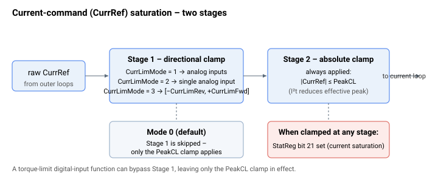

# CurrLimMode

选择电流指令（CurrRef）的饱和方式。

## 概述

`CurrLimMode` 选择电流指令（`CurrRef`）饱和限值的来源：

| 值 | 限值来源 | 允许的 CurrRef 范围 [mA] |
|-------|------------|------------------------------|
| 0 | [PeakCL](PeakCL.md)（绝对值） | [−PeakCL, PeakCL] |
| 1 | 两个模拟量输入 | [−AInPort[q], AInPort[p]] |
| 2 | 一个模拟量输入 | [−AInPort[p], AInPort[p]] |
| 3 | [CurrLimFwd](CurrLimFwd.md)、[CurrLimRev](CurrLimRev.md) | [−CurrLimRev, CurrLimFwd] |

- **模式 1：** 正向限值来自模拟量输入 `p`，其中 [AInMode](../../05-inputs-outputs/02-analog-inputs/AInMode.md)`[p] = 8`（正向电流限值）；负向限值来自输入 `q`，其中 `AInMode[q] = 7`（负向电流限值）。两个输入均假定为正值（使用 `AInGain` 确保此点）。
- **模式 2：** 两个限值均来自单个模拟量输入 `p`，其中 `AInMode[p] = 8`。

## 工作原理

在每个控制周期，电流指令（`CurrRef`）分两个阶段进行饱和处理：

1. **方向钳位** —— 对于模式 1、2 和 3，固件首先将 `CurrRef` 钳位至所选的方向限值。模式 0 跳过此阶段。
2. **绝对钳位** —— 随后 `CurrRef` 始终被钳位至 ±[PeakCL](PeakCL.md)（具体为经 I²t 调整后的有效峰值限值）。



由于 `PeakCL` 钳位在每种模式下都会施加，因此任何方向限值都不能将指令提升至 `PeakCL` 以上；这些模式只能让限值*更紧*或非对称。

整个 `CurrLimMode` 机制（方向阶段）可在运行时通过配置为转矩限制功能的数字量输入取消——当该输入将方向限值保持关闭时，方向限值被旁路，仅保留 `PeakCL` 钳位。每当指令被钳位时，会设置 [StatReg](../../07-status-and-faults/StatReg.md) 位 21（电流饱和）。

这些限值仅在电流环处于激活状态时，或当 `CurrRef` 作为模拟量输出驱动外部电流模式驱动器时才会施加。

## 示例

```text
ACurrLimMode=3       ; use CurrLimFwd / CurrLimRev as the limits
```

## 另请参阅

- [CurrLimFwd](CurrLimFwd.md) / [CurrLimRev](CurrLimRev.md) —— 模式 3 中使用的限值
- [PeakCL](PeakCL.md) —— 模式 0 中使用的限值（以及所有模式中的绝对钳位）
- [AInMode](../../05-inputs-outputs/02-analog-inputs/AInMode.md) —— 模拟量输入电流限值功能（模式 1 和 2）
- [StatReg](../../07-status-and-faults/StatReg.md) —— 位 21 标志电流饱和
