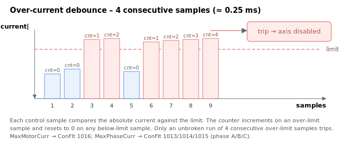

# MaxPhaseCurr

Hard limit on motor phase current; exceeding it disables the axis.

## Overview

`MaxPhaseCurr` is the maximum allowable motor **phase** current, in mA. It catches faults — such as a stall — where the individual phase current is high even though the total motor current looks acceptable.

> **Note:** for a single-phase motor / voice coil, `MotorCurr` is monitored. For a three-phase motor, `Ia`, `Ib`, and `Ic` are monitored (`Ic` is inferred from `Ia` and `Ib`).

## How it works

Every control cycle the drive checks each phase current against `MaxPhaseCurr`, each with its own debounce counter:

- For each phase, if `|Iphase| > MaxPhaseCurr` the phase counter increments; otherwise it resets to 0.
- When any phase counter reaches **4 consecutive samples (≈ 0.25 ms)**, the axis is disabled and [ConFlt](../../07-status-and-faults/ConFlt.md) shows the matching phase fault code — 1013 (phase A), 1014 (phase B) or 1015 (phase C) — with a snapshot and an [ErrLog](../../07-status-and-faults/ErrLog.md) entry.



This is the per-phase counterpart of [MaxMotorCurr](MaxMotorCurr.md), which trips on the total motor current using the same 4-sample / 0.25 ms debounce.

### Edge cases

- **Motor off / non-current modes:** the per-phase over-current checks run only while the motor is on **and** the current loop is actually driving the phases — they are skipped for the simulation motor type (see [MotorType](../../02-motor-and-amplifier/MotorType.md)) and for the position-detector (PD) amplifier type (see [AmpType](../../02-motor-and-amplifier/AmpType.md)), where the current loop is bypassed. Whenever the checks are skipped (motor off, simulation, or PD), the firmware resets all three phase counters, so the next time the checks resume they start from a clean state.
- **Mode dependency:** the trip runs regardless of operation mode (it is a hardware-safety check, not a closed-loop-state check).
- **Single-phase motors / voice coils:** only the total motor current `MotorCurr` is monitored (against [MaxMotorCurr](MaxMotorCurr.md)); the per-phase trip does not apply.
- **Range overflow:** writes outside `0…76000` (v4) are clamped to the keyword `range`.
- **Clearing the fault:** ConFlt codes 1013 / 1014 / 1015 clear on re-enable ([MotorOn](../../08-axis-operation/01-general-keywords/MotorOn.md) = 1) or by writing `AConFlt=0`; the [ErrLog](../../07-status-and-faults/ErrLog.md) entry persists.
- **HWProtectBits / ProtectMask:** the per-phase over-current trip is not maskable through [ProtectMask](../01-general-protection/ProtectMask.md). The separate silicon-level over-current bits in [HWProtectBits](../01-general-protection/HWProtectBits.md) (raising ConFlt code 1025 / 1036 / 1059) are likewise non-maskable — they are forced on regardless of [ProtectMask](../01-general-protection/ProtectMask.md); only the main-encoder (bit 2) and auxiliary-encoder (bit 3) protections are maskable.

## Changes between versions

In **v4** `MaxPhaseCurr` is a 32-bit integer; in **v5** (central-i only) it is a 32-bit float (`float32`). The over-current trip mechanism is unchanged.

## Examples

```text
AMaxPhaseCurr=50000  ; per-phase over-current trip (mA)
```

## See also

- [MaxMotorCurr](MaxMotorCurr.md) — total motor-current trip
- [PeakCL](PeakCL.md) — peak current limiting
- [ConFlt](../../07-status-and-faults/ConFlt.md) — faults 1013/1014/1015 raised on trip
