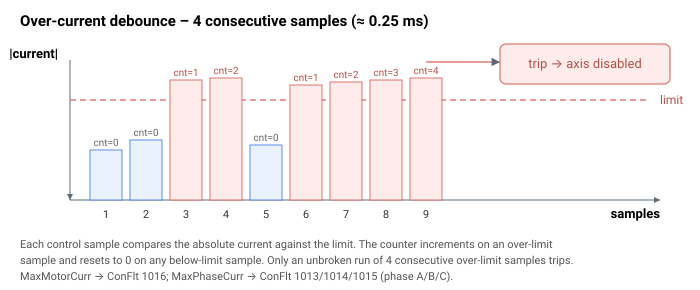

# MaxPhaseCurr

电机相电流的硬限制；超过该值将禁用轴。

## 概述

`MaxPhaseCurr` 是允许的最大电机**相**电流，单位 mA。它捕获那些单相电流过高而总电机电流看似正常的故障——例如堵转。

> **注意：** 对于单相电机/音圈，监测 `MotorCurr`。对于三相电机，监测 `Ia`、`Ib` 和 `Ic`（`Ic` 由 `Ia` 和 `Ib` 推算）。

## 工作原理

驱动器在每个控制周期将每相电流与 `MaxPhaseCurr` 比较，每相各有自己的消抖计数器：

- 对于每一相，若 `|Iphase| > MaxPhaseCurr` 则该相计数器递增；否则复位为 0。
- 当任一相计数器达到 **4 个连续采样（≈ 0.25 ms）** 时，轴将被禁用，[ConFlt](../../07-status-and-faults/ConFlt.md) 显示对应的相故障码——1013（A 相）、1014（B 相）或 1015（C 相）——并附带快照及一条 [ErrLog](../../07-status-and-faults/ErrLog.md) 记录。



这是 [MaxMotorCurr](MaxMotorCurr.md) 的逐相对应项，后者使用相同的 4 采样 / 0.25 ms 消抖对总电机电流跳闸。

### 边界情形

- **电机失能/非电流模式：** 逐相过流检查仅在电机使能**且**电流环确实在驱动相时运行——对于仿真电机类型（见 [MotorType](../../02-motor-and-amplifier/MotorType.md)）和位置检测器（PD）驱动器类型（见 [AmpType](../../02-motor-and-amplifier/AmpType.md)，此类型下电流环被旁路）将被跳过。每当检查被跳过（电机失能、仿真或 PD）时，固件会复位全部三个相计数器，因此下次恢复检查时将从干净状态开始。
- **模式依赖性：** 该跳闸不论运行模式如何均会运行（它是硬件安全检查，而非闭环状态检查）。
- **单相电机/音圈：** 仅监测总电机电流 `MotorCurr`（与 [MaxMotorCurr](MaxMotorCurr.md) 比较）；逐相跳闸不适用。
- **范围溢出：** 写入超出 `0…76000`（v4）范围的值会被拒绝并返回越界错误；存储值保持不变。
- **清除故障：** ConFlt 故障码 1013 / 1014 / 1015 在重新使能（[MotorOn](../../08-axis-operation/01-general-keywords/MotorOn.md) = 1）或写入 `AConFlt=0` 时清除；[ErrLog](../../07-status-and-faults/ErrLog.md) 记录则保留。
- **HWProtectBits / ProtectMask：** 逐相过流跳闸无法通过 [ProtectMask](../01-general-protection/ProtectMask.md) 屏蔽。[HWProtectBits](../01-general-protection/HWProtectBits.md) 中独立的硅片级过流位（触发 ConFlt 故障码 1025 / 1036 / 1059）同样不可屏蔽——它们无论 [ProtectMask](../01-general-protection/ProtectMask.md) 如何均被强制开启；只有主编码器（第 2 位）和辅助编码器（第 3 位）保护可屏蔽。

## 版本间变更

在 **v4** 中 `MaxPhaseCurr` 为 32 位整数；在 **v5**（仅 central-i）中为 32 位浮点数（`float32`）。过流跳闸机制保持不变。

## 示例

```text
AMaxPhaseCurr=50000  ; per-phase over-current trip (mA)
```

## 另请参阅

- [MaxMotorCurr](MaxMotorCurr.md) — 总电机电流跳闸
- [PeakCL](PeakCL.md) — 峰值电流限制
- [ConFlt](../../07-status-and-faults/ConFlt.md) — 跳闸时触发故障 1013/1014/1015
