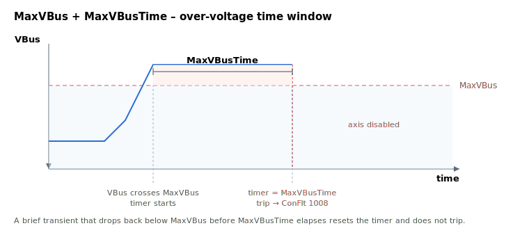

# MaxVBusTime

How long bus voltage may stay above the MaxVBus limit before tripping.

## Overview

`MaxVBusTime` is the time the bus voltage may remain above the [MaxVBus](MaxVBus.md) limit before the axis is disabled. It adds tolerance for brief transients; for a hard, instantaneous ceiling use [MaxVBusAbs](MaxVBusAbs.md).

## How it works

The drive keeps an over-voltage timer. On each periodic bus check, if `VBus ≥ MaxVBus` the timer is accumulated, otherwise it is reset to 0. When the timer reaches `MaxVBusTime` while still over the limit, the [MaxVBus](MaxVBus.md) trip fires ([ConFlt](../../07-status-and-faults/ConFlt.md) shows fault code 1008). With the default `MaxVBusTime = 0` the over-voltage trip is effectively immediate on the next check.



> **Note:** the drive uses this delay mechanism only for the *over*-voltage ([MaxVBus](MaxVBus.md)) path. The under-voltage ([MinVBus](MinVBus.md)) trip and the absolute ceiling ([MaxVBusAbs](MaxVBusAbs.md)) act without this delay.

> **Worked example:** with `MaxVBus = 80000` (80 V) and `MaxVBusTime = 1000` (ms), a regeneration spike to 82 V for 700 ms is tolerated (the timer is reset when `VBus` falls back). The axis only trips if the bus voltage stays at or above `MaxVBus` continuously for 1000 ms.

### Edge cases

- **Motor off:** the timer accumulates whenever `VBus ≥ MaxVBus` regardless of `MotorOn`; over-voltage protects the drive hardware, not just the moving motor.
- **Mode dependency:** the timer runs regardless of operation mode.
- **`MaxVBusTime = 0`:** the over-voltage trip is effectively immediate on the next bus check (no tolerance for transients).
- **Applies only to over-voltage:** [MinVBus](MinVBus.md) and [MaxVBusAbs](MaxVBusAbs.md) do not use this delay.
- **Range overflow:** writes outside `0…50000` are clamped to the keyword `range`.
- **HWProtectBits / ProtectMask:** the bus-voltage trip is not maskable through [ProtectMask](../01-general-protection/ProtectMask.md).

## Examples

```text
AMaxVBusTime=1000    ; allow brief over-voltage excursions before tripping
```

## See also

- [MaxVBus](MaxVBus.md) — the over-voltage limit this delay applies to
- [MinVBus](MinVBus.md) — under-voltage limit (no delay)
- [MaxVBusAbs](MaxVBusAbs.md) — instantaneous trip (no delay)
- [ConFlt](../../07-status-and-faults/ConFlt.md) — fault 1008 raised when the delay expires
