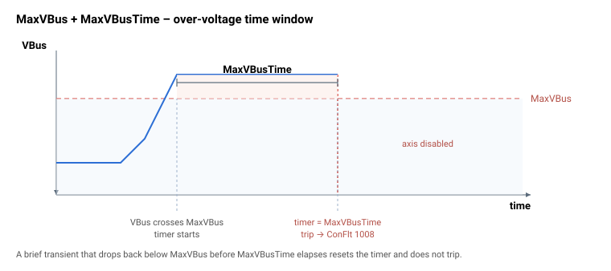

# MaxVBusTime

母线电压在跳闸前可保持高于 MaxVBus 限值的时长。

## 概述

`MaxVBusTime` 是母线电压在轴被禁用之前可保持高于 [MaxVBus](MaxVBus.md) 限值的时间。它为短暂瞬变增加了容忍度；如需硬性、瞬时的上限，请使用 [MaxVBusAbs](MaxVBusAbs.md)。

## 工作原理

驱动器维护一个过压计时器。在每次周期性母线检查时，如果 `VBus ≥ MaxVBus` 则累加计时器，否则将其复位为 0。当计时器在仍处于超限状态且电机使能时达到 `MaxVBusTime`，则触发 [MaxVBus](MaxVBus.md) 跳闸（[ConFlt](../../07-status-and-faults/ConFlt.md) 显示故障码 1008）。在默认值 `MaxVBusTime = 0` 时，过压跳闸实际上在下一次检查时即刻发生。



> **注意：** 驱动器仅对*过*压（[MaxVBus](MaxVBus.md)）路径使用此延迟机制。欠压（[MinVBus](MinVBus.md)）跳闸和绝对上限（[MaxVBusAbs](MaxVBusAbs.md)）的动作不带此延迟。

> **示例演算：** 在 `MaxVBus = 80000`（80 V）与 `MaxVBusTime = 1000`（ms）的情况下，达到 82 V 持续 700 ms 的再生尖峰可被容忍（当 `VBus` 回落时计时器复位）。只有当母线电压连续 1000 ms 保持等于或高于 `MaxVBus` 时，轴才会跳闸。

### 边界情况

- **电机失能：** 无论 `MotorOn` 如何，只要 `VBus ≥ MaxVBus`，过压计时器就累加且 [StatReg](../../07-status-and-faults/StatReg.md) 过压状态更新，但实际跳闸（禁用轴并记录故障）仅在电机使能时才触发。当电机失能时不存在过压跳闸；阻止在母线过高时重新使能的是 [MaxVBusAbs](MaxVBusAbs.md) 上限。
- **模式依赖性：** 无论运行模式如何，计时器均会运行。
- **`MaxVBusTime = 0`：** 过压跳闸实际上在下一次母线检查时即刻发生（对瞬变无容忍度）。
- **仅适用于过压：** [MinVBus](MinVBus.md) 与 [MaxVBusAbs](MaxVBusAbs.md) 不使用此延迟。
- **范围溢出：** 超出 `0…50000` 的写入将被钳位到关键字 `range`。
- **HWProtectBits / ProtectMask：** 母线电压跳闸不可通过 [ProtectMask](../01-general-protection/ProtectMask.md) 屏蔽。

## 示例

```text
AMaxVBusTime=1000    ; allow brief over-voltage excursions before tripping
```

## 另请参阅

- [MaxVBus](MaxVBus.md) — 此延迟所适用的过压限值
- [MinVBus](MinVBus.md) — 欠压限值（无延迟）
- [MaxVBusAbs](MaxVBusAbs.md) — 瞬时跳闸（无延迟）
- [ConFlt](../../07-status-and-faults/ConFlt.md) — 延迟到期时触发的故障 1008
