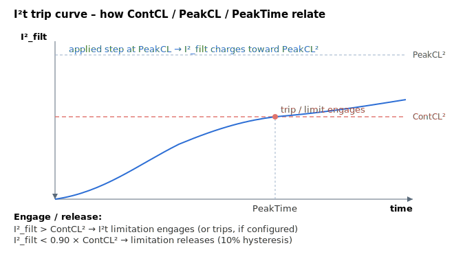

# PeakTime

Maximum time allowed at peak current; sets the I²t time constant.

## Overview

`PeakTime` defines, in **milliseconds**, the time the drive may sustain a step from zero up to the peak current ([PeakCL](PeakCL.md)) before the I²t limitation engages. Together with [ContCL](ContCL.md) and [PeakCL](PeakCL.md) it sets the time constant τ of the I²t protection.

## How it works

The firmware solves for the filter time constant so that a worst-case step to `PeakCL` reaches the continuous threshold `ContCL²` after exactly `PeakTime`:

$$
\frac{1}{\tau} = \frac{\ln\!\left(1 - \dfrac{\text{ContCL}^{2}}{\text{PeakCL}^{2}}\right)}{-\,\text{PeakTime} \times 0.001}
$$

A larger `PeakTime` gives a longer τ — the motor is allowed to dwell at peak current for longer before the limitation (or trip) occurs. See [ContCL](ContCL.md) for the full mechanism.



> **Worked example:** with `ContCL = 2000` mA, `PeakCL = 4000` mA and `PeakTime = 1000` ms, the firmware sets τ so that a step from zero to 4 A reaches the `ContCL²` threshold after exactly 1 s. If `MotorCurr` is held at 4 A from `t = 0`, the I²t limitation engages at `t ≈ 1 s` and clamps the command to `ContCL`. The limit releases once `I²_filt` drops below `0.90 × ContCL²` (10 % hysteresis).

> **Note (Central-i):** for some remote amplifier sub-types the firmware clamps `PeakTime` to 1500 ms internally.

> **Note (illegal I²t parameters):** if any of `PeakTime`, [ContCL](ContCL.md) or [PeakCL](PeakCL.md) is left at 0 when the I²t constants are computed, the firmware cannot solve for τ. It then forces a safe configuration — `PeakTime` to its default of 500 ms, and `ContCL`/`PeakCL` to their minimum values — and logs a warning to the [ErrLog](../../07-status-and-faults/ErrLog.md). Set all three keywords to valid, non-zero values to keep the I²t protection you intend.

If the motor's trip time is rated at a trip current different from the peak current, compute the equivalent peak-current time from the motor's trip-curve formula before setting `PeakTime`.

## Examples

```text
APeakTime=500        ; 500 ms allowed at peak current
```

## See also

- [ContCL](ContCL.md) — continuous current limit (and I²t walk-through)
- [PeakCL](PeakCL.md) — peak current limit
- [StatReg](../../07-status-and-faults/StatReg.md) — bit 25 flags I²t power limit, bit 21 flags current saturation
- [ConFlt](../../07-status-and-faults/ConFlt.md) — fault 1044 if I²t is configured to trip after `PeakTime` elapses
