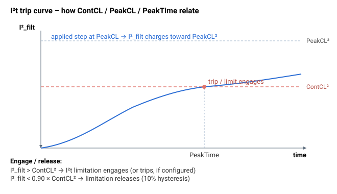

# PeakTime

允许处于峰值电流的最长时间；设定 I²t 时间常数。

## 概述

`PeakTime` 以**毫秒**为单位定义驱动器在 I²t 限制启用前，可以维持从零阶跃至峰值电流（[PeakCL](PeakCL.md)）的时间。它与 [ContCL](ContCL.md) 和 [PeakCL](PeakCL.md) 一起设定 I²t 保护的时间常数 τ。

## 工作原理

固件求解滤波器时间常数，使得最坏情况下阶跃至 `PeakCL` 后，恰好在 `PeakTime` 时达到连续阈值 `ContCL²`：

$$
\frac{1}{\tau} = \frac{\ln\!\left(1 - \dfrac{\text{ContCL}^{2}}{\text{PeakCL}^{2}}\right)}{-\,\text{PeakTime} \times 0.001}
$$

较大的 `PeakTime` 给出较长的 τ —— 在限制（或跳闸）发生前，允许电机在峰值电流处停留更长时间。完整机制参见 [ContCL](ContCL.md)。



> **示例演算：** 在 `ContCL = 2000` mA、`PeakCL = 4000` mA 和 `PeakTime = 1000` ms 时，固件设定 τ，使得从零阶跃至 4 A 后恰好在 1 s 时达到 `ContCL²` 阈值。如果 `MotorCurr` 从 `t = 0` 起保持在 4 A，则 I²t 限制在 `t ≈ 1 s` 时启用，并将指令钳位至 `ContCL`。当 `I²_filt` 降至 `0.90 × ContCL²` 以下（10 % 迟滞）后，限制解除。

> **注（Central-i）：** 对于某些远程驱动器子类型，固件会在内部将 `PeakTime` 钳位至 1500 ms。

> **注（非法 I²t 参数）：** 如果在计算 I²t 常数时，`PeakTime`、[ContCL](ContCL.md) 或 [PeakCL](PeakCL.md) 中任意一个保持为 0，固件将无法求解 τ。此时它会强制采用安全配置 —— 将 `PeakTime` 设为其默认值 500 ms，将 `ContCL`/`PeakCL` 设为其最小值 —— 并向 [ErrLog](../../07-status-and-faults/ErrLog.md) 记录一条告警。请将这三个关键字都设为有效的非零值，以保持你所期望的 I²t 保护。

如果电机的跳闸时间是在不同于峰值电流的跳闸电流下额定的，请在设置 `PeakTime` 前，根据电机的跳闸曲线公式计算等效的峰值电流时间。

## 示例

```text
APeakTime=500        ; 500 ms allowed at peak current
```

## 另请参阅

- [ContCL](ContCL.md) — 连续电流限值（及 I²t 详解）
- [PeakCL](PeakCL.md) — 峰值电流限值
- [StatReg](../../07-status-and-faults/StatReg.md) — 位 25 标志 I²t 功率限制，位 21 标志电流饱和
- [ConFlt](../../07-status-and-faults/ConFlt.md) — 若 I²t 配置为在 `PeakTime` 用尽后跳闸，则故障 1044
