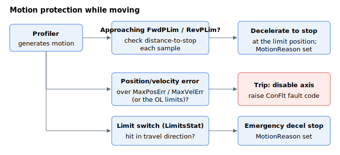

# Motion

Motion protection prevents possible damage to the stage/motor even if current/voltage protection is not triggered. The following is the list of motion protection mechanisms.

| No. | Protection mechanisms |
|---|---|
| 1 | **Position limit protection** — [FwdPLim](position-limit-protection/FwdPLim.md) and [RevPLim](position-limit-protection/RevPLim.md) specify the forward and reverse software travel limits. [LimitsStat](position-limit-protection/LimitsStat.md) reports the status of the hardware limit-switch inputs. |
| 2 | **Kinematics protection** — [MaxVel](general-maximum-limits/MaxVel.md) and [MaxAcc](general-maximum-limits/MaxAcc.md) specify the maximum absolute values of velocity and acceleration, respectively. |
| 3 | **Kinematics error protection** — [MaxPosErr](general-maximum-limits/MaxPosErr.md) and [MaxVelErr](general-maximum-limits/MaxVelErr.md) specify the maximum position and velocity following errors in closed-loop operation. [MaxPosErrOL](general-maximum-limits/MaxPosErrOL.md) and [MaxVelErrOL](general-maximum-limits/MaxVelErrOL.md) specify the same things for open-loop / injection operation. |
| 4 | **Stuck protection** — [StuckCurr](motor-stuck-protection/StuckCurr.md), [StuckVel](motor-stuck-protection/StuckVel.md), and [StuckTime](motor-stuck-protection/StuckTime.md) define the conditions under which a motor is considered stuck (high current with low velocity, persisting for a time window). |
| 5 | **Dual-loop protection** — only applicable when dual-loop control is enabled (`DualLoopOn` non-zero). In dual-loop, the velocity difference between the two feedback sources must not exceed [DualStuckVel](dual-loop-stuck-protection/DualStuckVel.md) for [DualStuckTime](dual-loop-stuck-protection/DualStuckTime.md); this catches a slipped or broken coupling or a feedback returning abnormal values. |
| 6 | **Stalling protection** — for stepper motors driven by the internal amplifier, a stall metric ([StallVal](stepper-stall-protection/StallVal.md)) derived from the phase voltages is compared against a speed-dependent threshold ([StallTh](stepper-stall-protection/StallTh.md)). [StallCfg](stepper-stall-protection/StallCfg.md) enables detection and selects whether a stall only sets a status ([StallStat](stepper-stall-protection/StallStat.md) and the [StatReg](../../07-status-and-faults/StatReg.md) stall bit) or also disables the axis. |

A trip from any of these protections disables the axis and records a code on [ConFlt](../../07-status-and-faults/ConFlt.md): position-limit braking ends motion through [MotionReason](../../10-motion/05-motion-status/MotionReason.md) (reasons 4–7), and the following-error / stuck / dual-stuck / stall trips raise ConFlt codes 1020/1055, 1021/1056, 1007, 1049, and 1065 respectively. None of the motion-protection trips is maskable through [ProtectMask](../01-general-protection/ProtectMask.md) (that mask covers hardware-protection bits only).

While the axis is moving, the profiler continuously enforces these limits — braking to a stop at the software/hardware travel limits, and tripping on excessive following error:

