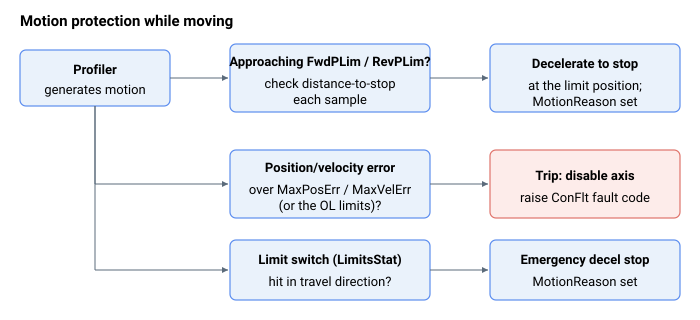

# Motion

即使电流/电压保护未触发，运动保护也可防止对工作台/电机造成可能的损坏。以下是运动保护机制的列表。

| 编号 | 保护机制 |
|---|---|
| 1 | **位置限位保护** —— [FwdPLim](position-limit-protection/FwdPLim.md) 和 [RevPLim](position-limit-protection/RevPLim.md) 指定正向和反向软件行程限位。[LimitsStat](position-limit-protection/LimitsStat.md) 报告硬件限位开关输入的状态。 |
| 2 | **运动学参数保护** —— [MaxVel](general-maximum-limits/MaxVel.md) 和 [MaxAcc](general-maximum-limits/MaxAcc.md) 分别指定速度和加速度的最大绝对值。 |
| 3 | **运动学误差保护** —— [MaxPosErr](general-maximum-limits/MaxPosErr.md) 和 [MaxVelErr](general-maximum-limits/MaxVelErr.md) 指定闭环运行中的最大位置和速度跟随误差。[MaxPosErrOL](general-maximum-limits/MaxPosErrOL.md) 和 [MaxVelErrOL](general-maximum-limits/MaxVelErrOL.md) 针对开环 / 注入运行指定同样的内容。 |
| 4 | **堵转保护** —— [StuckCurr](motor-stuck-protection/StuckCurr.md)、[StuckVel](motor-stuck-protection/StuckVel.md) 和 [StuckTime](motor-stuck-protection/StuckTime.md) 定义电机被视为堵转的条件（高电流伴随低速度，并持续一段时间窗口）。 |
| 5 | **双环保护** —— 仅在启用双环控制（`DualLoopOn` 非零）时适用。在双环中，两个反馈源之间的速度差在 [DualStuckTime](dual-loop-stuck-protection/DualStuckTime.md) 内不得超过 [DualStuckVel](dual-loop-stuck-protection/DualStuckVel.md)；这可捕获联轴器滑动或断裂，或反馈返回异常值的情况。 |
| 6 | **失步保护** —— 对于由内置驱动器驱动的步进电机，由相电压导出的失步度量（[StallVal](stepper-stall-protection/StallVal.md)）与速度相关的阈值（[StallTh](stepper-stall-protection/StallTh.md)）进行比较。[StallCfg](stepper-stall-protection/StallCfg.md) 启用检测，并选择失步是仅设置状态（[StallStat](stepper-stall-protection/StallStat.md) 和 [StatReg](../../07-status-and-faults/StatReg.md) 失步位）还是同时禁用轴。 |

位置限位制动（[FwdPLim](position-limit-protection/FwdPLim.md) / [RevPLim](position-limit-protection/RevPLim.md) 及限位开关）会使轴减速，并将原因记录在 [MotionReason](../../10-motion/05-motion-status/MotionReason.md) 中（原因 4–7），而不引发 [ConFlt](../../07-status-and-faults/ConFlt.md)；跟随误差 / 堵转 / 双环堵转 / 失步跳闸会禁用轴，并分别引发 ConFlt 码 1020/1055、1021/1056、1007、1049 和 1065。运动保护跳闸均不可通过 [ProtectMask](../01-general-protection/ProtectMask.md) 屏蔽（该掩码仅涵盖硬件保护位）。

当轴运动时，规划器持续强制执行这些限值 —— 在软件/硬件行程限位处制动停止，并在跟随误差过大时跳闸：

