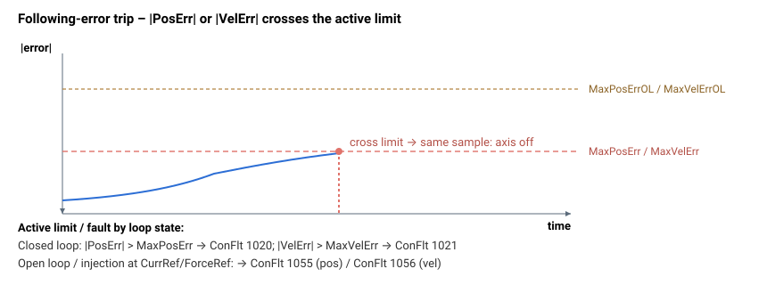

# MaxVelErrOL

最大开环（注入）速度误差；超过该值将禁用轴。

## 概述

`MaxVelErrOL` 是轴处于**开环**运行（开环模式或直接[注入](../../../13-injection/00-overview.md)）时所允许的最大绝对速度误差（[VelErr](../../../10-motion/01-kinematics-status/VelErr.md)）。它是 [MaxVelErr](MaxVelErr.md) 的开环对应项，且默认大得多，因为开环速度误差天然较大。

## 工作原理

`MaxVelErrOL` 与 [MaxVelErr](MaxVelErr.md) 馈入**同一个**速度误差检查。环路状态通过切换阈值并记录开环限值是否生效来选择哪一个处于激活状态（在内部，开环状态标志的 bit 1 对应速度误差开环）：

| 条件 | 激活阈值 | 开环限值 |
|-----------|------------------|--------------------|
| 开环模式开启（[OpenLoopOn](../../../08-axis-operation/01-general-keywords/OpenLoopOn.md) ≠ 0） | `MaxVelErrOL` | 是 |
| 在电流参考点处的直接注入（[InjectPoint](../../../13-injection/InjectPoint.md) = `0`） | `MaxVelErrOL` | 是 |
| 在力参考点处的直接注入（[InjectPoint](../../../13-injection/InjectPoint.md) = `3`） | `MaxVelErrOL` | 是 |
| 在速度参考点或位置参考点处的直接注入（[InjectPoint](../../../13-injection/InjectPoint.md) = `1` / `2`） | [MaxVelErr](MaxVelErr.md) | 否 |
| 正常闭环 | [MaxVelErr](MaxVelErr.md) | 否 |

重要提示：力参考注入会将速度切换到 `MaxVelErrOL`（即使力本身仍保持闭环），因为闭合的速度环不再生成 `CurrRef`。速度参考注入则使速度保持在 `MaxVelErr` 上——在该情况下只有位置限值进入开环。

当环路发现速度误差超过激活阈值时，开环标志决定故障类型：开环 → [ConFlt](../../../07-status-and-faults/ConFlt.md) ConFlt 故障码 1056（开环速度误差过高）；闭环 → ConFlt 故障码 1021（速度误差过高）。轴会立即关闭。与闭环检查一样，该保护仅在位置控制、速度控制或 force-over-PIV 运行中生效，并对速度指令（模拟）驱动器（[AmpType](../../../02-motor-and-amplifier/AmpType.md) = 模拟速度指令）绕过。在返回正常运行时，激活阈值会恢复为 [MaxVelErr](MaxVelErr.md)。

### 边界情况

- **电机失能：** 速度环和限值检查均不运行；`VelErr` 被重置为 `0`。
- **模式依赖：** 在位置控制、速度控制和 force-over-PIV 运行之外，`VelErr` 被强制为 `0`，因此无论阈值如何，该检查在这些模式下都无法触发。
- **需要换相：** 与闭环检查一样（参见 [MaxVelErr](MaxVelErr.md)），速度误差跳闸仅在换相已建立（[StatReg](../../../07-status-and-faults/StatReg.md) bit 0 置位）后才运行，因此在尚未完成自动定相的无刷电机上不会触发。
- **速度指令驱动器绕过：** 当 [AmpType](../../../02-motor-and-amplifier/AmpType.md) 为模拟速度指令驱动器时，该跳闸被完全跳过——外部驱动会闭合其自身的速度环。
- **范围溢出：** 超出关键字 `range` 的写入将被钳位。每当 `MaxVelErr`/`OpenLoopOn`/`InjectType`/`InjectPoint` 发生变化时，都会重新计算激活的内部限值；在已处于开环时对 `MaxVelErrOL` 的写入本身不会重新计算激活限值，因此它会在下一次此类变化时（或下一次进入开环/注入时）生效。
- **清除故障：** ConFlt 故障码 1056 在重新使能（[MotorOn](../../../08-axis-operation/01-general-keywords/MotorOn.md) = 1）或写入 `AConFlt=0` 时清除；[ErrLog](../../../07-status-and-faults/ErrLog.md) 条目仍然保留。
- **HWProtectBits / ProtectMask：** 开环跟随误差跳闸无法通过 [ProtectMask](../../01-general-protection/ProtectMask.md) 屏蔽（该掩码仅涵盖硬件保护位）。



## 示例

```text
AMaxVelErrOL[1]=20000000   ; max open-loop velocity error (user units/s)
AMaxVelErrOL[1]            ; read back the limit
```

## 另请参阅

- [MaxVelErr](MaxVelErr.md) — 闭环速度误差限值（备选阈值）
- [MaxPosErrOL](MaxPosErrOL.md) — 开环位置误差限值
- [VelErr](../../../10-motion/01-kinematics-status/VelErr.md) — 该限值所作用的测量误差
- [ConFlt](../../../07-status-and-faults/ConFlt.md) — 记录故障码 1056（开环速度误差过高）
