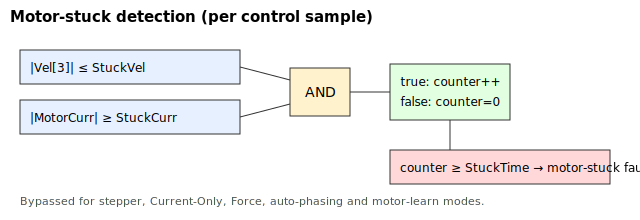

# StuckTime

Duration the stuck condition must persist before the axis is flagged stuck.

## Overview

`StuckTime` is how long the stuck condition must hold continuously before the motor-stuck fault fires. The stuck condition is current at or above [StuckCurr](StuckCurr.md) **and** speed at or below [StuckVel](StuckVel.md). The keyword carries a samples-to-milliseconds scaling, so the value is expressed as a time; internally it is compared against a sample counter. The default is `4096`.

## How it works

The firmware keeps an internal sample counter:

```text
increment the stuck counter
if the stuck counter has reached StuckTime
    turn the axis off and log the fault
```

- The counter increments by one each control sample for as long as the AND-ed [StuckCurr](StuckCurr.md)/[StuckVel](StuckVel.md) condition is true.
- The instant any sample breaks the condition, the counter is reset to `0`. The fault therefore requires a single unbroken run of `StuckTime`; intermittent stalls do not accumulate.
- When the counter reaches `StuckTime`, the axis is turned off and [ConFlt](../../../07-status-and-faults/ConFlt.md) records fault code 1007 (motor stuck).



The control loop runs at a fixed sample rate, so larger `StuckTime` tolerates a longer momentary stall before tripping. Setting it small makes the protection react quickly but increases the chance of nuisance trips during legitimate high-load, low-speed phases.

## Examples

```text
AStuckTime[1]=4096    ; how long the stuck condition must hold continuously
AStuckTime[1]         ; read back
```

## See also

- [StuckCurr](StuckCurr.md) — current threshold; also lists the mode bypasses
- [StuckVel](StuckVel.md) — velocity threshold
- [ConFlt](../../../07-status-and-faults/ConFlt.md) — records fault code 1007 (motor stuck)
