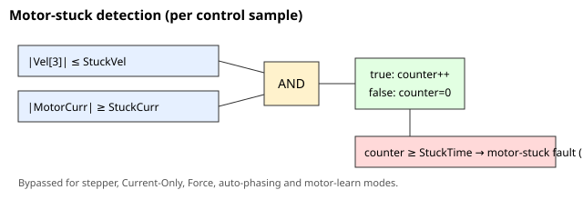

# StuckVel

电机堵转检测的速度阈值。

## 概述

`StuckVel` 是电机堵转检测的速度阈值，单位为 user units/s（默认 `40000`）。它是堵转条件中"几乎不动"的一半：当滤波后速度的绝对值达到或低于 `StuckVel`，同时电流达到或高于 [StuckCurr](StuckCurr.md)，并连续持续 [StuckTime](StuckTime.md) 时，电机被视为不动。

## 工作原理

每个控制采样周期，固件检查 `|Vel[3]| <= StuckVel` **AND** 电机电流的绝对值 `>= StuckCurr`。`Vel[3]` 是主编码器速度 `Vel[2]` 在最近 32 个控制采样周期内的滑动平均（在标准 16 kHz 控制速率下 ≈ 2 ms），因此短暂的抖动不会破坏"堵转"判定。在两个条件同时成立期间，内部计数器递增；当其达到 [StuckTime](StuckTime.md) 时，轴被关闭，[ConFlt](../../../07-status-and-faults/ConFlt.md) 记录 ConFlt 码 1007（电机堵转）。任何打破该条件的采样都会将计数器重置为零。



将 `StuckVel` 设得更高会使"不动"判定更宽松（电机可以缓慢爬行却仍被计为堵转）；将其设为 `0` 则要求电机基本静止。对于步进电机以及仅电流/力控制/自动定相/电机学习模式，检测被绕过；并且整个检查仅在外层门控之后运行（电机使能、真实——非仿真——电机、电流指令型驱动器，即非脉冲方向驱动器；参见 [StuckCurr](StuckCurr.md)）。

### 边界情况

- **电机失能：** 检测不运行；电机失能时内部计数器重置为 `0`。
- **模式依赖性：** 与 [StuckCurr](StuckCurr.md) 相同的绕过列表——仅在采用非步进电机的位置控制/速度控制下有效。
- **范围溢出：** 写入超出 `0…1300000000` 的值会被钳位到关键字的 `range`。
- **清除故障：** ConFlt 码 1007 在重新使能（[MotorOn](../../../08-axis-operation/01-general-keywords/MotorOn.md) = 1）时或通过写入 `AConFlt=0` 清除；[ErrLog](../../../07-status-and-faults/ErrLog.md) 条目仍然保留。
- **HWProtectBits / ProtectMask：** 电机堵转跳闸无法通过 [ProtectMask](../../01-general-protection/ProtectMask.md) 屏蔽（该掩码仅覆盖硬件保护位）。

## 示例

```text
AStuckVel[1]=40000    ; stuck if velocity stays at/below this (user units/s)
AStuckVel[1]          ; read back the threshold
```

## 参见

- [StuckCurr](StuckCurr.md) — 电流阈值（AND 条件的另一半）；也列出了模式绕过情况
- [StuckTime](StuckTime.md) — 该条件必须持续多长时间
- [ConFlt](../../../07-status-and-faults/ConFlt.md) — 记录故障码 1007（电机堵转）
