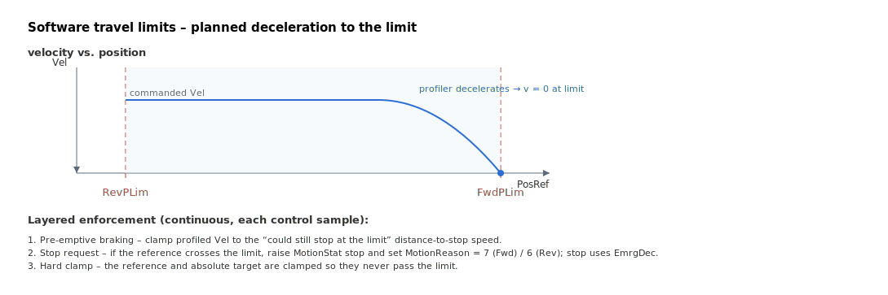

# FwdPLim

Forward software travel limit; reference position is capped here.

## Overview

`FwdPLim` is the forward (positive) software travel limit, in counts. It is the upper bound of the legal travel range; `RevPLim` is the lower bound. The reference position is never allowed to pass `FwdPLim` in the forward direction, and a motion that would carry the axis past it is either rejected at `Begin` or decelerated to a stop at the limit.

Unlike the hardware limit switches reported by `LimitsStat` (which are physical inputs), `FwdPLim`/`RevPLim` are firmware-computed boundaries acting on the position reference. The value is held in flash and cannot be changed while the axis is in motion.

## How it works



The profiler enforces the forward limit in several layered ways:

**1. Pre-emptive braking (planned stop at the limit).** When a point-to-point / jog profile is running, the profiler continuously computes the maximum velocity from which it could still stop exactly at `FwdPLim` using the active deceleration, via a square-root distance-to-stop formula:

```text
DecelerationSpeed = -Decel·T + sqrt(Decel²·T² + 2·Decel·(FwdPLim·2^16 - PosRef)·T)
```

If the profiled velocity exceeds `DecelerationSpeed`, it is clamped to it, so the axis ramps down and arrives at `FwdPLim` at zero speed rather than overshooting.

**2. Stop request when the reference crosses the limit.** If the shaped/filtered reference does pass `FwdPLim` while moving forward, the profiler raises a stop request in [MotionStat](../../../10-motion/05-motion-status/MotionStat.md) and records [MotionReason](../../../10-motion/05-motion-status/MotionReason.md) = 7 (motion ended at the forward software limit). When that reason is active, the stop uses the emergency deceleration `EmrgDec` rather than the normal `Decel`.

**3. Hard clamp of the reference.** In multiple profiler modes the position reference and the absolute target are hard-clamped so they can never exceed `FwdPLim`. The same clamp is also applied inside the control interrupt's PVT/streaming path.

**4. Begin-time rejection.** A motion cannot be started in the "outside the limits, pointing further out" case: if the position reference is already beyond `FwdPLim`/`RevPLim` and the motion mode is not one of the direct/jog modes that can drive back inside, `Begin` is rejected (the axis cannot start a motion while outside the position limits).

| MotionReason | Meaning |
|--------------|---------|
| 7 | Motion stopped at the forward software limit |
| 6 | Motion stopped at the reverse software limit |

### Data type by version

On central-i v5 the limit is stored as a 64-bit position, extending the usable travel range well beyond the 32-bit range used on standalone/v4 (see the frontmatter `range` override). The braking and clamping logic is otherwise identical.

## Examples

```text
AFwdPLim[1]=1000000    ; forward soft limit (counts)
AFwdPLim[1]            ; read back the forward soft limit
```

### Walk-through: confirm a forward soft-limit trip

To validate that the forward software limit is actually enforced, drive a jog past it and inspect the stop reason:

```text
AFwdPLim[1]=100000    ; set the forward soft limit
AMotionMode=0         ; jog
ASpeed=50000          ; positive sign drives toward FwdPLim
ABegin                ; jog forward
```

The profiler's pre-emptive braking decelerates the axis so the reference arrives at `100000` at zero speed. Once stopped, inspect:

```text
AMotionStat                   ; expect 0 (motion ended)
AMotionReason                 ; expect 7 (forward software limit)
ALimitsStat                   ; expect 0 (no hardware switch active)
APosRef                       ; clamped at FwdPLim (100000)
```

If `MotionReason` reports `5` (forward limit switch) instead of `7`, an external FLS engaged first — check [LimitsStat](LimitsStat.md) bit 1. The stop in either case used [EmrgDec](../../../10-motion/03-kinematics-configuration/EmrgDec.md), not the normal `Decel`.

## See also

- [RevPLim](RevPLim.md) — reverse software travel limit (lower bound of the same range)
- [LimitsStat](LimitsStat.md) — hardware limit-switch status (physical RLS/FLS inputs)
- [MotionStat](../../../10-motion/05-motion-status/MotionStat.md) — carries the stop-request bit set when the limit is hit
- [MotionReason](../../../10-motion/05-motion-status/MotionReason.md) — records reason code 7 when motion ends here
- [EmrgDec](../../../10-motion/03-kinematics-configuration/EmrgDec.md) — emergency rate used by this stop (not the normal `Decel`)
- [Decel](../../../10-motion/03-kinematics-configuration/Decel.md) — the rate used by pre-emptive braking before the limit is reached
