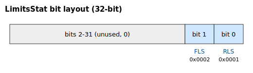

# LimitsStat

Read-only bitfield reporting reverse/forward limit-switch activation.

## Overview

`LimitsStat` reports the current state of the two hardware limit-switch inputs as a bitfield. A set bit (`1`) means that limit is currently active (the switch is engaged). These are physical inputs, distinct from the firmware software travel limits `FwdPLim`/`RevPLim`.

## How it works

The controller updates `LimitsStat` whenever a limit-switch input changes state, setting the appropriate bit when the switch becomes active and clearing it when the switch releases:

| Value | Action |
|-------|--------|
| `0x0001` | Set when the reverse limit switch becomes active |
| `0x0002` | Set when the forward limit switch becomes active |
| `0xFFFE` | Mask that clears the RLS bit |
| `0xFFFD` | Mask that clears the FLS bit |

### Bit layout



| Bit # | Name | Meaning when set |
|-------|------|------------------|
| 0 | RLS | Reverse limit switch active |
| 1 | FLS | Forward limit switch active |
| 2–31 | — | Unused (always 0) |

| `LimitsStat` value | Meaning |
|--------------------|---------|
| 0 | No limit switch active |
| 1 | RLS active |
| 2 | FLS active |
| 3 | Both RLS and FLS active |

### Effect on motion

The profiler reads these bits to brake the axis on contact:

- Moving forward into an active forward limit switch requests a stop with [MotionReason](../../../10-motion/05-motion-status/MotionReason.md) = 5 (motion ended at the forward limit switch).
- Moving backward into an active reverse limit switch requests a stop with [MotionReason](../../../10-motion/05-motion-status/MotionReason.md) = 4 (motion ended at the reverse limit switch).
- These stops use the emergency deceleration `EmrgDec`.
- A `Begin` is rejected if the axis is already inside a limit switch and the commanded direction is further into it.

Homing also inspects `LimitsStat` to detect and react to switch contact during a homing sequence.

### Edge cases

- **Motor off:** the bits still update from the live digital-input states; you can read them at any time to confirm switch wiring before enabling the axis.
- **Mode dependency:** the deceleration response to a switch hit applies in indirect/profiled motion modes. Direct streaming modes (the user drives the reference) honour the bits only through `Begin`-time rejection — the live profiler is not present to brake.
- **Both bits set:** if both RLS and FLS are active (value `3`), the stage is between two close switches or one is mis-wired — no motion can `Begin` in either direction until you jog off.
- **DIn polarity:** the active level of each switch is set in [DInMode](../../../05-inputs-outputs/04-digital-inputs/DInMode.md); reversing polarity there inverts the bits here without rewiring.
- **No fault raised:** limit-switch braking is a controlled deceleration; it does **not** raise a [ConFlt](../../../07-status-and-faults/ConFlt.md). The cause appears in [MotionReason](../../../10-motion/05-motion-status/MotionReason.md) only.
- **HWProtectBits / ProtectMask:** the hardware limit switches are independent of [HWProtectBits](../../01-general-protection/HWProtectBits.md) — they are normal digital inputs, not silicon-level protection.

## Examples

```text
ALimitsStat         ; 0 = none, 1 = RLS, 2 = FLS, 3 = both
```

### Walk-through: confirm a limit-switch trip

```text
AMotionMode=0         ; jog
ASpeed=50000          ; positive sign drives toward the forward limit switch
ABegin                ; jog forward into the FLS
```

When the FLS engages, the profiler raises a stop request and brakes with [EmrgDec](../../../10-motion/03-kinematics-configuration/EmrgDec.md). Inspect:

```text
ALimitsStat                   ; expect bit 1 set -> value 2 (FLS active)
AMotionReason                 ; expect 5 (forward limit switch)
AMotionStat                   ; expect 0 after the stop settles
```

If `MotionReason = 7` instead, the software limit [FwdPLim](FwdPLim.md) trips first, before the switch — the soft limit is inside the switch position. Re-issuing `ABegin` while the FLS bit is still set is rejected; the axis must first jog off the switch in the opposite direction.

## See also

- [FwdPLim](FwdPLim.md) / [RevPLim](RevPLim.md) — software travel limits (firmware-computed, distinct from these physical switches)
- [MotionStat](../../../10-motion/05-motion-status/MotionStat.md) — carries the stop request set when a switch is hit
- [MotionReason](../../../10-motion/05-motion-status/MotionReason.md) — records reason codes 4 (RLS) and 5 (FLS) when motion ends on a limit switch
- [EmrgDec](../../../10-motion/03-kinematics-configuration/EmrgDec.md) — emergency rate used when the profiler brakes on a switch
- [DInMode](../../../05-inputs-outputs/04-digital-inputs/DInMode.md) — assigns the digital inputs that drive these bits
