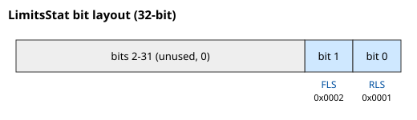

# LimitsStat

只读位域，报告反向/正向限位开关的激活状态。

## 概述

`LimitsStat` 以位域形式报告两个硬件限位开关输入的当前状态。置位（`1`）表示该限位当前处于激活状态（开关已接合）。这些是物理输入，与固件软件行程限位 `FwdPLim`/`RevPLim` 不同。

## 工作原理

每当某个限位开关输入改变状态时，控制器都会更新 `LimitsStat`，在开关变为激活时置位相应的位，并在开关释放时清零该位：

| 值 | 动作 |
|-------|--------|
| `0x0001` | 反向限位开关变为激活时置位 |
| `0x0002` | 正向限位开关变为激活时置位 |
| `0xFFFE` | 清除 RLS 位的掩码 |
| `0xFFFD` | 清除 FLS 位的掩码 |

### 位布局



| 位 # | 名称 | 置位时的含义 |
|-------|------|------------------|
| 0 | RLS | 反向限位开关激活 |
| 1 | FLS | 正向限位开关激活 |
| 2–31 | — | 未使用（始终为 0） |

| `LimitsStat` 值 | 含义 |
|--------------------|---------|
| 0 | 无限位开关激活 |
| 1 | RLS 激活 |
| 2 | FLS 激活 |
| 3 | RLS 和 FLS 均激活 |

### 对运动的影响

规划器读取这些位以在接触时制动轴：

- 正向运动进入已激活的正向限位开关时，请求停止并记录 [MotionReason](../../../10-motion/05-motion-status/MotionReason.md) = 5（运动在正向限位开关处结束）。
- 反向运动进入已激活的反向限位开关时，请求停止并记录 [MotionReason](../../../10-motion/05-motion-status/MotionReason.md) = 4（运动在反向限位开关处结束）。
- 这些停止使用紧急减速 `EmrgDec`。
- 如果轴已处于某个限位开关内侧且指令方向进一步深入其中，则 `Begin` 被拒绝。

回零过程也会检查 `LimitsStat`，以在回零序列期间检测并响应开关接触。

### 边界情况

- **电机失能：** 这些位仍会根据实时的数字量输入状态更新；您可以随时读取它们，以在使能轴之前确认开关接线。
- **模式相关性：** 对开关命中的减速响应适用于间接/规划运动模式。直接流式模式（由用户驱动参考）仅通过 `Begin` 时刻的拒绝来遵守这些位——没有实时规划器进行制动。
- **两位均置位：** 如果 RLS 和 FLS 都激活（值 `3`），则工作台位于两个相距很近的开关之间，或其中一个接线错误——在任一方向都无法 `Begin` 运动，直到您点动脱离为止。
- **DIn 极性：** 每个开关的有效电平在 [DInMode](../../../05-inputs-outputs/04-digital-inputs/DInMode.md) 中设置；在该处反转极性会反转此处的位，而无需重新接线。
- **不引发故障：** 限位开关制动是一次受控减速；它**不会**引发 [ConFlt](../../../07-status-and-faults/ConFlt.md)。其原因仅出现在 [MotionReason](../../../10-motion/05-motion-status/MotionReason.md) 中。
- **HWProtectBits / ProtectMask：** 硬件限位开关独立于 [HWProtectBits](../../01-general-protection/HWProtectBits.md)——它们是普通的数字量输入，而非硅级保护。

## 示例

```text
ALimitsStat         ; 0 = none, 1 = RLS, 2 = FLS, 3 = both
```

### 操作演示：确认限位开关跳闸

```text
AMotionMode=0         ; jog
ASpeed=50000          ; positive sign drives toward the forward limit switch
ABegin                ; jog forward into the FLS
```

当 FLS 接合时，规划器发出停止请求并以 [EmrgDec](../../../10-motion/03-kinematics-configuration/EmrgDec.md) 制动。检查：

```text
ALimitsStat                   ; expect bit 1 set -> value 2 (FLS active)
AMotionReason                 ; expect 5 (forward limit switch)
AMotionStat                   ; expect 0 after the stop settles
```

如果 `MotionReason = 7` 而非 5，则软件限位 [FwdPLim](FwdPLim.md) 先于开关跳闸——软件限位位于开关位置之内。在 FLS 位仍置位时重新发出 `ABegin` 会被拒绝；轴必须先朝相反方向点动脱离开关。

## 另请参阅

- [FwdPLim](FwdPLim.md) / [RevPLim](RevPLim.md) — 软件行程限位（由固件计算，与这些物理开关不同）
- [MotionStat](../../../10-motion/05-motion-status/MotionStat.md) — 携带命中开关时置位的停止请求
- [MotionReason](../../../10-motion/05-motion-status/MotionReason.md) — 运动在限位开关处结束时记录原因码 4（RLS）和 5（FLS）
- [EmrgDec](../../../10-motion/03-kinematics-configuration/EmrgDec.md) — 规划器在开关处制动时使用的紧急速率
- [DInMode](../../../05-inputs-outputs/04-digital-inputs/DInMode.md) — 分配驱动这些位的数字量输入
