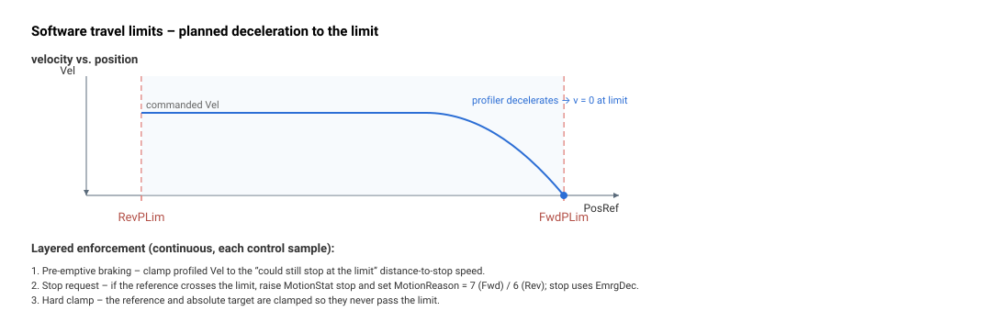

# RevPLim

反向软件行程限位；参考位置在此处被钳位。

## 概述

`RevPLim` 是反向（负方向）软件行程限位，以 counts 为单位。它是合法行程范围的下界；`FwdPLim` 是上界。参考位置在反方向上绝不允许越过 `RevPLim`，会使轴越过该限位的运动要么在 `Begin` 处被拒绝，要么减速并在限位处停止。

与 `LimitsStat` 报告的硬件限位开关（物理输入）不同，`RevPLim`/`FwdPLim` 是由固件计算、作用于位置参考的边界。该值保存在闪存中，且在轴运动期间不能更改。

## 工作原理



反向限位是正向限位的镜像；适用同样的四种机制：

**1. 预先制动。** 对于负方向曲线，停止距离速度针对 `RevPLim` 计算：

```text
DecelerationSpeed = Decel·T - sqrt(Decel²·T² + 2·Decel·(PosRef - RevPLim))
```

规划速度被钳位到该值，使轴以零速度到达 `RevPLim`。

**2. 参考越过限位时的停止请求。** 如果整形/滤波后的参考在反向运动时低于 `RevPLim`，则会在 [MotionStat](../../../10-motion/05-motion-status/MotionStat.md) 中发出停止请求，并记录 [MotionReason](../../../10-motion/05-motion-status/MotionReason.md) = 6（运动在反向软件限位处结束）；此停止随后使用 `EmrgDec`。

**3. 硬钳位。** 在规划器模式下（包括缓冲/流式（FIFO）运动路径），参考和绝对目标会被钳位为不低于 `RevPLim`。

**4. Begin 时刻的拒绝。** 如果位置参考已经低于 `RevPLim`，且运动模式无法驱动回到内侧，则运动被拒绝（轴在位置限位之外时无法启动运动）。

| MotionReason | 含义 |
|--------------|---------|
| 6 | 运动在反向软件限位处停止 |
| 7 | 运动在正向软件限位处停止 |

### 实时状态与停止原因

除了在停止事件时记录的一次性 [MotionReason](../../../10-motion/05-motion-status/MotionReason.md) 6/7 之外，控制器还在 [StatReg](../../../07-status-and-faults/StatReg.md) 中报告一个连续可轮询的标志：每当整形/滤波后的位置参考低于 `RevPLim` 时置位位 19，每当其超过 `FwdPLim` 时置位位 20（否则均清零，每个控制周期重新评估）。这些仅为状态，不会引发 [ConFlt](../../../07-status-and-faults/ConFlt.md)。参见 [StatReg](../../../07-status-and-faults/StatReg.md) 位 19/20。

### 按版本的数据类型

在 central-i v5 上，限位以 64 位位置存储，将可用行程范围扩展到超过 standalone/v4 所用的 32 位范围（参见前置数据中的 `range` 覆盖）。除此之外，制动与钳位逻辑完全相同。

> **公式说明（不对称性）：** 上述反向方向的固件公式不包含正向方向公式（见 [FwdPLim](FwdPLim.md)）中出现的 `·2^k` 位置缩放或末尾的 `·T` 因子。这种不对称性存在于固件本身，并非编辑上的差异。

### 边界情况

- **电机失能：** 规划器未运行，因此不会发生预先制动。当稍后启动运动时，位置参考的硬钳位和 `Begin` 时刻的拒绝仍然生效。
- **模式相关性：** 预先制动和停止请求机制适用于间接/规划运动模式。直接流式模式在规划器之外驱动参考——硬钳位仍会将其固定在 `RevPLim`，但不会获得预先减速斜坡。
- **不引发故障：** 位置限位制动是一次受控减速；它**不会**引发 [ConFlt](../../../07-status-and-faults/ConFlt.md)，也不与 [ProtectMask](../../01-general-protection/ProtectMask.md) 交互。其原因仅出现在 [MotionReason](../../../10-motion/05-motion-status/MotionReason.md) 中。
- **运动中无法更改：** `RevPLim` 受 `ok_in_motion: false` 门控——运动期间写入会被拒绝。
- **范围溢出：** v4 关键字范围为 `−2147483648…2147483647`；v5 扩展到 ±2^51（参见前置数据 `central-i.v5` 覆盖）。

## 示例

```text
ARevPLim[1]=-1000000    ; reverse soft limit (counts)
ARevPLim[1]             ; read back the reverse soft limit
```

验证流程是正向流程的镜像——参见 [FwdPLim](FwdPLim.md) 的**操作演示：确认正向软件限位跳闸**，但需以负 `Speed` 点动，并预期 `MotionReason = 6`。

## 另请参阅

- [FwdPLim](FwdPLim.md) — 正向软件行程限位（同一范围的上界；含操作演示）
- [LimitsStat](LimitsStat.md) — 硬件限位开关状态（物理 RLS/FLS 输入）
- [MotionStat](../../../10-motion/05-motion-status/MotionStat.md) — 携带命中限位时置位的停止请求位
- [MotionReason](../../../10-motion/05-motion-status/MotionReason.md) — 运动在此结束时记录原因码 6
- [EmrgDec](../../../10-motion/03-kinematics-configuration/EmrgDec.md) — 此停止使用的紧急速率（而非常规的 `Decel`）
