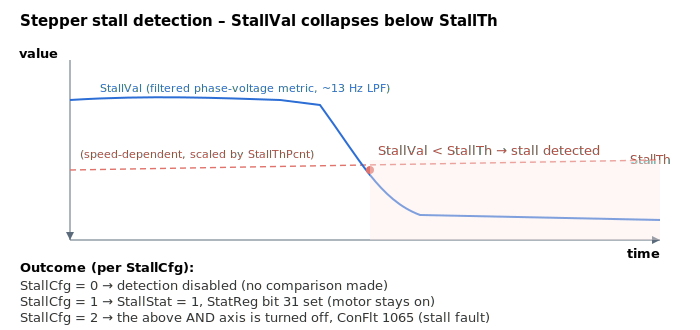

# StallTh

Read-only stepper stall-detection threshold.

## Overview

`StallTh` is the read-only, firmware-computed threshold against which the stall metric [StallVal](StallVal.md) is compared: a stall is declared when `StallVal < StallTh`. It is recomputed every control sample (only while [StallCfg](StallCfg.md) enables detection) as a speed-dependent threshold scaled by [StallThPcnt](StallThPcnt.md) and shaped by the [StallCnst](StallCnst.md) coefficients.

## How it works

The threshold is built each sample from the commanded velocity, the percentage [StallThPcnt](StallThPcnt.md), and the two [StallCnst](StallCnst.md) coefficients, then low-pass filtered:

```text
speed = |commanded velocity| >> (StepBits - 2)   ; scaled commanded speed, shifted to avoid overflow

threshold input = (StallThPcnt * speed) * 0.01 * 0.001
                  * (StallCnst[1]*speed + StallCnst[2])
                  - 10000                          ; fixed offset

StallTh = threshold input * 0.005 + 0.995 * previous StallTh   ; same ~13 Hz LPF as StallVal
```

In words:

- `StallCnst[1]·speed + StallCnst[2]` is a **linear fit of the expected metric vs. speed** (slope and intercept) — see [StallCnst](StallCnst.md). This makes the threshold track how the healthy `StallVal` is expected to grow with speed.
- That fit is scaled by `StallThPcnt/100` (the `× 0.01`) and a fixed `× 0.001`, so `StallThPcnt` sets *what fraction* of the expected healthy value counts as "stalled" — a lower percentage means a lower threshold and therefore less-sensitive detection.
- A fixed offset of `10000` is subtracted to reduce false triggers.
- The result is filtered with the same 0.005 smoothing factor as `StallVal`, so threshold and metric move on the same time scale.

`StallTh` is read-only and is reset to `0` when the motor is off.



## Examples

```text
AStallTh[1]           ; read the live (filtered) stall threshold
```

## See also

- [StallThPcnt](StallThPcnt.md) — percentage that scales this threshold
- [StallCnst](StallCnst.md) — slope/intercept coefficients of the speed-dependent fit
- [StallVal](StallVal.md) — metric compared against this threshold
- [StallStat](StallStat.md) — set when `StallVal < StallTh`
