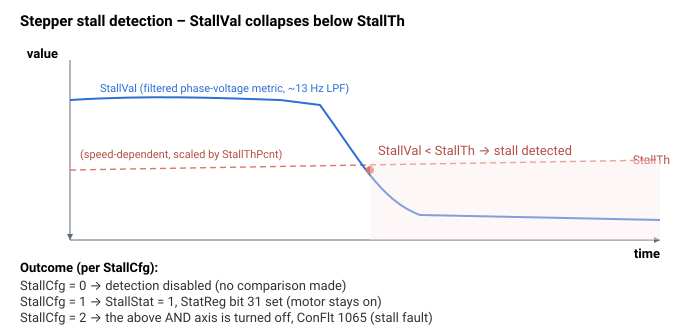

# StallVal

只读的步进失步检测度量当前值。

## 概述

`StallVal` 是步进失步检测度量的只读实时值——该量与阈值 [StallTh](StallTh.md) 比较以判定 [StallStat](StallStat.md)。它由电机相电压导出，作为电机负载角 / 反电动势的代理量：当步进电机失步时，该值会崩落。

## 工作原理

该度量在步进电流环分支内每个控制周期计算。首先形成各相电压差的平方和：

```text
voltage sum = (Va-Vc)² + (Vb-Vc)²
```

然后通过一阶低通滤波器（平滑因子 `0.005`，≈13 Hz 截止频率）以产生 `StallVal`：

```text
StallVal = voltage sum * 0.005 + 0.995 * previous StallVal
```

`Va`、`Vb`、`Vc` 是步进电机的（饱和后）相电压。当电机跟随其指令电角度时，这些相电压差保持较高；当转子失步（堵转）时，有效贡献下降，`StallVal` 随之下降。当 `StallVal` 跌落到所计算的阈值 [StallTh](StallTh.md) **以下**时即判定为失步。当电机失能时 `StallVal` 复位为 `0`。



> 注意：此度量仅针对由内置驱动器驱动的步进电机产生；伺服或外部驱动器配置不会生成该度量。

## 示例

```text
AStallVal[1]          ; read the live stall metric (filtered)
```

## 另请参阅

- [StallTh](StallTh.md) — 此值与之比较的阈值（当 `StallVal < StallTh` 时失步）
- [StallStat](StallStat.md) — 最终的失步标志
- [StallCfg](StallCfg.md) — 启用/选择失步检测
