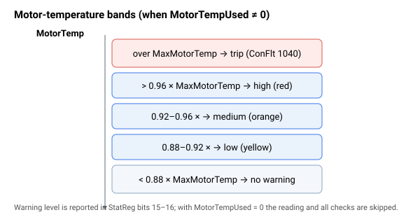

# 电机温度

电机温度保护使用接入温度传感器输入的温度传感器（RTD/PT100）来防止电机过热。

- [MotorTempUsed](MotorTempUsed.md) 是总开关：未选择传感器（`0`）时，跳过温度读取与全部保护；启用后，读取与保护均生效。
- [MotorTemp](MotorTemp.md) 是以 °C 为单位的测量温度。
- [MaxMotorTemp](MaxMotorTemp.md) 是过温限值。超出该限值会禁用轴，并在 [ConFlt](../../07-status-and-faults/ConFlt.md) 上触发故障码 1040（电机温度过高）；在到达该限值之前，会在 [StatReg](../../07-status-and-faults/StatReg.md) 第 15–16 位中报告分级告警。

