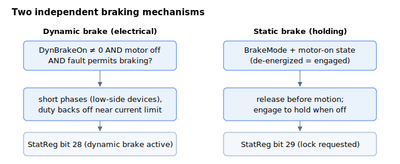

# Brake

The drive provides two independent braking mechanisms:

- [Dynamic brake](Dynamicbrake.md) — electrical braking that rapidly slows the motor by shorting its phases through the low-side devices and dissipating the back-EMF current. Used to stop a motor that is suddenly disabled. Reported in [StatReg](../../07-status-and-faults/StatReg.md) bit 28.
- [Static brake](Staticbrake.md) — control of an external fail-safe holding (electromechanical) brake, engaged to hold the load when the axis is off and released before motion, with optional automatic timing tied to the motor-on sequence. The lock request is reported in [StatReg](../../07-status-and-faults/StatReg.md) bit 29.

