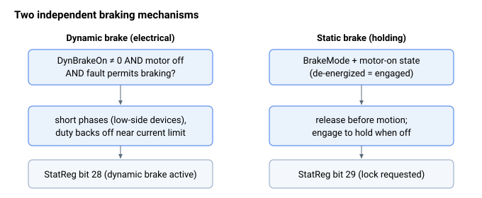

# Brake

驱动器提供两种独立的制动机制：

- [Dynamic brake](Dynamicbrake.md) — 电气制动，通过低边器件将电机各相短接并耗散反电动势电流，从而快速使电机减速。用于停止突然被禁用的电机。在 [StatReg](../../07-status-and-faults/StatReg.md) 第 28 位中报告。
- [Static brake](Staticbrake.md) — 对外部失效保护型保持（机电）制动器的控制，在轴关闭时接入以保持负载，在运动前松开，可选地与电机使能序列联动实现自动定时。抱闸请求在 [StatReg](../../07-status-and-faults/StatReg.md) 第 29 位中报告。

