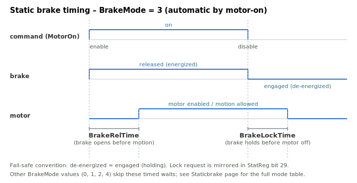

# Static brake

Static braking controls an external holding (electromechanical) brake — engaging it to hold the load when the axis is off and releasing it before motion. This page covers `BrakeUsed`, `BrakeMode`, `BrakeLockTime`, and `BrakeRelTime`.

## How it works

The brake is a fail-safe electromechanical device: **de-energized = engaged (holding)**, **energized = released**. The drive controls it through a release/lock command (set = release, clear = lock) and mirrors the request in [StatReg](../../07-status-and-faults/StatReg.md) **bit 29** (static-brake lock requested). The brake state machine runs each control cycle, selecting behaviour from `BrakeMode`. If `BrakeUsed = 0` the drive drives no voltage to the (absent) device, and in manual modes a 1→0 change of `BrakeUsed` leaves the brake in its last state.

## BrakeUsed

Enables or disables the static brake feature.

| Value | Description |
|-------|-------------|
| 0 | Disabled |
| 1 | Enabled |

## BrakeMode

Defines how the brake is controlled. (Engaged = de-energized; released = energized.) The **default is 2** (manual release, without protection).

| Value | Mode | Behaviour |
|-------|------|-----------|
| 0 | **Manual lock** | Always locks → brake engaged. |
| 1 | **Manual release, with protection** | Releases the brake only while the motor is enabled; if the motor is off the brake re-engages. |
| 2 | **Manual release, without protection** *(default)* | Always releases → brake released, regardless of motor state. |
| 3 | **Automatic by motor-on state** | Released when the motor is enabled, engaged when disabled; the release/lock is timed by the `MotorOn` sequence using `BrakeRelTime` / `BrakeLockTime`. |
| 4 | **Automatic by discrete input, with protection** | Driven from a discrete input: input high → engage (if not in motion); input low → release (if motor enabled). |

If `BrakeMode` is somehow out of range, the default action keeps the brake **locked** (safe state).

## BrakeLockTime

> **Condition:** active only when `BrakeMode = 3` (automatic by motor-on).

Delay, in milliseconds, from receiving the motor-disable command until the motor is actually disabled — giving the brake time to engage first. On a disable command the drive first engages the brake, arms a counter of `BrakeLockTime` (converted to control samples), waits for it to elapse, **then** disables the motor.

**Example:** if the brake takes 300 ms to engage after power is cut, set `BrakeLockTime = 350`. On a disable command the controller engages the brake, waits 350 ms, then disables the motor.

## BrakeRelTime

> **Condition:** active only when `BrakeMode = 3` (automatic by motor-on).

Time to wait, in milliseconds, after releasing (energizing) the brake before allowing motion. On a motor-on command the drive enables the motor, releases the brake, arms a counter of `BrakeRelTime` samples, and waits for it to elapse before returning — so motion is not commanded until the brake has had time to open.

**Example:** if the brake takes 150 ms to release, set `BrakeRelTime = 200`. On a motor-on command the controller energizes the brake, waits 200 ms, then allows motion.

> Both times are stored internally in control samples and must not be set to 0 in `BrakeMode = 3`, or the timing logic would not behave as intended.

## Timing diagram (BrakeMode = 3)



## Walk-through: automatic brake handoff on enable/disable (BrakeMode 3)

A typical vertical-axis setup uses `BrakeMode = 3` so the static brake covers the windows where the motor is off:

```text
ABrakeUsed=1            ; enable the brake feature
ABrakeMode=3            ; automatic by MotorOn state
ABrakeRelTime=200       ; wait 200 ms after release before allowing motion
ABrakeLockTime=350      ; engage brake then wait 350 ms before disabling the motor
```

On enable (`AMotorOn = 1`):

```text
AStatReg                ; bit 29 clears (release requested)
                        ; for BrakeRelTime ms the motor is energized but motion is held off
```

After `BrakeRelTime` elapses the axis can move. Verify by issuing `ABegin` immediately after `AMotorOn = 1` — motion should not start before the brake has released.

On disable (`AMotorOn = 0`):

```text
AStatReg                ; bit 29 sets (lock requested) immediately
                        ; motor stays energized for BrakeLockTime ms, then disables
```

If the load drops on disable, increase `BrakeLockTime` so the brake fully engages before the motor torque is removed. If motion stutters at the start of a move, increase `BrakeRelTime` so the brake is fully open before the profiler starts.

## See also

- [Dynamic brake](Dynamicbrake.md) — fast electrical braking (shorting the phases)
- [StatReg](../../07-status-and-faults/StatReg.md) — bit 29 reports the static-brake lock request
- [MotorOn](../../08-axis-operation/01-general-keywords/MotorOn.md) — drives the `BrakeMode = 3` release/lock timing
