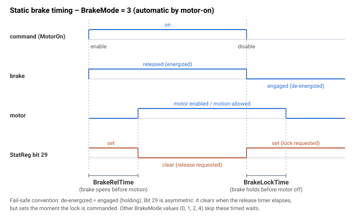

# Static brake

静态制动控制一个外部抱闸（机电式）制动器——在轴失能时将其抱闸以保持负载，并在运动前松闸。本页介绍 `BrakeUsed`、`BrakeMode`、`BrakeLockTime` 和 `BrakeRelTime`。

## 工作原理

该制动器是一种失效安全的机电式装置：**断电 = 抱闸（保持）**，**通电 = 松闸**。驱动器通过松闸/抱闸指令（置位 = 松闸，清除 = 抱闸）控制它，并在 [StatReg](../../07-status-and-faults/StatReg.md) **bit 29**（请求静态制动器抱闸）中映射该请求。制动器状态机每个控制周期运行一次，根据 `BrakeMode` 选择行为。如果 `BrakeUsed = 0`，驱动器不向（不存在的）装置施加任何电压；在手动模式下，`BrakeUsed` 的 1→0 变化使制动器保持在其上一状态。

## BrakeUsed

使能或禁用静态制动器功能。

| 取值 | 说明 |
|-------|-------------|
| 0 | 禁用 |
| 1 | 使能 |

## BrakeMode

定义如何控制制动器。（抱闸 = 断电；松闸 = 通电。）**默认为 2**（手动松闸，无保护）。

| 取值 | 模式 | 行为 |
|-------|------|-----------|
| 0 | **手动抱闸** | 始终抱闸 → 制动器接入。 |
| 1 | **手动松闸，带保护** | 仅在电机使能时松闸；如果电机失能，制动器重新抱闸。 |
| 2 | **手动松闸，无保护** *(默认)* | 始终松闸 → 制动器松闸，与电机状态无关。 |
| 3 | **按电机使能状态自动** | 电机使能时松闸，失能时抱闸；松闸/抱闸由 `MotorOn` 序列使用 `BrakeRelTime` / `BrakeLockTime` 进行定时。 |
| 4 | **按数字量输入自动，带保护** | 由数字量输入驱动：输入高 → 抱闸（若不在运动中）；输入低 → 松闸（若电机使能）。 |

如果 `BrakeMode` 不知何故超出范围，默认动作使制动器保持**抱闸**（安全状态）。

## BrakeLockTime

> **条件：** 仅在 `BrakeMode = 3`（按电机使能自动）时有效。

从收到电机禁用指令到电机实际禁用之间的延迟，单位为毫秒——给制动器留出先行抱闸的时间。在收到禁用指令时，驱动器首先抱闸，设置一个 `BrakeLockTime`（转换为控制采样数）的计数器，等待其耗尽，**然后**禁用电机。

**示例：** 如果断电后制动器需要 300 ms 才能抱闸，则设置 `BrakeLockTime = 350`。在收到禁用指令时，控制器抱闸，等待 350 ms，然后禁用电机。

## BrakeRelTime

> **条件：** 仅在 `BrakeMode = 3`（按电机使能自动）时有效。

在松闸（通电）后、允许运动前需等待的时间，单位为毫秒。在收到电机使能指令时，驱动器使能电机，松闸，设置一个 `BrakeRelTime` 采样的计数器，并等待其耗尽后才返回——因此在制动器有时间打开之前不会发出运动指令。

**示例：** 如果制动器需要 150 ms 才能松闸，则设置 `BrakeRelTime = 200`。在收到电机使能指令时，控制器给制动器通电，等待 200 ms，然后允许运动。

> 两个时间均在内部以控制采样数存储，在 `BrakeMode = 3` 中不得设为 0，否则时序逻辑将无法按预期工作。

## 时序图（BrakeMode = 3）



## 演示：使能/禁用时的自动制动器交接（BrakeMode 3）

一个典型的垂直轴配置使用 `BrakeMode = 3`，以便静态制动器覆盖电机失能的时间窗口：

```text
ABrakeUsed=1            ; enable the brake feature
ABrakeMode=3            ; automatic by MotorOn state
ABrakeRelTime=200       ; wait 200 ms after release before allowing motion
ABrakeLockTime=350      ; engage brake then wait 350 ms before disabling the motor
```

使能时（`AMotorOn = 1`）：

```text
AStatReg                ; bit 29 clears (release requested)
                        ; for BrakeRelTime ms the motor is energized but motion is held off
```

`BrakeRelTime` 耗尽后，轴可以运动。可在 `AMotorOn = 1` 后立即发出 `ABegin` 来验证——运动不应在制动器松闸之前开始。

禁用时（`AMotorOn = 0`）：

```text
AStatReg                ; bit 29 sets (lock requested) immediately
                        ; motor stays energized for BrakeLockTime ms, then disables
```

如果禁用时负载下坠，则增大 `BrakeLockTime`，使制动器在电机转矩移除之前完全抱闸。如果运动在起始时出现卡顿，则增大 `BrakeRelTime`，使制动器在规划器启动之前完全打开。

### 边界情况

- **电机失能：** 在模式 `1`（手动松闸带保护）和 `4`（输入带保护）中，电机失能时制动器重新抱闸；在模式 `2`（手动松闸无保护）中，即使电机失能制动器仍保持松闸。
- **模式 `3` 时序：** `BrakeLockTime` 和 `BrakeRelTime` **仅**在模式 `3` 中有效。在模式 `3` 中将它们设为 `0` 会使时序逻辑失效——两者均应保持 ≥ 数个控制采样。
- **手动模式下 `BrakeUsed = 0`：** [BrakeUsed](Staticbrake.md) 的 `1→0` 变化使制动器保持在其上一状态（驱动器仅停止驱动输出）；制动器硬件随后保持其当前状态，直至断电。
- **范围溢出：** `BrakeMode` 超出范围会回退至安全默认值——制动器**抱闸**。
- **HWProtectBits / ProtectMask：** 静态制动机制不产生 [ConFlt](../../07-status-and-faults/ConFlt.md)，且不可被掩码屏蔽。抱闸请求在 [StatReg](../../07-status-and-faults/StatReg.md) bit 29 中可见。
- **`MotorReason` 与制动器：** 如果你禁用电机且制动器重新置位抱闸，[MotorReason](../../07-status-and-faults/MotorReason.md) 反映的是禁用原因（控制器故障、DI、用户程序或通信）——而非制动器状态。

## 参见

- [Dynamic brake](Dynamicbrake.md) — 快速电气制动（短接电机相）
- [StatReg](../../07-status-and-faults/StatReg.md) — bit 29 报告静态制动器抱闸请求
- [MotorOn](../../08-axis-operation/01-general-keywords/MotorOn.md) — 驱动 `BrakeMode = 3` 的松闸/抱闸时序
