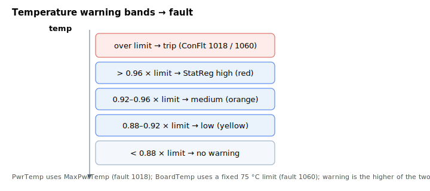

# Board temperature

Keywords for monitoring the drive's own temperatures (the power stage and the controller board) and protecting against overheating.

- [PwrTemp](PwrTemp.md) reports the power-stage (IPM) temperature. [MaxPwrTemp](MaxPwrTemp.md) is its user-settable over-temperature limit; exceeding it disables the axis with fault code 1018 (IPM temperature too high) on [ConFlt](../../07-status-and-faults/ConFlt.md).
- [BoardTemp](BoardTemp.md) reports the controller-board temperature, protected against a fixed 75 °C limit; exceeding it raises fault code 1060 (board temperature too high).

Both contribute to the combined power/board-temperature warning reported in [StatReg](../../07-status-and-faults/StatReg.md) bits 11–12, where the reported level is the higher of the two.

