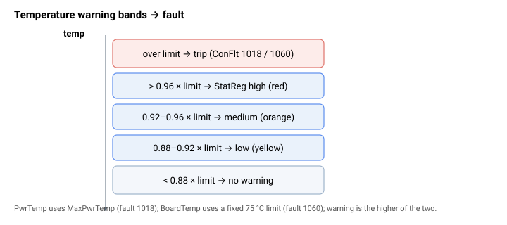

# Board temperature

用于监测驱动器自身温度（功率级和控制器板）并防止过热的关键字。

- [PwrTemp](PwrTemp.md) 报告功率级（IPM）温度。[MaxPwrTemp](MaxPwrTemp.md) 是其用户可设置的过温限值；超过该限值会以故障码 1018（IPM 温度过高）在 [ConFlt](../../07-status-and-faults/ConFlt.md) 上禁用轴。
- [BoardTemp](BoardTemp.md) 报告控制器板温度，受固定的 75 °C 限值保护；超过该限值会触发故障码 1060（板温度过高）。

两者共同构成在 [StatReg](../../07-status-and-faults/StatReg.md) bits 11–12 中报告的功率/板温度组合告警，其中报告的等级取两者中较高者。

