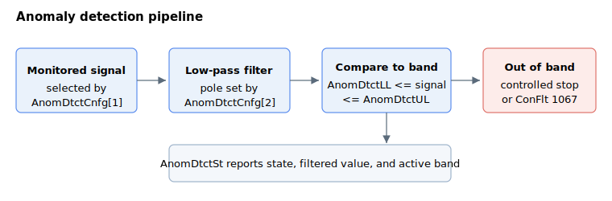

# Anomaly detection

Anomaly (collision) detection watches a chosen signal during motion and trips the axis when the signal leaves an expected band. It is intended to catch mechanical anomalies — a collision, a jam, an unexpected load — by learning the normal shape of a repeated motion and flagging deviations from it.

The detector runs every control cycle through a fixed pipeline:

1. **Source** — [AnomDtctCnfg](AnomDtctCnfg.md) element 1 selects which signal is monitored (for example a current or force reading) by holding its complex CAN code.
2. **Filter** — the signal is passed through a second-order low-pass filter each cycle; element 2 of [AnomDtctCnfg](AnomDtctCnfg.md) sets the filter pole frequency.
3. **Compare** — the filtered value is compared against an expected band defined point-by-point along the motion by the [AnomDtctUL](AnomDtctUL.md) (upper) and [AnomDtctLL](AnomDtctLL.md) (lower) limit tables. [AnomDtctGap](AnomDtctGap.md) sets how many cycles each table point covers.
4. **React** — if the filtered value goes above the upper limit or below the lower limit, the detector trips. Depending on configuration it either commands a controlled stop or disables the axis with fault code 1067 (anomaly/collision detected) on [ConFlt](../../07-status-and-faults/ConFlt.md).

[AnomDtctOn](AnomDtctOn.md) enables the detector and [AnomDtctSt](AnomDtctSt.md) reports its live state, the current filtered value, and the band currently in force.

This feature is available from v5 (central-i).

## Keywords

- [AnomDtctOn](AnomDtctOn.md) — enable or disable detection on the axis.
- [AnomDtctCnfg](AnomDtctCnfg.md) — configuration array: monitored source, filter pole, stop behavior, motion selection.
- [AnomDtctUL](AnomDtctUL.md) / [AnomDtctLL](AnomDtctLL.md) — upper and lower limit tables that define the expected band along each monitored motion.
- [AnomDtctGap](AnomDtctGap.md) — how many control cycles each limit-table point spans, per motion.
- [AnomDtctSt](AnomDtctSt.md) — status array: detector state, filtered value, active band, active motion.
