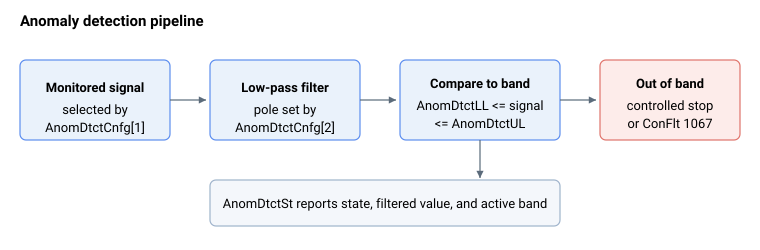

# 异常检测

异常（碰撞）检测在运动期间监视所选信号，并在该信号超出预期分段时使轴跳闸。它旨在通过学习重复运动的正常形态并标记偏离该形态的情况，来捕捉机械异常——碰撞、卡阻或意外负载。

检测器在运动进行期间通过一个固定流程运行：

1. **来源** — [AnomDtctCnfg](AnomDtctCnfg.md) 元素 1 通过保存其复合 CAN 码来选择监视哪个信号（例如某个电流或力的读数）。
2. **滤波** — 该信号每个控制周期经过一个二阶低通滤波器；[AnomDtctCnfg](AnomDtctCnfg.md) 的元素 2 设置滤波器极点频率。滤波后的值每个周期报告在 [AnomDtctSt](AnomDtctSt.md) 元素 2 中。
3. **比较** — 将滤波后的值与一个预期分段进行比较，该分段由 [AnomDtctUL](AnomDtctUL.md)（上限）和 [AnomDtctLL](AnomDtctLL.md)（下限）限值表沿运动逐点定义。分段检查在每个 [AnomDtctGap](AnomDtctGap.md) 窗口起始处求值：使用默认的 1 周期间隔时这实际上是每个周期，但使用更大的间隔时分段在每个窗口采样一次（在窗口中段发生的越界不会被检查）。[AnomDtctGap](AnomDtctGap.md) 设置每个表点所覆盖的周期数。
4. **响应** — 如果某个采样的滤波值超过上限或低于下限，检测器跳闸。根据配置，它要么命令受控停止，要么以故障码 1067（检测到异常/碰撞）在 [ConFlt](../../07-status-and-faults/ConFlt.md) 上禁用轴。

[AnomDtctOn](AnomDtctOn.md) 使能检测器，[AnomDtctSt](AnomDtctSt.md) 报告其实时状态、当前滤波值以及当前生效的分段。

此功能自 v5（central-i）起可用。

## 关键字

- [AnomDtctOn](AnomDtctOn.md) — 在轴上启用或禁用检测。
- [AnomDtctCnfg](AnomDtctCnfg.md) — 配置数组：监视来源、滤波器极点、停止行为、运动选择。
- [AnomDtctUL](AnomDtctUL.md) / [AnomDtctLL](AnomDtctLL.md) — 上限和下限表，定义每个被监视运动沿途的预期分段。
- [AnomDtctGap](AnomDtctGap.md) — 每个限值表点跨越多少个控制周期，按运动设置。
- [AnomDtctSt](AnomDtctSt.md) — 状态数组：检测器状态、滤波值、生效分段、生效运动。
