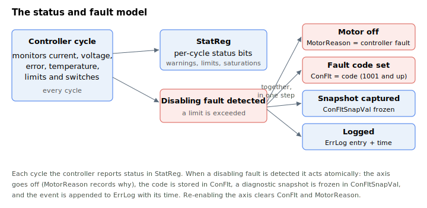

# Status and Faults

Keywords that report the live status of an axis and record why and how it faulted. Every controller cycle the axis status is published as a bitfield in [StatReg](StatReg.md). When a disabling fault is detected, the controller acts in one atomic step: it turns the motor off and records the reason in [MotorReason](MotorReason.md), stores the fault code in [ConFlt](ConFlt.md), freezes a diagnostic snapshot in [ConFltSnapVal](ConFltSnapVal.md), and appends the event with its time to the controller log [ErrLog](ErrLog.md).

The category contains:

- **Live status** — [StatReg](StatReg.md), the 32-bit per-axis status word (warnings, limits, saturations, brake, homing and stall).
- **Fault code** — [ConFlt](ConFlt.md), the code that disabled the axis (`0` = no fault; codes are numbered from `1001`). See [Controller error codes](../../04-error-codes/controller-error-codes.md) for the full list.
- **Disable reason** — [MotorReason](MotorReason.md), distinguishing a fault from a deliberate disable command.
- **Fault snapshot** — [ConFltSnapSrc](ConFltSnapSrc.md) selects which parameters are captured, and [ConFltSnapVal](ConFltSnapVal.md) holds the values frozen at the moment of the fault.
- **Error log** — [ErrLog](ErrLog.md), the unit-wide circular log of recent errors and their times, cleared with [ClearErr](ClearErr.md).

`ConFlt` and `MotorReason` reflect the current fault state and are cleared when the axis is re-enabled; the snapshot and the log persist for later diagnosis.
