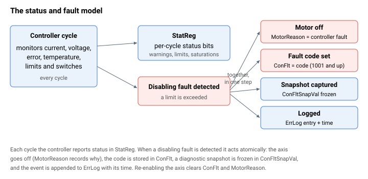

# 状态与故障

用于报告轴实时状态、并记录其因何及如何故障的关键字。每个控制器周期，轴状态都会作为位域发布到 [StatReg](StatReg.md)。当检测到禁用性故障时，控制器在一个原子步骤中完成动作：关闭电机并将原因记录到 [MotorReason](MotorReason.md)，将故障码存入 [ConFlt](ConFlt.md)，在 [ConFltSnapVal](ConFltSnapVal.md) 中冻结一份诊断快照，并将该事件连同其发生时间追加到控制器日志 [ErrLog](ErrLog.md)。



该类别包含：

- **实时状态** —— [StatReg](StatReg.md)，每轴的 32 位状态字（告警、限位、饱和、抱闸、回零和堵转）。
- **故障码** —— [ConFlt](ConFlt.md)，禁用该轴的代码（`0` = 无故障；代码从基数 `1000` 开始编号）。完整列表见 [控制器错误代码](../../04-error-codes/controller-error-codes.md)。
- **禁用原因** —— [MotorReason](MotorReason.md)，区分故障与有意的禁用指令。
- **故障快照** —— [ConFltSnapSrc](ConFltSnapSrc.md) 选择捕获哪些参数，[ConFltSnapVal](ConFltSnapVal.md) 保存在故障时刻冻结的值。
- **错误日志** —— [ErrLog](ErrLog.md)，整个单元范围内近期错误及其发生时间的循环日志，可用 [ClearErr](ClearErr.md) 清除。

`ConFlt` 和 `MotorReason` 反映当前故障状态，并在轴重新使能时被清除；而快照和日志则持续保留以供后续诊断。

## 操作演练：诊断一次故障发生

当一个轴跳闸时，四项状态会在一个原子步骤中写入：[MotorOn](../08-axis-operation/01-general-keywords/MotorOn.md) 被强制关闭，[ConFlt](ConFlt.md) 取得故障码，[ConFltSnapVal](ConFltSnapVal.md) 冻结所选参数的快照，并将该事件连同时间戳追加到 [ErrLog](ErrLog.md)。标准诊断步骤按该顺序读取它们。

1. **提前一次性配置快照。** [ConFltSnapSrc](ConFltSnapSrc.md) 的槽 `[1]..[4]` 指定最多四个要捕获的参数（以[复合 CAN 代码](../../01-keyword-usage-and-syntax/complex-can-code.md)形式）；[ConFltSnapVal](ConFltSnapVal.md) 的槽 `[5]..[14]` 是固定的系统参数，总是被自动捕获。写入 `ConFltSnapSrc` 也会清除现有快照 —— 请在你想要诊断的故障发生*之前*重新配置，而不是之后：

   ```text
   AConFltSnapSrc[1]=33                  ; capture StatReg (CAN code 33) into ConFltSnapVal[1]
   AConFltSnapSrc[2]=<complex code of AVel[1]>
   AConFltSnapSrc[3]=<complex code of ACurrent>
   AConFltSnapSrc[4]=0                   ; disable slot 4
   ```

2. **故障发生后，读取故障码。** [ConFlt](ConFlt.md) 在无故障时为 `0`，在轴被控制器禁用时为正代码（从基数 `1000` 开始编号）。[MotorReason](MotorReason.md) 在控制器故障禁用时读为 `1`，从而将其与有意的 `MotorOn=0` 指令（来自用户程序为 `3`，来自通信为 `4`）或数字量输入禁用（`2`）区分开来：

   ```text
   AConFlt                ; fault code (e.g. 1020 = position-error limit)
   AMotorReason           ; 1 = controller fault, 2 = DI, 3 = user program, 4 = comm
   ```

   每个代码的含义见 [控制器错误代码](../../04-error-codes/controller-error-codes.md)。

3. **检查快照。** 该捕获在故障瞬间被冻结，因此它反映的是系统*当时*的行为，而非当前的行为。固定槽涵盖了最有用的基线信息（状态字、位置、速度、电流、故障码本身在 `[10]`，以及捕获时间在 `[14]`）；你用户选择的参数则填入 `[1]..[4]`：

   ```text
   AConFltSnapVal[5]      ; StatReg at fault — saturations, limits, brake state
   AConFltSnapVal[7]      ; Position
   AConFltSnapVal[8]      ; Velocity
   AConFltSnapVal[10]     ; same fault code as ConFlt
   AConFltSnapVal[14]     ; time of capture, in seconds since power-on
   AConFltSnapVal[1]      ; first user-selected parameter (here: StatReg, again)
   ```

4. **从 [ErrLog](ErrLog.md) 重建时间线。** 该日志是一个由 128 个事件组成的 `(带标记代码, 时间)` 对的环形缓冲区（256 个元素）。代码元素的低 24 位是错误编号；高 8 位标识来源（`0` = 非轴，`1..8` = 轴 A..H，`16 + n` = 用户程序线程 `n`）。配套元素是以上电后秒数为单位的时间戳：

   ```text
   AErrLog[1]             ; tagged code of the first logged error
   AErrLog[2]             ; its timestamp
   AErrLog[3]             ; tagged code of the second logged error
   AErrLog[4]             ; its timestamp ...
   ```

   解码：`code = AErrLog[1] & 0xFFFFFF`，`source = (AErrLog[1] >> 24) & 0xFF`。

5. **清除并重新使能。** 重新使能轴会自动清除 `ConFlt` 并复位 `MotorReason`。向 `ConFlt` 写入 `0` 会清除实时故障状态，但**不会**抹除快照或日志 —— 它们会持续保留以供后续检查。要显式抹除日志，使用 [ClearErr](ClearErr.md)：

   ```text
   AConFlt=0              ; clear the live fault status (snapshot + log are untouched)
   AMotorOn=1             ; re-enable; ConFlt and MotorReason also auto-clear on enable
   AClearErr              ; wipe the unit-wide error log when you no longer need it
   ```

实时状态（独立于故障）由 32 位的 [StatReg](StatReg.md) 每个周期报告 —— 饱和、限位、告警等级、抱闸状态和回零完成。这些 2 位的严重级别字段（母线电压、电流、温度、饱和、电机温度）与 PCSuite 状态 LED 一一对应。
