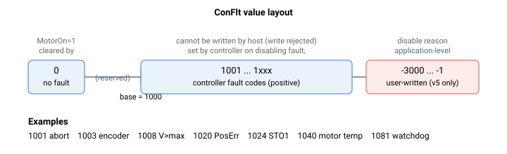

# ConFlt

保存导致轴被禁用的控制器错误码。

## 概述

`ConFlt` 存储导致轴被禁用的错误码。值为 `0` 表示无故障；任何正值都是控制器故障码。故障码从基数 `1000` 开始编号，并自该处连续向上递增——完整列表及其含义参见[控制器错误码](../../04-error-codes/controller-error-codes.md)。请注意，`1001`（中止信号）是当前固件不会触发的保留/遗留码；你实际会看到的最低故障码是各项有效保护，例如 `1003`（编码器错误）、`1020`（位置误差）以及母线电压和过流故障。

`ConFlt` 是一个轴范围寄存器，不保存至闪存，因此它始终反映该轴的实时故障状态。它与诊断快照对 [ConFltSnapSrc](ConFltSnapSrc.md) / [ConFltSnapVal](ConFltSnapVal.md) 协同工作，后者在故障发生的瞬间冻结选定的参数值；它还与 [MotorReason](MotorReason.md) 协同工作，后者报告轴被禁用的更广泛类别。



## 工作原理

当控制器检测到一个会禁用轴的故障时，它会针对受影响的轴原子性地一并执行四项操作：

1. 轴被禁用（[MotorOn](../08-axis-operation/01-general-keywords/MotorOn.md) 被强制关闭）。
2. `ConFlt` 被载入故障码。
3. 一个诊断快照被捕获到 [ConFltSnapVal](ConFltSnapVal.md)。
4. 该故障被追加到控制器 [ErrLog](ErrLog.md)，并标记轴字母及上电时间。

例外：CPU 后台循环看门狗故障（`1081`）不遵循完整序列。当它触发时，控制器会强制每个轴关闭，并在每个 `ConFlt` 仍为 `0` 的轴上写入 `ConFlt=1081`（它绝不会覆盖已存在的故障），但对于 `1081`，它**不会**捕获新的 [ConFltSnapVal](ConFltSnapVal.md) 快照，也**不会**向 [ErrLog](ErrLog.md) 追加 `1081` 条目。因此，仅因 `1081` 被关闭的轴不会有与之匹配的快照或日志对：快照仍保留最后一次捕获的内容（如果该轴此前从未发生过故障，则为其默认值 `-1`，否则为更早一次故障的陈旧值）。如果你在多个轴上同时读到 `ConFlt=1081` 而没有匹配的 `1081` 快照或日志条目，这是预期行为。

另外，当轴在存在故障时转入被禁用状态时，[MotorReason](MotorReason.md) 被置为 `1`（控制器故障）。

清除：

- 当轴被重新使能（`MotorOn=1`）时，`ConFlt` 会自动清除为 `0`。
- 你可以向 `ConFlt` 写入 `0` 来手动清除故障状态。清除 `ConFlt` **不会**清除 [ErrLog](ErrLog.md) 或 [ConFltSnapVal](ConFltSnapVal.md)——它们会持久保留以供诊断。
- 在 v4 中，可写范围为 `0…0`：`0` 是你唯一能写入的值。你无法写入正值来模拟故障，写入非零值会被拒绝。（在 v5 中你还可以写入负值——参见[版本间变化](#版本间变化)。）

### 一些常见故障码

下面列出了几个有代表性的故障码；[控制器错误码](../../04-error-codes/controller-error-codes.md)页面提供了完整的表格。

| Code | 含义 |
|------|---------|
| 0 | 无故障 |
| 1001 | 检测到中止信号 |
| 1003 | 编码器错误（断开或其他） |
| 1008 | 母线电压过高 |
| 1009 | 母线电压过低 |
| 1020 | 位置误差超过限值 |
| 1024 | STO1 已激活 |
| 1040 | 电机温度过高 |
| 1043 | Central-i 通信已断开 |
| 1081 | CPU 后台循环看门狗超时 |

## 示例

```text
AConFlt             ; read the current fault code (0 = no fault)
AConFlt=0            ; clear the fault status
```

## 版本间变化

v5（Central-i）固件定义了 v4 中不存在的额外故障码：

| Code | 含义（仅 v5） |
|------|---------|
| 1067 | 系统中检测到异常/碰撞 |
| 1071 | 检测到不稳定的电流环 |
| 1072 | 检测到高噪声/抖动 |
| 1080 | 未检测到定相 |

其机制（故障时设置、重新使能时清除、追加到 `ErrLog`）在两个版本中完全相同。

在 v5 中，可写范围扩展为 `-3000…0`。正故障码仍然只能由控制器设置，但你可以自行写入一个**负**值，以记录禁用轴的应用层原因（一条发给你上层应用程序的用户自定义消息）。`0` 仍然清除故障状态，且无法写入正值。

## 另请参阅

- [控制器错误码](../../04-error-codes/controller-error-codes.md) — 每个故障码的含义
- [MotorReason](MotorReason.md) — 轴被禁用的原因（故障还是命令）
- [ConFltSnapSrc](ConFltSnapSrc.md) / [ConFltSnapVal](ConFltSnapVal.md) — 故障时捕获的参数快照
- [ErrLog](ErrLog.md) — 正的 ConFlt 值会被追加到的日志
- [MotorOn](../08-axis-operation/01-general-keywords/MotorOn.md) — 重新使能轴会清除 ConFlt
