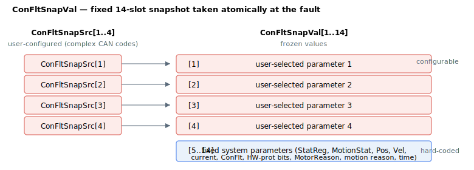

# ConFltSnapVal

Read-only snapshot of parameter values captured at the last fault.

## Overview

`ConFltSnapVal` holds the parameter values captured at the moment the last controller fault occurred. Reading it after a fault gives you a frozen picture of the system state at the instant the axis faulted, which is the key tool for diagnosing why a fault happened.

It is an axis-scoped, read-only array that is not saved to flash. The default element value is `-1`, which means no value has been captured for that slot (also the state after [ConFltSnapSrc](ConFltSnapSrc.md) is reconfigured).

## How it works

The whole snapshot is captured in one shot at the instant a fault is raised (the same event that sets [ConFlt](ConFlt.md), disables the axis, and appends to [ErrLog](ErrLog.md)). The array has a **fixed layout**: only slots `[1]`–`[4]` come from your [ConFltSnapSrc](ConFltSnapSrc.md) configuration; slots `[5]`–`[14]` always capture the same hard-coded system parameters regardless of configuration.



| Index | Captured value | Source |
|---|---|---|
| [1] | User-selected parameter 1 | [ConFltSnapSrc](ConFltSnapSrc.md)[1] |
| [2] | User-selected parameter 2 | [ConFltSnapSrc](ConFltSnapSrc.md)[2] |
| [3] | User-selected parameter 3 | [ConFltSnapSrc](ConFltSnapSrc.md)[3] |
| [4] | User-selected parameter 4 | [ConFltSnapSrc](ConFltSnapSrc.md)[4] |
| [5] | [StatReg](StatReg.md) | fixed |
| [6] | MotionStat | fixed |
| [7] | Position | fixed |
| [8] | Velocity | fixed |
| [9] | Motor current | fixed |
| [10] | [ConFlt](ConFlt.md) (the fault code itself) | fixed |
| [11] | Hardware-protection bits | fixed |
| [12] | [MotorReason](MotorReason.md) | fixed |
| [13] | Motion reason | fixed |
| [14] | Capture time (s since power-on) | fixed |

A user slot whose [ConFltSnapSrc](ConFltSnapSrc.md) entry is `0` (disabled) stays at `-1`. Captured values for scaled parameters are stored in raw (internal) units.

## Examples

```text
AConFltSnapVal[1]   ; read the value captured for the first configured source
AConFltSnapVal[10]  ; the fault code (ConFlt) that was active when the snapshot was taken
AConFltSnapVal[14]  ; the time (s since power-on) the snapshot was captured
AConFltSnapVal      ; read the full captured snapshot
```

## Changes between versions

In v4 the snapshot values are 32-bit (`int32`). In v5 (Central-i) they are 64-bit (`int64`): wide values such as position and velocity are captured at full 64-bit resolution, and floating-point parameters (e.g. motor current) are stored as their IEEE bit pattern rather than a truncated integer. The fixed element layout above is the same in both versions.

## See also

- [ConFltSnapSrc](ConFltSnapSrc.md) — selects the parameters in slots 1–4
- [ConFlt](ConFlt.md) — the fault code that triggers the capture (also captured in slot 10)
- [MotorReason](MotorReason.md) — captured in slot 12
- [StatReg](StatReg.md) — captured in slot 5
