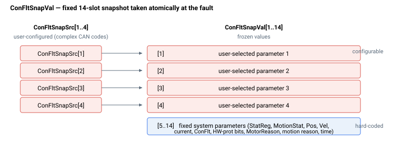

# ConFltSnapVal

只读快照，保存在上一次故障时捕获的参数值。

## 概述

`ConFltSnapVal` 保存在上一次控制器故障发生的瞬间所捕获的参数值。在故障之后读取它，可以获得轴故障那一刻系统状态的冻结画面，这是诊断故障原因的关键工具。

它是一个轴范围、只读的数组，不保存至闪存。元素的默认值为 `-1`，表示该槽位尚未捕获任何值（也是在 [ConFltSnapSrc](ConFltSnapSrc.md) 被重新配置之后的状态）。

## 工作原理

整个快照在故障被触发的瞬间一次性捕获（与设置 [ConFlt](ConFlt.md)、禁用轴并追加到 [ErrLog](ErrLog.md) 的是同一事件）。该数组具有**固定布局**：只有槽位 `[1]`–`[4]` 来自你的 [ConFltSnapSrc](ConFltSnapSrc.md) 配置；槽位 `[5]`–`[14]` 无论如何配置都始终捕获相同的硬编码系统参数。



| Index | 捕获的值 | 来源 |
|---|---|---|
| [1] | 用户选定参数 1 | [ConFltSnapSrc](ConFltSnapSrc.md)[1] |
| [2] | 用户选定参数 2 | [ConFltSnapSrc](ConFltSnapSrc.md)[2] |
| [3] | 用户选定参数 3 | [ConFltSnapSrc](ConFltSnapSrc.md)[3] |
| [4] | 用户选定参数 4 | [ConFltSnapSrc](ConFltSnapSrc.md)[4] |
| [5] | [StatReg](StatReg.md) | 固定 |
| [6] | MotionStat | 固定 |
| [7] | Position | 固定 |
| [8] | Velocity | 固定 |
| [9] | 电机电流 | 固定 |
| [10] | [ConFlt](ConFlt.md)（故障码本身） | 固定 |
| [11] | 硬件保护位 | 固定 |
| [12] | [MotorReason](MotorReason.md) | 固定 |
| [13] | 运动原因 | 固定 |
| [14] | 捕获时间（自上电起的秒数） | 固定 |

[ConFltSnapSrc](ConFltSnapSrc.md) 条目为 `0`（禁用）的用户槽位保持为 `-1`。带缩放的参数所捕获的值以原始（内部）单位存储。

## 示例

```text
AConFltSnapVal[1]   ; read the value captured for the first configured source
AConFltSnapVal[10]  ; the fault code (ConFlt) that was active when the snapshot was taken
AConFltSnapVal[14]  ; the time (s since power-on) the snapshot was captured
AConFltSnapVal      ; read the full captured snapshot
```

## 版本间变化

在 v4 中，快照值为 32 位（`int32`）。在 v5（Central-i）中，它们为 64 位（`int64`）：诸如位置和速度等宽值以完整的 64 位分辨率捕获，浮点参数（例如电机电流）以其 IEEE 位模式而非截断的整数存储。上述固定元素布局在两个版本中相同。

## 参见

- [ConFltSnapSrc](ConFltSnapSrc.md) — 选择槽位 1–4 中的参数
- [ConFlt](ConFlt.md) — 触发捕获的故障码（也捕获在槽位 10 中）
- [MotorReason](MotorReason.md) — 捕获在槽位 12 中
- [StatReg](StatReg.md) — 捕获在槽位 5 中
