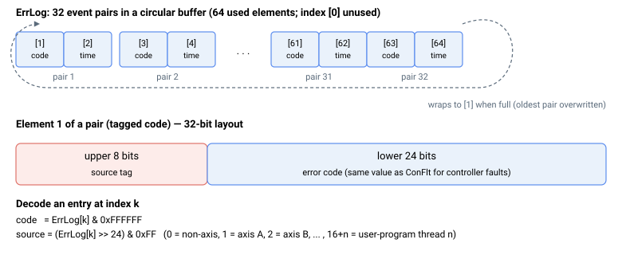

# ErrLog

只读循环日志，记录近期错误及其时间戳。

## 概述

`ErrLog` 保存控制器的错误日志。它是一个单元级（非轴）只读数组，在错误发生时予以记录，并同时记录每个错误发生的时间，以便在出现问题后重建故障序列。它不会保存至闪存。每个正的 [ConFlt](ConFlt.md) 值都会自动追加到此处——其他内部错误（如错误的用户程序加载和通信错误）也会被追加——整个日志可通过 [ClearErr](ClearErr.md) 清除。

读取 `ErrLog` 最简便的方式是使用 Agito PCSuite 软件，它会将每个错误码翻译为文本，并使用 PC 时钟将上电时间转换为时钟读数。

## 工作原理

每个错误占用**两个**连续的数组元素（一个“对”）：

- **该对的第 1 个元素**——带标记的错误码（高 8 位为来源标记，低 24 位为错误码）。
- **该对的第 2 个元素**——错误时间，以单元上电以来的秒数表示（记录时刻 [Time](../01-system/03-timing/Time.md) 的副本）。

因此第一个错误位于 `ErrLog[1]` / `ErrLog[2]`，第二个位于 `ErrLog[3]` / `ErrLog[4]`，依此类推。该数组保存 **128 个事件对**（256 个已用元素；索引 `[0]` 未使用，因此第一个可用索引为 `[1]`）。当缓冲区满时，它会回绕到 `ErrLog[1]` 并覆盖最旧的对——这是一个循环日志，因此它始终保留最近的 128 个事件，但没有溢出标志。

缓冲区长度随单元的轴数缩放：每轴 64 个条目，外加一个未使用的前导元素（`64 x axes + 1`）。在本产品上即为 257 个元素 = 128 个事件对（256 个已用；索引 `[0]` 未使用）；轴数不同的单元，对的数量按比例增多或减少（例如 3 轴单元为 193 个元素 = 96 个对）。在所有情况下，它都在最后一个对之后回绕，覆盖最旧的对，且没有溢出标志。



### 带标记的错误码（对元素 1）

低 24 位为错误码（对于控制器故障，与 [ConFlt](ConFlt.md) 的值相同——参见[控制器错误码](../../04-error-codes/controller-error-codes.md)）。高 8 位标识来源：

| 高 8 位 | 来源 |
|---|---|
| 0 | 非轴相关（单元级错误） |
| 1 | 轴 A |
| 2 | 轴 B |
| 3 | 轴 C |
| 4 | 轴 D |
| 5 | 轴 E |
| 6 | 轴 F |
| 7 | 轴 G |
| 8 | 轴 H |
| 16 + *n* | 用户程序线程 *n*（例如 17 = 线程 1） |

要拆分一个已记录的值：`code = ErrLog[k] & 0xFFFFFF`，`source = (ErrLog[k] >> 24) & 0xFF`。注意这与其他地方基于 1 的轴字母不同——这里轴 A 报告为 **1**，而非 0，而来源 0 表示非轴错误。

## 示例

```text
AErrLog[1]          ; tagged source + error code of the first logged error
AErrLog[2]          ; time (s since power-on) of the first logged error
AErrLog[3]          ; tagged source + error code of the second logged error
AErrLog             ; read the full log
```

解码第一条记录：错误码 = `AErrLog[1] & 0xFFFFFF`，来源 = `(AErrLog[1] >> 24) & 0xFF`（1 = 轴 A，0 = 非轴）。

## 参见

- [ClearErr](ClearErr.md) — 清除此日志中的所有条目
- [ConFlt](ConFlt.md) — 追加到此日志的每轴故障码
- [控制器错误码](../../04-error-codes/controller-error-codes.md) — 每个错误码的含义
- [Time](../01-system/03-timing/Time.md) — 用于时间戳元素的上电时间
